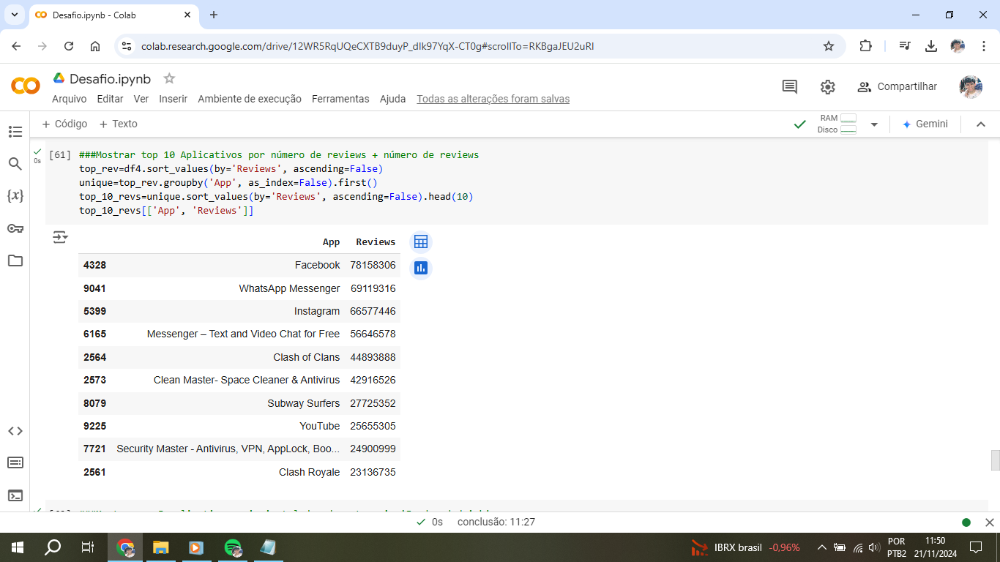

# Instruções

Nesta Sprint foi realizado o desafio de realizar análise de dados com gráficos e dataframes, utilizando as bibliotecas Pandas e Matplotlib do Python, em uma plataforma online, utilizando neste caso, o notebook do Google Colab. O desafio foi executado com as seguintes etapas: 
1- Ler o arquivo csv googleplaystore.csv e remover as linhas duplicadas 
2- Tratar os dados, eliminando os inconsistentes e padronizando-os 
3- Fazer o gráfico de barras contendo os top 5 aplicativos por número de instalação 
4- Fazer o gráfico de pizza mostrando as categorias de aplicativos existentes no dataset de acordo com a frequência em que elas aparecem 
5- Mostrar qual o aplicativo mais caro 
6- Mostrar quantos aplicativos são classificados como 'Mature 17+ 
7- Mostrar o top 10 aplicativos por número de reviews e o respectivo número de reviews 
8- Apresentar os top 5 apps mais instalados da categoria 'Food and drink' 
9- Apresentar o aplicativo pago mais baixado e sua categoria 
10- Apresentar em um gráfico de dispersão os top 10 aplicativos por número de reviews e seu respectivo rating 
11- Apresentar em um gráfico de linha os 5 aplicativos mais instalados da categoria 'Food and Drink' com seu respectivo rating 

## Resumo

**Python:** Aprendi mais funções da linguagem, como converter dados, importar arquivos e ler arquivos através do stream

**Pandas:** Como utilizar a biblioteca, manipular dados em dataframes

**Matplotlib:** Como utilizar a biblioteca, criar gráficos e configurá-los

**Colab:** Como utilizar a plataforma, executar scripts

# Exercícios

1. [Pasta Exercicios I](exercicios/)

2. [Pasta Exercicios II](exercicios/ExercicioII/)

## Evidências

Importando as bibliotecas pandas e numpy e fazendo upload do arquivo CSV

Lendo o arquivo csv e armazenando em um Dataframe(df)

Visualizando as primeiras 10 linhas do arquivo

Visualizando informações sobre os tipos de dados de cada coluna

Eliminando as linhas duplicadas, armazenando em um novo dataframe(df2) e visualizando o resultado

Visualizando informações sobre o novo dataframe sem linhas duplicadas

Verificando as linhas que estavam duplicadas no dataframe inicial(df)

Conferindo se a linha toda realmente estava duplicada

Visualizando os valores únicos de Category e Rating

Copiando o df2 para o df3 e organizando os atributos da linha 10472

Visualização da linha 10472 corrigida

Visualização dos valores diferentes do padrão através do .unique()

Mudanças nos atributos e conversão dos tipos de dados nos campos

Plotando o primeiro gráfico, de barras, com os 5 aplicativos mais instalados

Plotando o segundo gráfico, de pizza, exibindo a representação (em %) de aplicativos por categoria em relação ao total

Mostrando o aplicativo mais caro 

Mostrando quantos aplicativos são classificados como Mature 17+

Exibindo os 10 aplicativos por maior número de reviews, juntamente com a quantidade de reviews que possuem

Os 5 aplicativos mais instalados da categoria 'Food and drink'

Exibição do aplicativo pago mais baixado e sua respectiva categoria

Criação de um novo gráfico, do tipo dispersão, exibindo os 10 aplicativos com maior números de reviews e seu respectivo rating

Criação de um gráfico do tipo linha, exibindo os 5 aplicativos mais instalados da categoria 'Food and drink' e seu respectivo rating

Projeto completo com os arquivos
[Arquivos do Desafio](desafio/)

## Apresentação do desafio

[Desafio](desafio/README.md)

# Certificados

Certificado do Curso de AWS
[Curso AWS](certificados/AWS.pdf)