# Desafio
Para a execução deste desafio foi criado um código na linguagem Python, com o auxílio das bibliotecas Pandas e Matplotlib no ambiente de desenvolvimento online: Google Colab, um notebook semelhante ao Jupyter

## Etapas

1. Para a correta execução do desafio, primeiro foi necessário importar as bibliotecas Pandas e Numpy, e posteriormente fazer o upload do arquivo CSV, que contém todos os dados utilizados
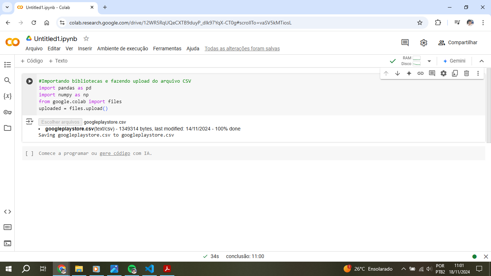

2. Então o arquivo csv é lido e armazenado em uma variável e por sua vez armazenando em um Dataframe(df)
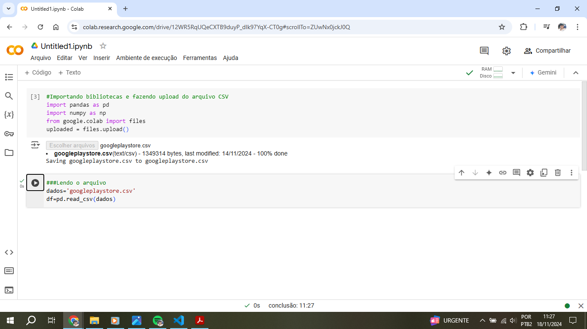

3. Visualizar as primeiras 10 linhas do arquivo para entender a estrutura dos dados e visualizar as colunas
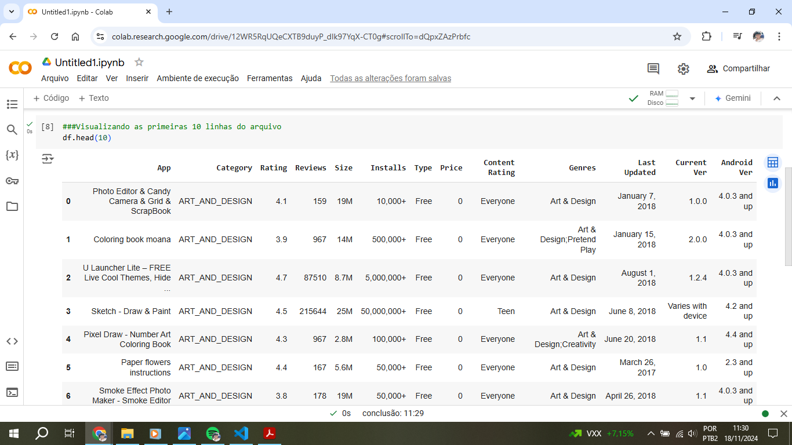 
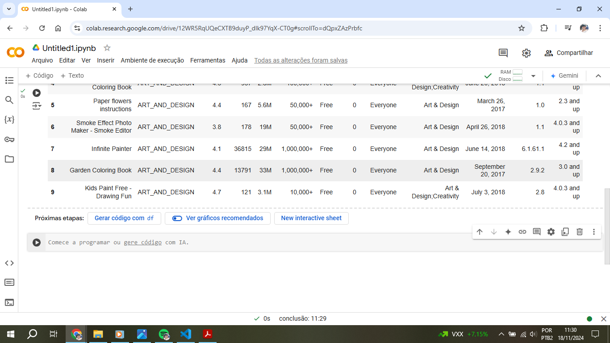

4. Visualizando informações sobre os tipos de dados de cada coluna, será necessário converter os tipos de dados de todas as colunas, que estão como **object**, exceto por Rating que já está em float

5. Eliminando as linhas duplicadas, armazenando em um novo dataframe(df2), para tornar o primeiro dataframe como um backup, e visualizando o resultado. O dataframe(df2) foi reduzido de 10841 linhas para 10358

6. Visualizando informações sobre o novo dataframe(df2) sem linhas duplicadas

7. Verificando as linhas que estavam duplicadas no dataframe inicial(df)
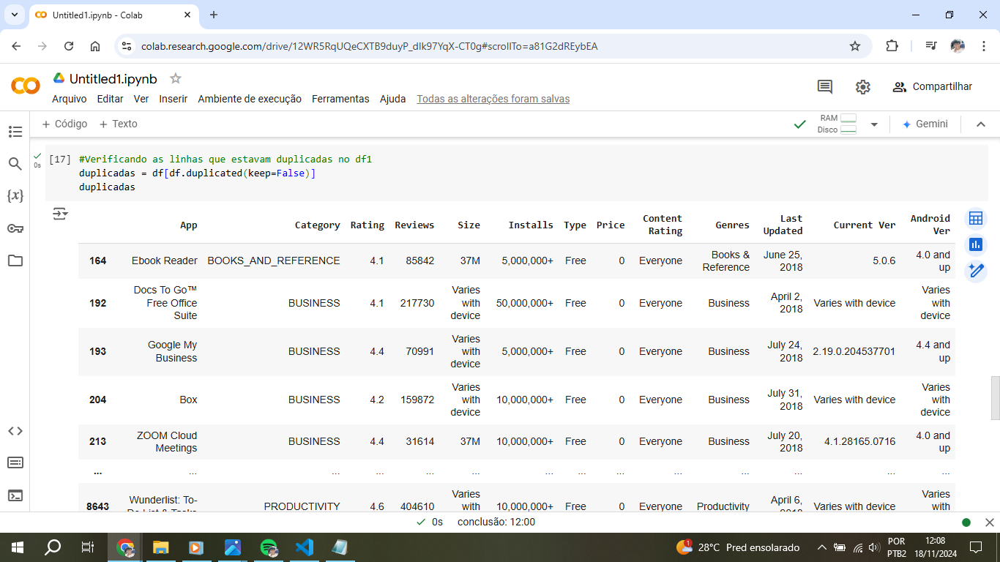

8. Conferindo se a linha toda realmente estava duplicada, a partir do exemplo de visualização do aplicativo: "AAFP" em df. Pode-se constatar que a linha 10768 é uma cópia da 2515

9. Visualizando os valores únicos de Category e Rating. Das execuções [10] a [13] foram feitas verificações de valores únicos em suas respectivas colunas para detectar valores inconsistentes ou fora do padrão
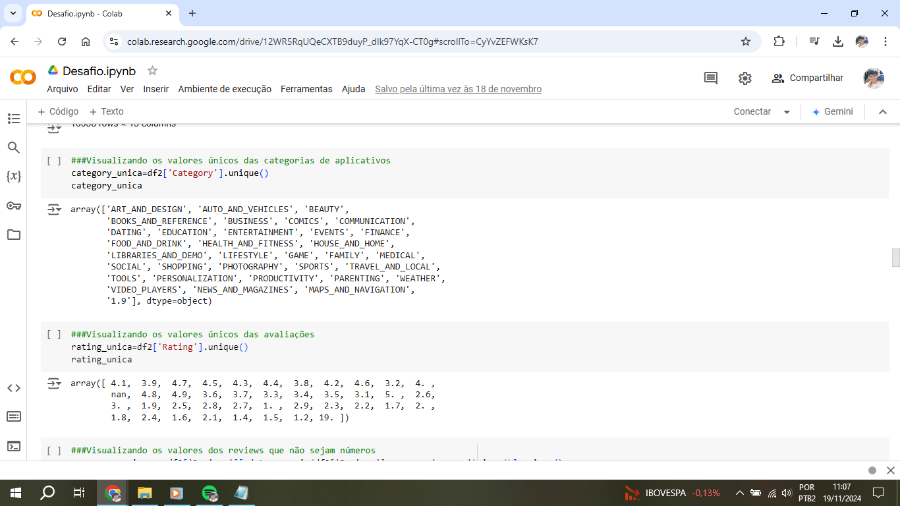

10. Ao detectar uma linha fora do padrão em 'Reviews', foi executado o comando para visualizar esta linha e  constatou-se que os valores estavam todos fora do lugar. Então em [14] foi feita uma copia do df2 para o df3 (pois grandes mudanças foram feitas, por segurança df2 foi mantido como um backup e as alterações feitas em df3), e feitas as alterações nos campos desta linha 10472

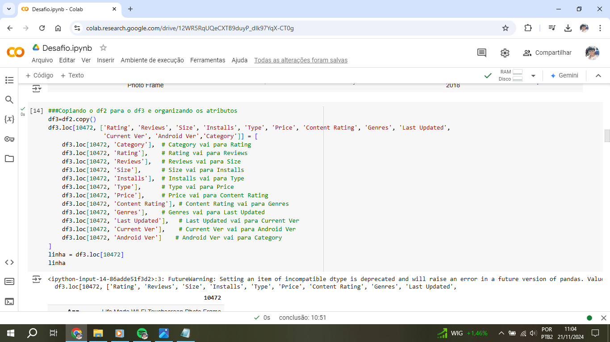
Linha corrigida:

11. De [15] a [27] foram feitas verificações de valores únicos em suas respectivas colunas para detectar valores inconsistentes ou fora do padrão
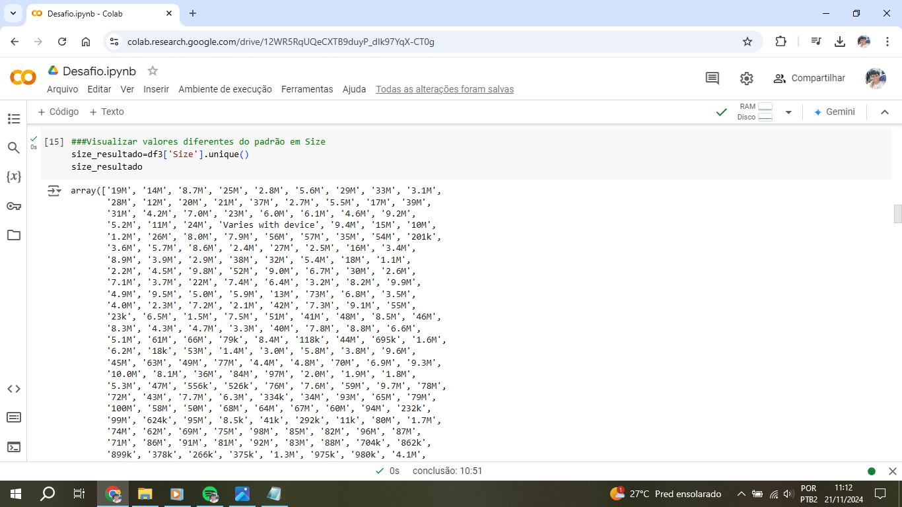
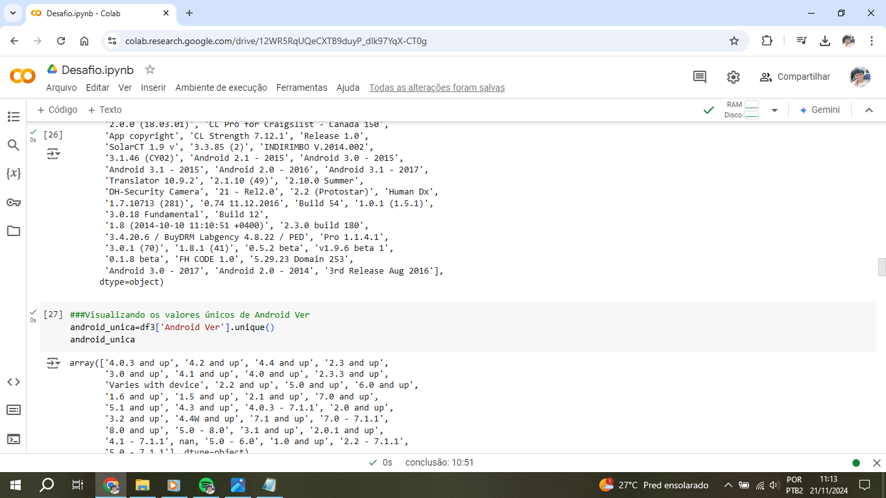

12. Cópia do df3 para o df4 para realizar as futuras mudanças nos atributos e conversão dos tipos de dados nos campos. De [29] a [55] foram realizadas as mudanças necessárias, como substituição de valores e conversão de tipos de dados
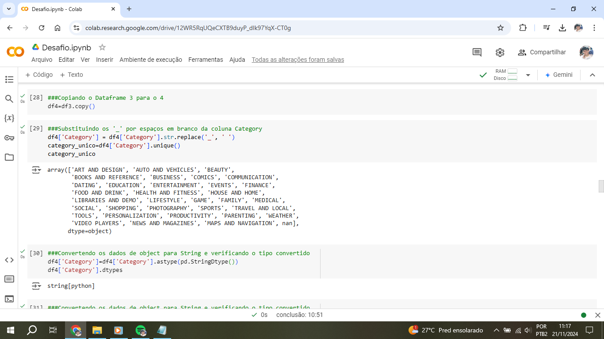
Aqui é possível verificar as colunas e seus tipos de dados em df4:

13. Plotagem do primeiro gráfico, de barras, com os 5 aplicativos mais instalados. Antes da plotagem do gráfico é necessário criar o vetor com os 5 aplicativos mais instalados, extraídos da coluna 'Installs'
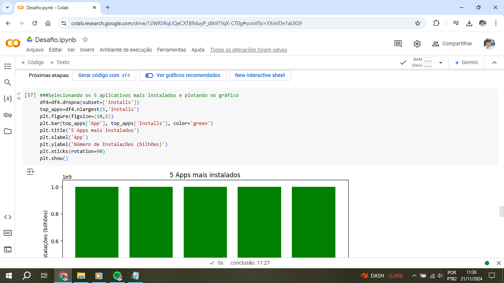
Gráfico:

14. Plotagem do segundo gráfico, de pizza, e exibição da representação (em %) de aplicativos por categoria em relação ao total
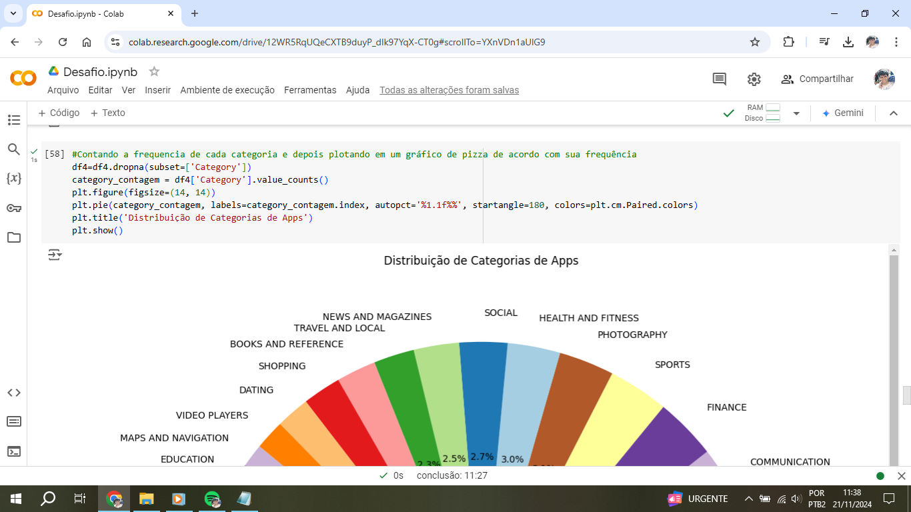
Gráfico:
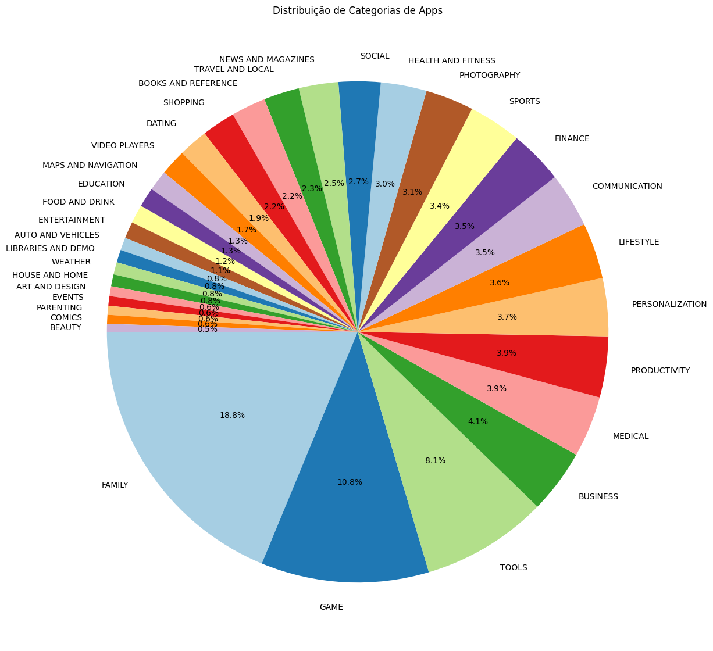

15. Mostrando o aplicativo mais caro, através da seleção do maior valor de 'Price'
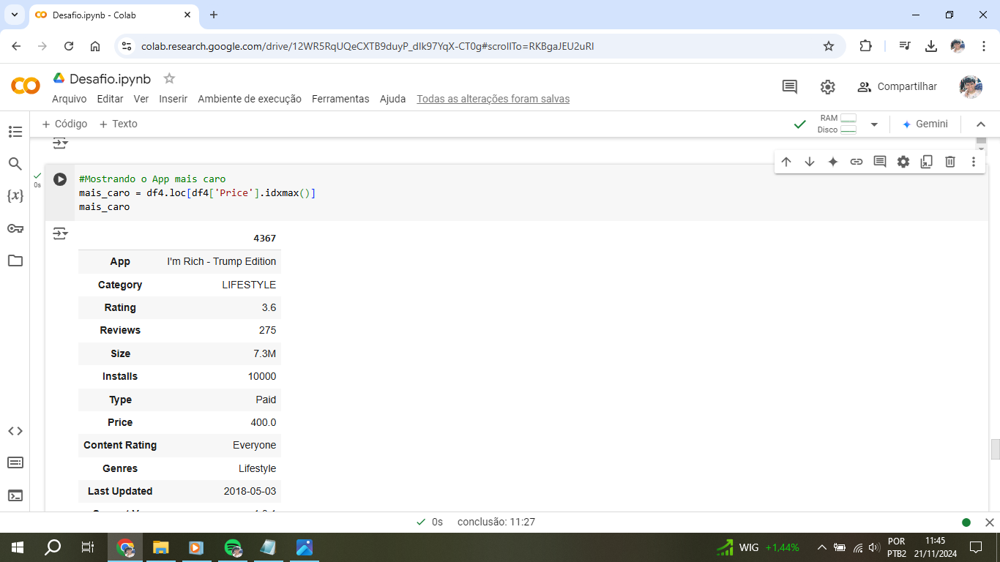

16. Mostrando quantos aplicativos são classificados como Mature 17+ Para exibir apenas o valor, é necessário que seja exibido apenas o primeiro valor do vetor, com: shape[0]

17. Exibindo os 10 aplicativos por maior número de reviews, juntamente com a quantidade de reviews que possuem. Foi necessário selecionar os únicos, pois haviam aplicativos repetidos

**A partir desta seção a escolha das operações efetuadas ficaram a critério do desenvolvedor**

18. Foi escolhida a exibição dos 5 aplicativos mais instalados da categoria 'Food and drink' e exibido as respectivas quantidades de instalações em formato de valor e depois de lista
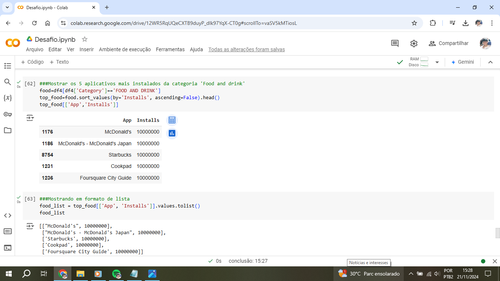

19. Foi escolhido a exibição do aplicativo pago mais baixado e sua respectiva categoria, primeiro em formato de valor e depois de lista

20. Criação de um novo gráfico, do tipo dispersão, exibindo os 10 aplicativos com maior números de reviews e seu respectivo rating.

Podemos notar que para um número de reviews acima de 50 milhões apenas 1 aplicativo possui nota maior ou igual 4.5, porém o conjunto de dados ainda é pequeno para tirar alguma conclusão concreta. Gráfico:

21. Criação de um gráfico do tipo linha, exibindo os 5 aplicativos mais instalados da categoria 'Food and drink' e seu respectivo rating

Aqui todos os aplicativos selecionados possuem o mesmo número de instalações. Podemos verificar que há um salto na nota quando saímos das duas versões de 'Mc Donald's' para outros aplicativos de outras marcas. Gráfico:
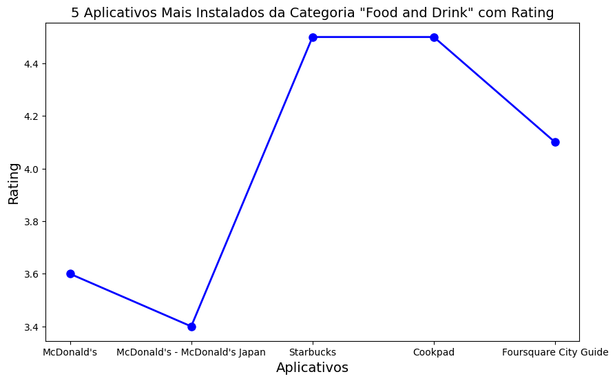

## Erros e problemas

1. Para que fosse possível fazer as alterações na linha 10472 em [Evidencia 12](../evidencias/12.png) foram feitas várias reexecuções no código com várias modificações até acertar as colunas correspondentes para as mudanças corretas

2. Foi necessário selecionar os valores únicos de 'Reviews', pois apenas selecionando os 10 aplicativos por maior número de reviews, os valores estavam aparecendo duplicados, como pode ser visto em:
