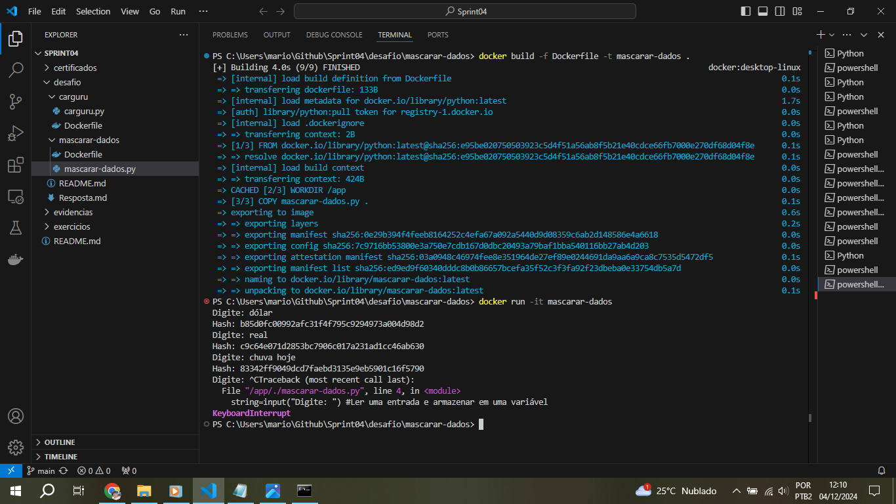

# Instruções

Nesta Sprint foi realizado o desafio de criar e executar imagens e containers do Docker, executando 2 scripts distintos do Python. O desafio foi executado com as seguintes etapas: 

1. Construção da primeira imagem e execução do script: "Carguru.py" em um container 
2. Reutilização de um container 
3. Construção da segunda imagem e execução do script que cria hashs para strings, através do algoritmo SHA-1, em um novo container

## Resumo

**Python:** Aprendi mais funções da linguagem, como utilizar funções lambda, map, list

**Docker:** Como criar e utilizar: containers e imagens

# Exercícios

[Pasta Exercicios](exercicios/)

## Evidências

Arquivo Dockerfile para criar a imagem de carguru.py

Criando a primeira imagem e nomeando-a
 

Criando um container

Comprovando que o container foi executado

Reiniciando um container

Exibindo que o container foi reiniciado

Script Python para gerar uma hash para a string de entrada

Arquivo Dockerfile para criar a imagem de mascarar-dados.py

Criando a segunda imagem e nomeando-a

Criando o container e executando-o de forma interativa

Container da imagem mascarar-dados em execução

Saindo do terminal e encerrando a execução do container

Erro ao executar a imagem sem o -it

Utilização do algoritmo incorreto

Hashs criadas de forma incorreta (256 bits no lugar de 160 bits)

Projeto completo com os arquivos:
[Arquivos do Desafio](desafio/)

## Apresentação do desafio

[Desafio](desafio/README.md)

# Certificados

Certificados do Curso de AWS:
[Certificado AWS 1](certificados/AWS1.pdf) | [Certificado AWS 2](certificados/AWS2.pdf)