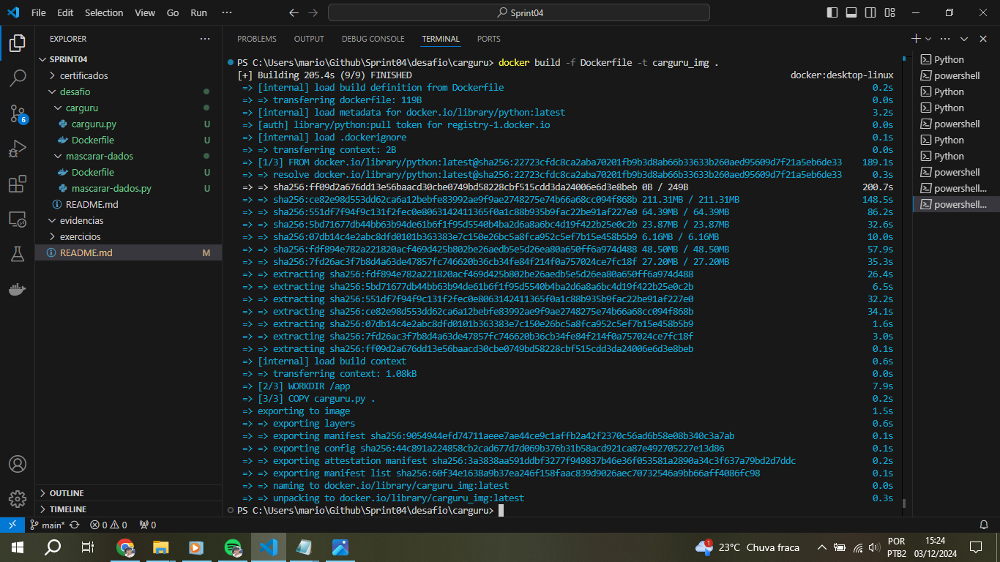
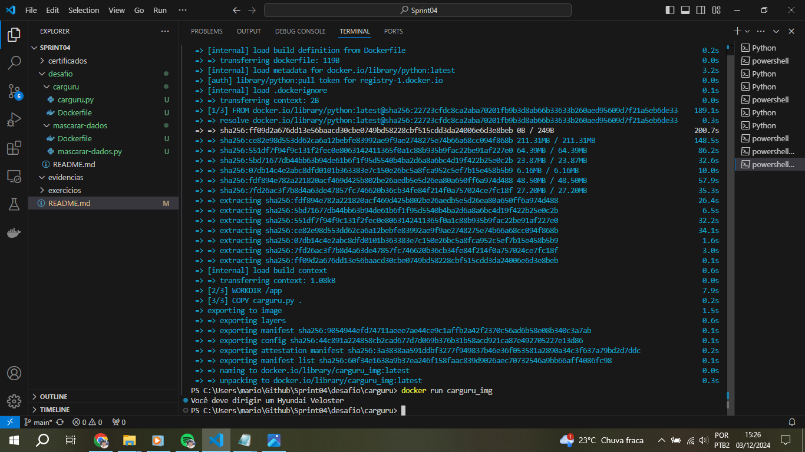
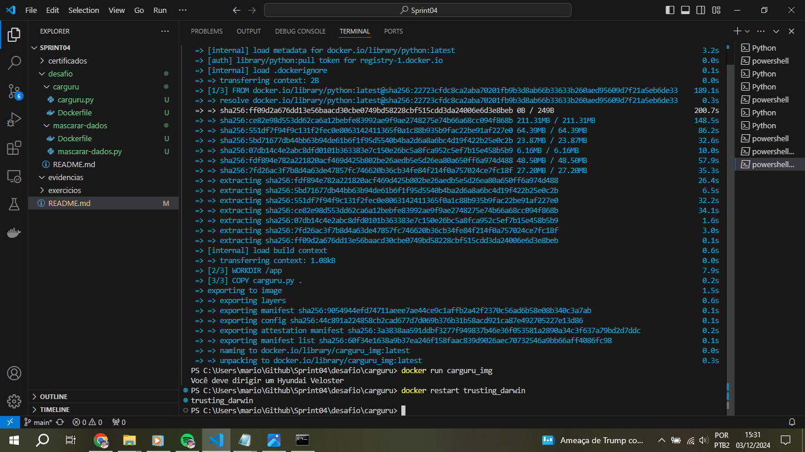
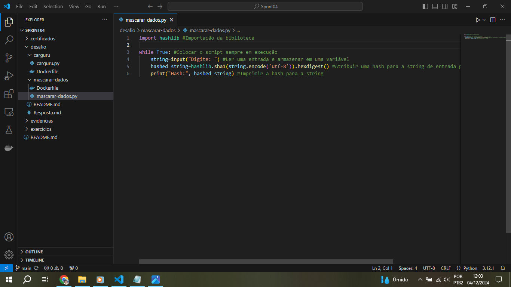
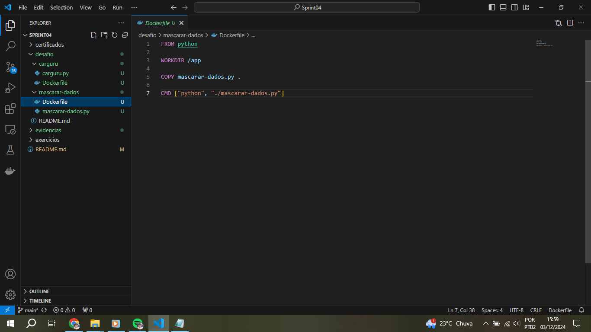
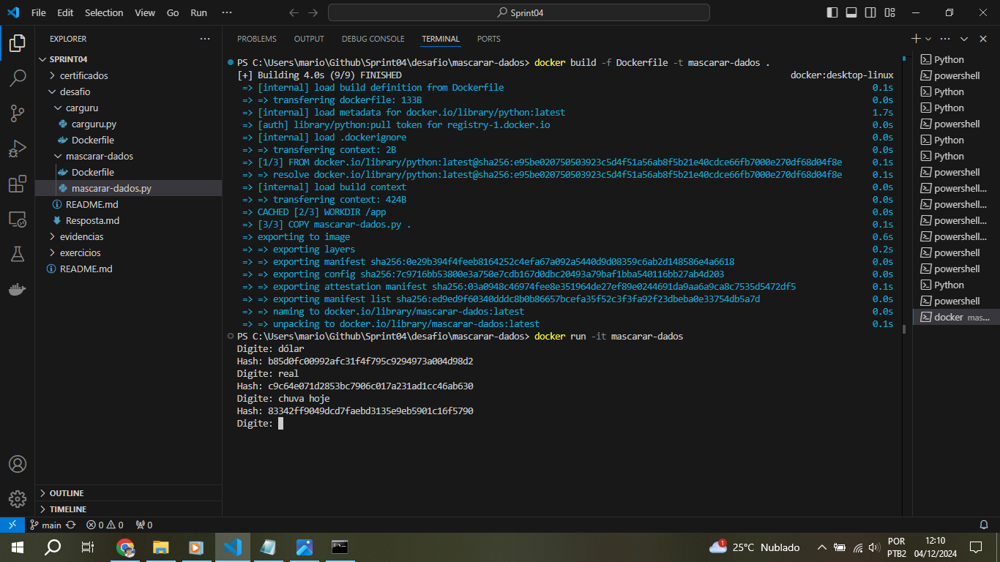
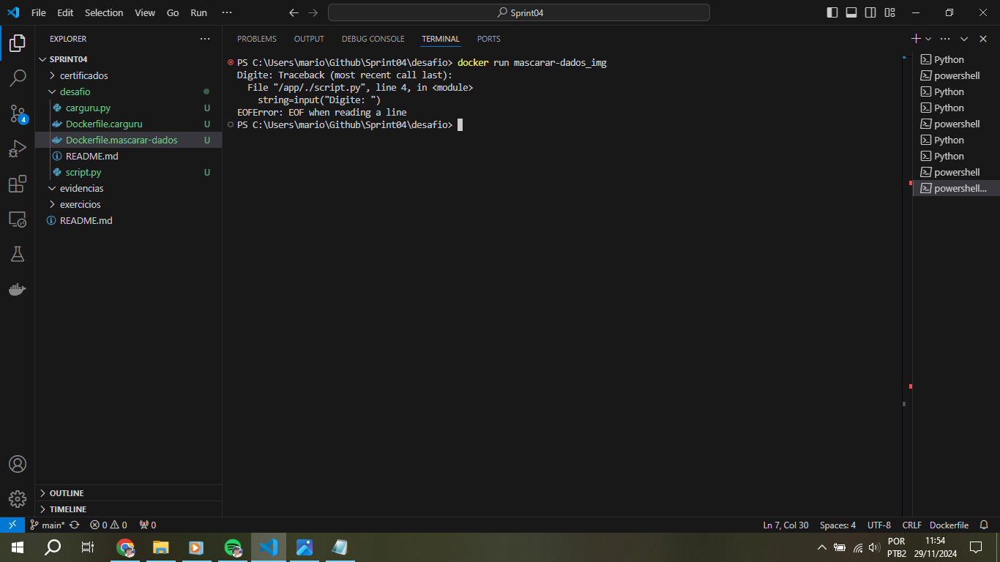

# Desafio
Para a execução deste desafio foram criados códigos Python e scripts de execução para os Dockerfile no ambiente de desenvolvimento do VSCode, além de executar comandos para criação, execução de imagens e containers, entre outros comandos relacionados ao Docker no Shell Script e CMD do Windows.

## Etapas

1. A Primeira etapa consiste em criar um arquivo Dockerfile para criar uma imagem com o script **carguru.py**

2. Depois de criado o Dockerfile, é hora de executá-lo e criar a imagem, nomeando-a como: **carguru_img**

3. Execução e criação de um container com a imagem criada recentemente. A saída do script é impressa na tela e sua execução chega ao fim
 

4. Pode-se conferir que não há nenhum container em execução, e que a imagem anterior já foi executada (pode-se verificar isto através do comando: **docker ps -a**)

5. Verifica-se se é possível reutilizar o mesmo container utilizado anteriormente, cujo nome é: **trusting_darwin**, reiniciando-o. Resposta ao questionamento: [Resposta](Resposta.md)

6. Pode-se constatar que o container foi reutilizado, de acordo com o **STATUS**, saída há 37 segundos atrás

7. É criado um novo script Python para gerar hashs para cada string de entrada, por meio do algoritmo SHA-1

8. Criação de um novo Dockerfile para criar a imagem com o script de mascarar dados

9. Execução do Dockerfile e criação da imagem **mascarar-dados**

10. Criando e executando o container de forma interativa, para que seja possível entrar com dados no script, no próprio terminal

11. Constatando que o container que contém a imagem **mascarar-dados** está em execução. Para pará-lo, é necessário dar o comando **Ctrl+c** ou abrir um novo terminal e digitar: **docker stop nome_container**

12. Para pará-lo, foi dado o comando **Ctrl+c**

## Erros e problemas

1. Ao criar e consequentemente executar um novo container para a imagem **mascarar-dados** um erro foi apresentado ao não colocar a execução como forma interativa. É importante fazer isto, pois neste caso trata-se de uma imagem com um script contendo laço de repetição que exige execução ininterrupta do container no Docker.
