# Instruções

Nesta Sprint foi realizado o desafio de criar um script em Python para analisar uma base de dados e enviar os arquivos e fazer o download de uma base de dados a partir do serviço em nuvem: AWS S3. O desafio consistiu nas seguintes etapas: 

1. Escolha da base de dados no site do governo brasileiro: http://dados.gov.br 
2. Construção do script para analisar os dados do database em CSV. Foi utilizado em um primeiro momento o Google Colab em conjunto com a biblioteca **Pandas** e depois este arquivo foi exportado como .py para o VScode 
3. Construção do script para criar um bucket no S3 e fazer o upload da base de dados 
4. Configuração das variáveis para ter acesso às credenciais da conta AWS

## Resumo

**Python:** Aprendi mais funções da linguagem, como realizar importações de script e utilizar as bibliotecas: OS e Boto3

**AWS S3:** Como utilizar os serviços em nuvem para armazenamento de arquivos

**AWS EC2:** Como criar e configurar instâncias

**AWS Dynamo DB**: Como configurar bancos de dados NOSQL

**IAM**: Como gerenciar usuários e grupos de usuários

# Certificados

Certificados do Curso de AWS:
[Certificado AWS 1](certificados/aws-cloud-quest-cloud-practitioner.png) 
Link para a badge: https://www.credly.com/badges/3764c6fe-d862-4342-81df-e12aaf0f66cb/public_url

# Exercícios

[Pasta Exercicios](exercicios/)

Link para o endpoint do bucket: http://exercicio-1.s3-website-us-east-1.amazonaws.com

Arquivos inseridos no bucket:

Execução da página index.html:

Instância no EC2 em execução:

## Apresentação do desafio

[Desafio](desafio/README.md)

## Evidências

Database no Excel

Salvamento e visualização do dataframe
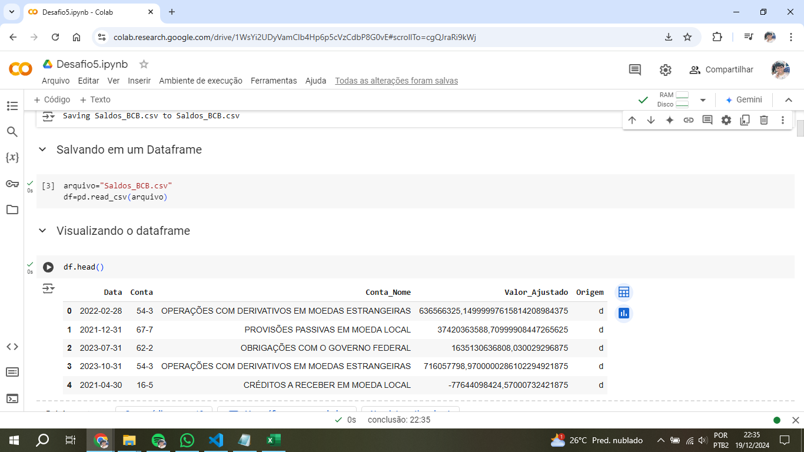

Renomeação das colunas do dataframe
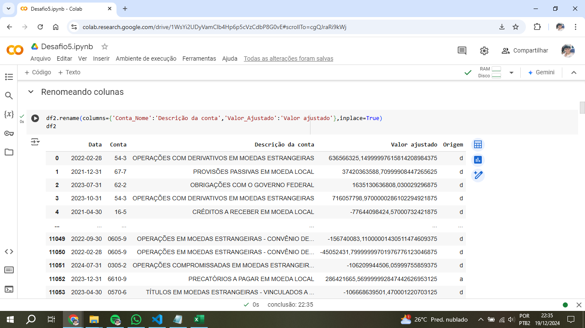 

Renomeação dos dados da coluna 'Descrição da conta'
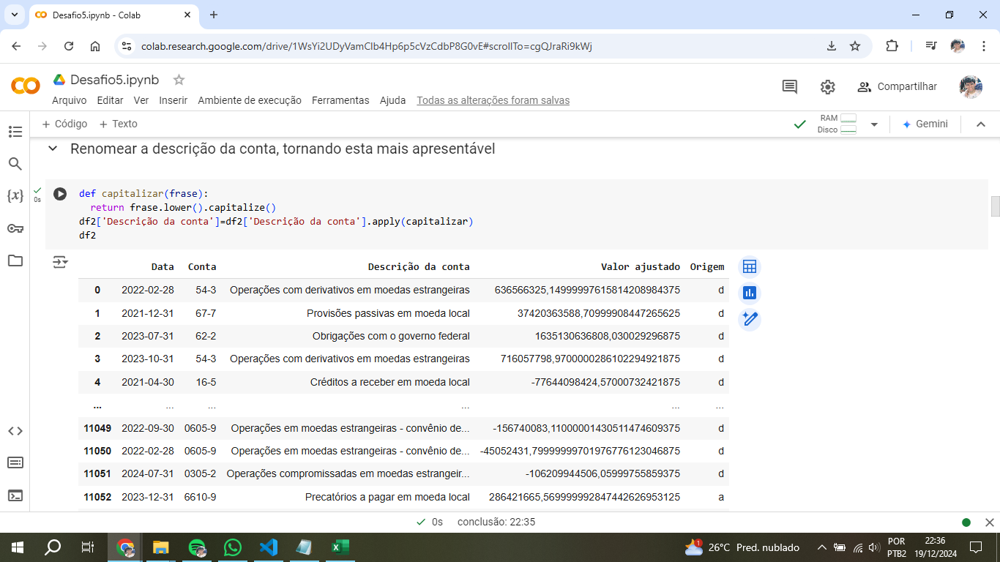

Substituição de ',' por '.' e conversão dos valores das colunas

Remoção dos espaços em vazio na coluna 'Descrição da conta'
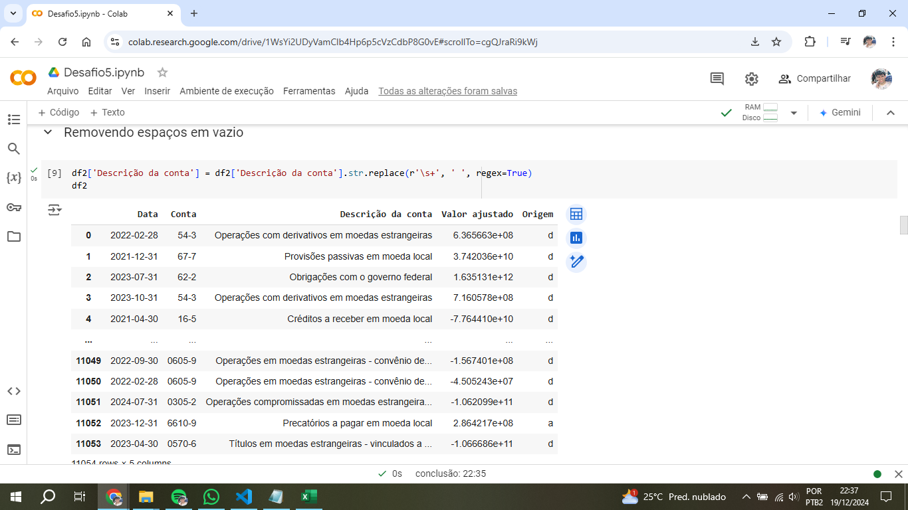

Verificação de valores nulos ou duplicados

Verificação dos maiores e menores valores

Verificação de quais valores são maiores que 0 e menores que 1 milhão 

Classificação do dataframe por data

Formatando a visualização dos números

Divisão dos valores por 1 milhão
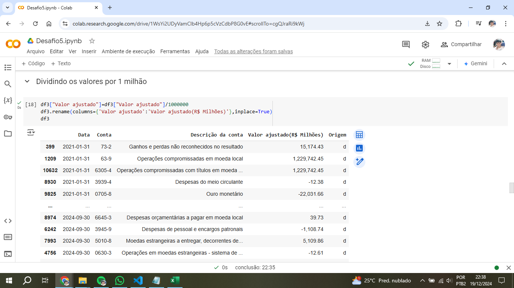

Verificação do maior e menor valor positivo

Verificação dos valores únicos das contas e suas respectivas descrições

Verificação de quais descrições de contas possuem mais de um valor atribuido para 'conta'

Função de conversão de valores na coluna 'Origem'
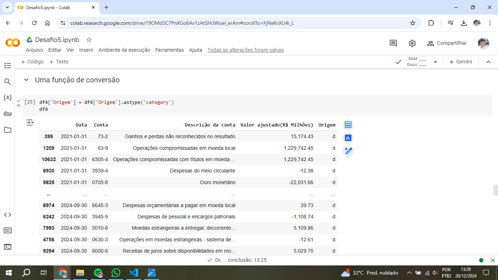

Cláusula que filtra dados usando ao menos dois operadores lógicos
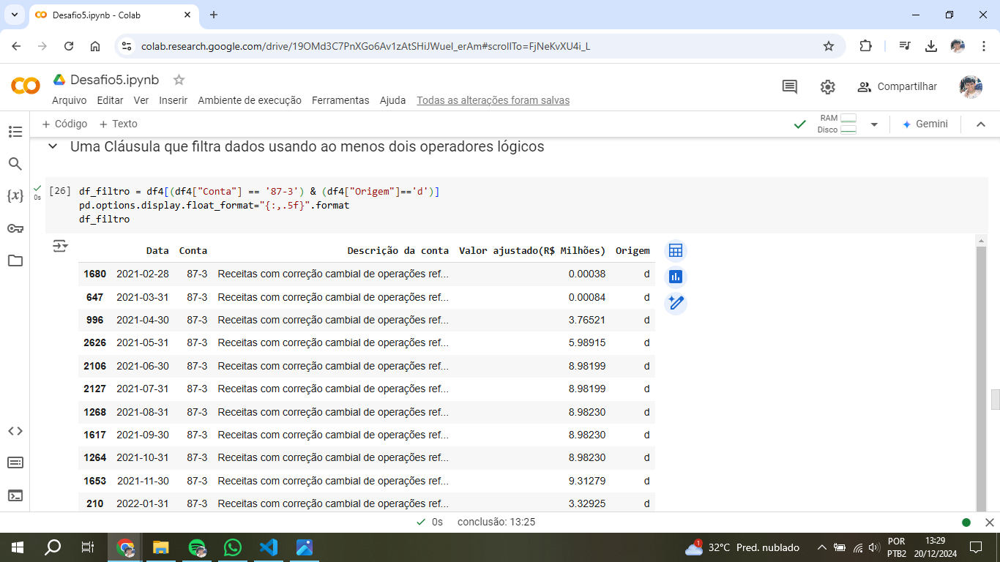

Primeira função de agregação (group by) e somar os valores da conta '87-3' por ano
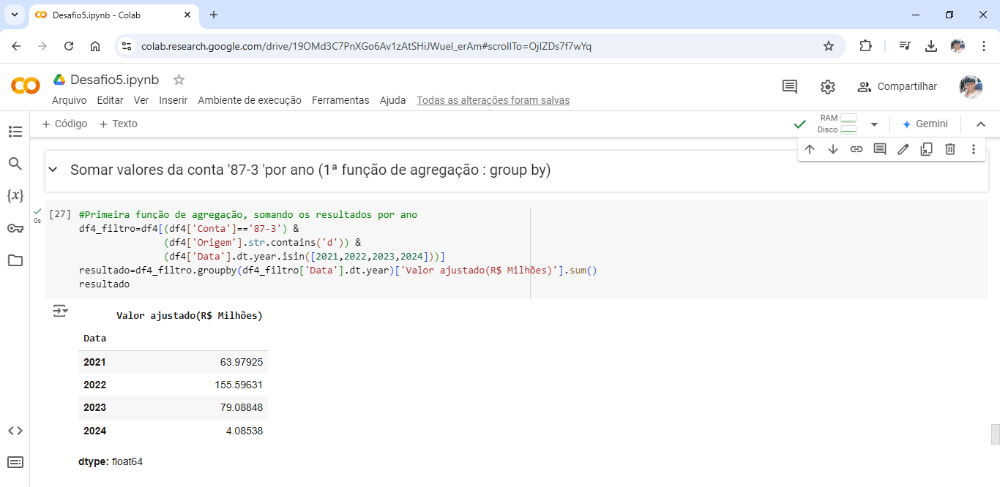

Conversão de series para dataframe
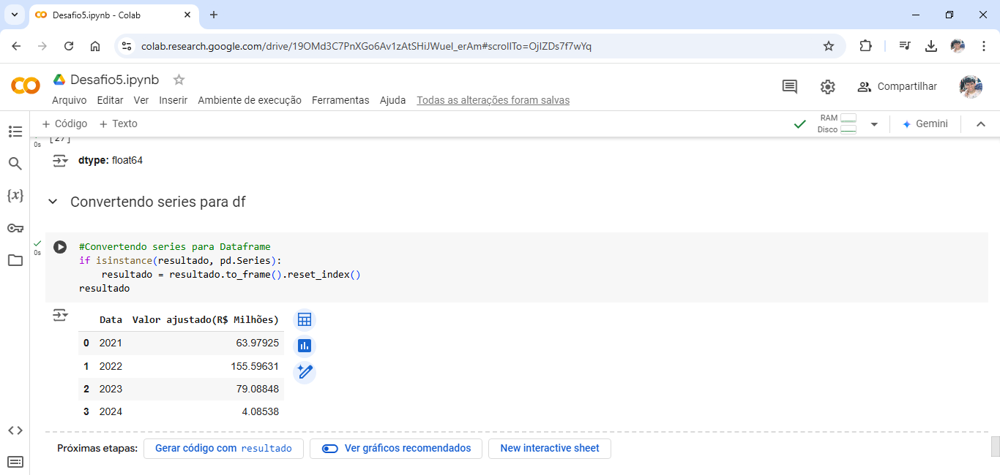

Utilização da segunda função de agregação (sum)

Adicionar uma observação 
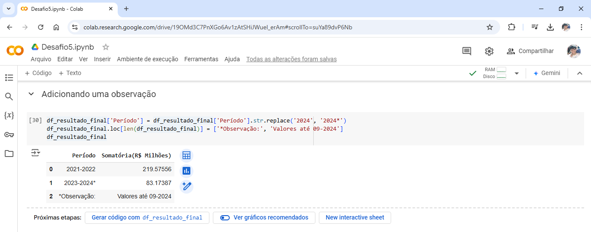

Obter a data atual através de uma função e adicionar outra observação ao final do dataframe final

Erro ao não converter series para dataframe
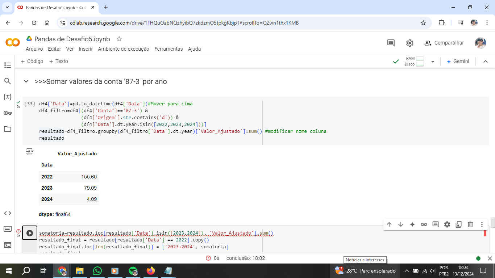
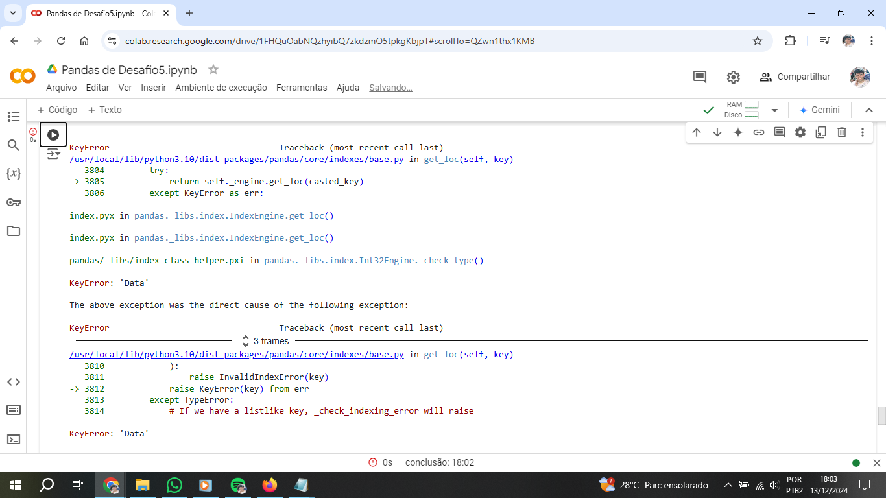

Erros de definição de credenciais

Erros de localização de arquivo local

Primeiro teste bem sucedido de acesso das credenciais à conta AWS
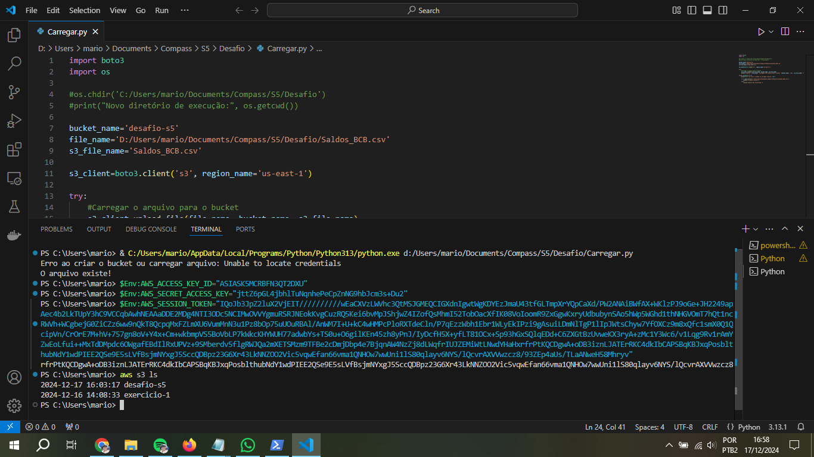

Execução das chaves de acesso no terminal do VScode

Execução do script **Desafio5.py**

[Arquivos do Desafio](desafio/)