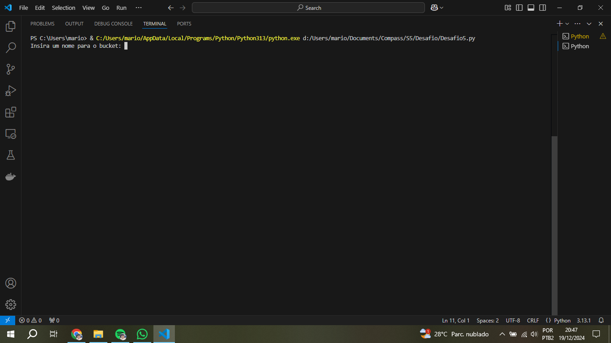
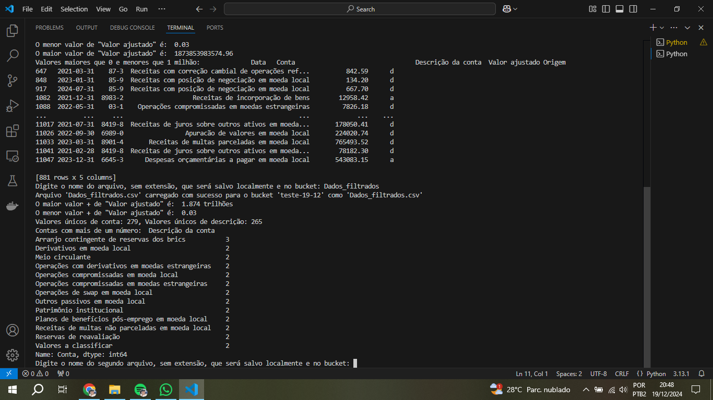
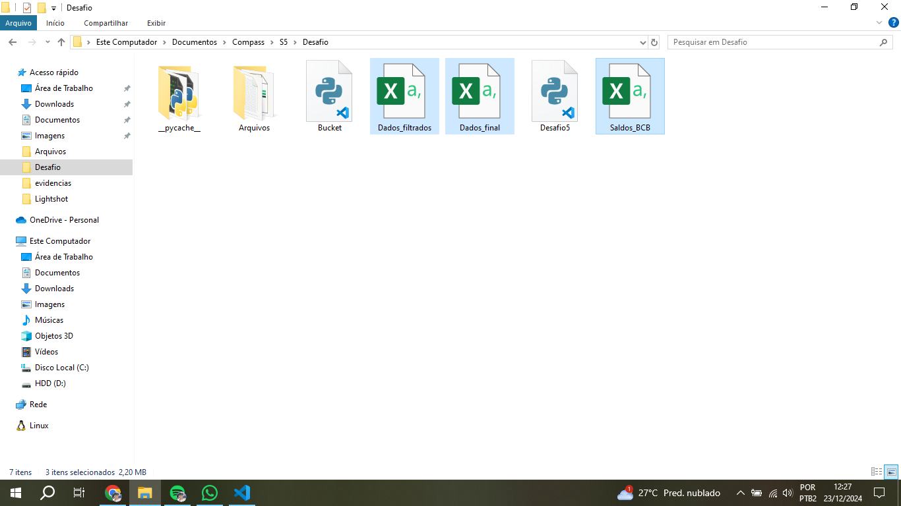
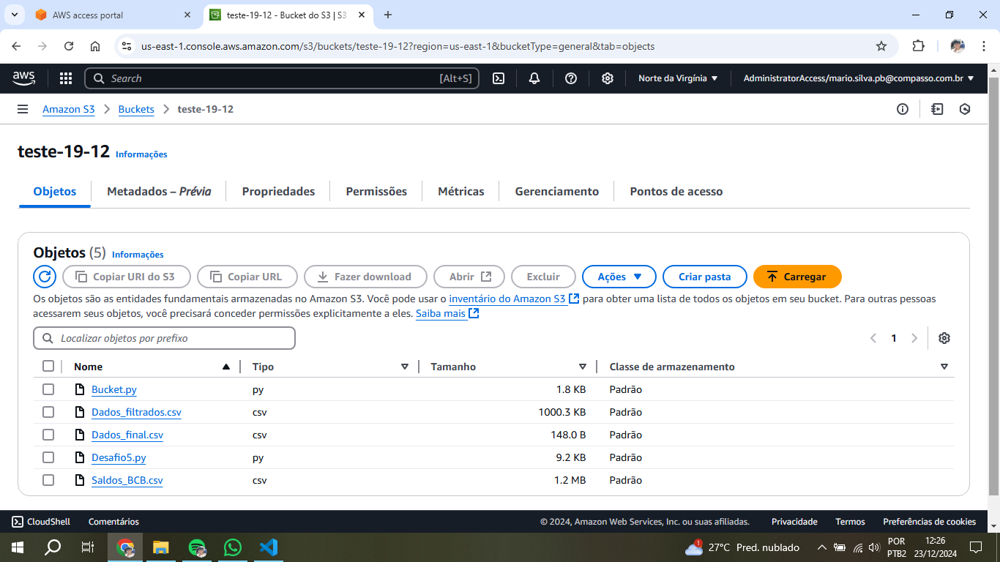

## Explicação do conjunto de dados

1. O database original é composto de dados contábeis sobre o Banco Central do Brasil

2. Data é o momento de aferição do saldo de determinada conta. São verificadas mensalmente

3. Conta é o número da conta que contém um nome associado à esta, em: 'Conta_Nome'. Em alguns casos o nome da conta possui mais de um número de conta

4. 'Valor_Ajustado' é o saldo verificado para determinada conta em determinada data

5. 'Origem': contém 'a' ou 'd' 
'a': Posição das contas, nas datas de balanço, antes da apuração do resultado 
'd': Posições das contas nas datas de balanço, posições após a apuração do resultado.

Link para o dicionario de dados do BCB: https://olinda.bcb.gov.br/olinda/servico/Saldos_BCB/versao/v1/documentacao

## Consultas

As consultas podem ser melhor detalhadas através do Readme do desafio e no notebook do Google colab 
Link: https://colab.research.google.com/drive/19OMd3C7PnXGo6Av1zAtSHiJWuel_erAm?usp=sharing

## Execução do desafio

1. Primeiramente são copiadas as credenciais da conta AWS, advindas da sessão de Powershell, e depois coladas no terminal do VScode:

2. É executado o script **Desafio5.py**, a primeira entrada requerida é o nome do bucket que será criado

3. Após a criação do bucket, o script informa se ele foi criado corretamente, e posteriormente: 
1- Informa o diretório de trabalho atual 
2- Informa se o arquivo de dados local foi excluido após o upload para o S3 
3- Faz o download do arquivo que está no S3 para o armazenamento local 
4- Faz algumas verificações e ajustes no database 
5- Pergunta qual será o nome do database filtrado a ser salvo localmente e para fazer upload no S3

4. Depois da etapa anterior, o script faz mais algumas verificações no database já filtrado e executa as filtragens requeridas para o desafio. Após esta etapa pede um nome para o arquivo que contém o resultado das filtragens e o salva localmente e no S3

5. O script informa se as operações requeridas foram executadas com sucesso e faz o upload dos arquivos: CSV final e dos 2 scripts Python: **Bucket.py** e **Desafio5.py**

6. Três arquivos CSV salvos localmente:

7. Arquivos salvos no S3, com o bucket **teste-19-12** criado recentemente:
