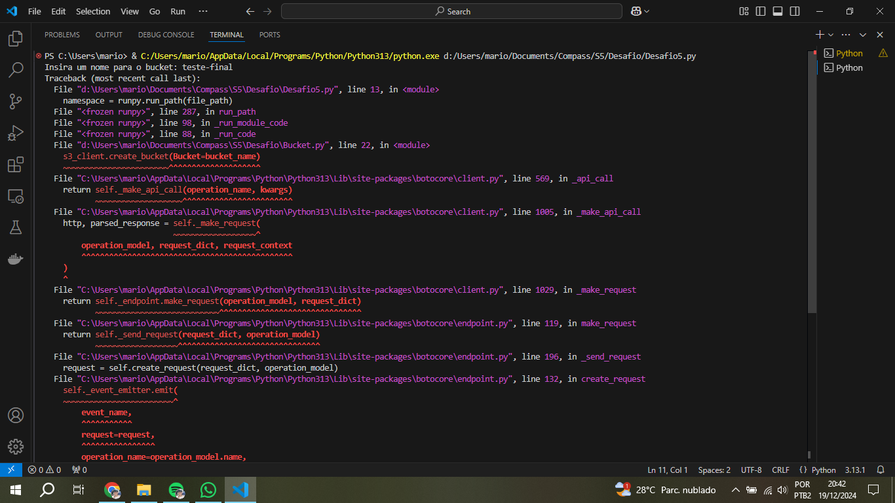

# Desafio
Para a execução deste desafio foi necessário primeiramente escolher uma base de dados, para depois analisá-la com o Pandas no Google Colab para melhor visualização dos dados. Após a análise foi criado o script para criar um bucket no AWS S3 e depois fazer o upload da base de dados, da base de dados filtrada e do resultado da análise dos dados.
Foi analisada uma base de dados do Banco Central do Brasil, contendo registros contábeis, mês a mês, de Janeiro de 2021 a Setembro de 2024.<br> Procurou-se investigar como estavam: 'receitas com correção cambial de operações referenciadas em moedas estrangeiras', por biênio: 2021-2022 e depois 2023-2024<br><br>
Esta base de dados é composta de: Data, Conta(Número da conta), Descrição da conta, Valor Ajustado(saldo) e Origem(a: posição das contas antes da apuração do resultado, d: posição das contas após apuração de resultado).<br>
A base de dados está disponível em: https://dados.gov.br/dados/conjuntos-dados/saldos-contabeis-mensais-bcb<br>
O dicionário de dados está disponível em: https://olinda.bcb.gov.br/olinda/servico/Saldos_BCB/versao/v1/documentacao


## Etapas

### Análise dos dados no Google Colab


Acesso ao notebook do Google Colab: https://colab.research.google.com/drive/19OMd3C7PnXGo6Av1zAtSHiJWuel_erAm?usp=sharing

1. Primeiramente foi escolhido uma base de dados, disponível no site acima, na sessão Recursos > Saldos contábeis mensais do BCB > Acessar o recurso. Uma nova guia é aberta no site do BCB, então foi definido data inicial como 01/01/2021 e data final 10/12/2024*, saída: text/csv e depois: Baixar CSV.<br>
*Foram fornecidos dados até 09/2024, data provável da última disponibilização de dados pelo BCB


2. Dado o início da análise dos dados a partir do Google Colab, importando o arquivo CSV, salvando-o em um Dataframe e visualizando os primeiros dados a partir de **df.head()**


3. Uma cópia de df é feita para df2, como uma forma de backup, pois em caso de alguma alteração indevida não seria necessário importar o CSV novamente, bastando apenas buscá-lo em **df**. Aqui tem-se o início de alteração na base de dados, renomeando as colunas para que tenham uma aparência melhor
 

4. Renomeação dos dados da coluna 'Descrição da conta', tornando as strings minúsculas com a primeira letra maiúscula


5. Substituindo as vírgulas por pontos nos valores da coluna 'Valor Ajustado', para que os valores possam ser convertidos em **float** e posteriormente poder realizar cálculos com a base de dados. Outros dados das outras colunas também são convertidos para seus devidos tipos 


6. Foram detectados espaços adicionais no campo 'Descrição da conta', então estes são removidos


7. Verificação de valores nulos e duplicados. Constata-se que não há para nenhum dos casos


8. Verificação de como estão a faixa dos valores, para definir posteriormente a melhor forma de apresentar estes dados


9. Verificação de quantos valores são maiores que 0 e menores que 1 milhão. Conclui-se que estes são a minoria dentre as 11054 linhas


10. Organização da disposição dos dados, classificando-os por data


11. Um novo dataframe é criado, copiando df2 para df3 para realizar mudanças significativas. Os números estavam com muitas casas decimais, decidiu-se formatá-los para 2 casas decimais


12. Como os números estavam muito grandes e a maioria é acima de 1 milhão, decidiu-se dividi-los por 1 milhão para serem apresentados de forma melhor. Na coluna Valor Ajustado, foi adicionada a informação de que os números estão na casa dos milhões 


13. A seguinte função foi utilizada para realizar consultas a valores desejados:
```
def conversao(valor):
  if valor <= 1e-12:
    valor_f=valor/1e12
    return f"{valor_f:.3f} trilhões"
  elif valor <= 1e-09:
    valor_f=valor/1e09
    return f"{valor_f:.3f} bilhões"
  elif valor <= 1e-06:
    valor_f=valor/1e06
    return f"{valor_f:.3f} milhões"
  elif valor >= 1e12:
    valor_f=valor/1e12
    return f"{valor_f:.3f} trilhões"
  elif valor >= 1e09:
    valor_f=valor/1e09
    return f"{valor_f:.3f} bilhões"
  elif valor >= 1e06:
    valor_f=valor/1e06
    return f"{valor_f:.3f} milhões"
  else:
    return valor
```

14. Foram realizadas duas consultas de valores, o maior e o menor valor positivo, utilizando a função apresentada acima. Note que os valores foram apresentados da melhor forma possível, porém não seria possível implementá-los diretamente na base de dados por questões de impossibilidade de calcular dados, já que teríamos que obrigatoriamente converter os dados para string ou object


15. Após verificação de contagem de valores entre 'Conta' e 'Descrição da conta', foram constatados que havia casos de mais contas para um determinado tipo de conta, segundo a descrição


16. Neste instante foram exibidos quais tipos de conta tinham mais de uma conta associada


17. Para a análise final, o **df3** foi copiado para o **df4**. A partir deste ponto inicia-se as análises finais, que em um primeiro momento foram executadas por partes, para melhor compreensão no desenvolvimento das análises, e então só no final do desenvolvimento fossem agrupados em uma só saída.<br>
Começando pela primeira função de conversão da coluna 'Origem', convertendo os dados para Category. Há apenas dois tipos: 'd' ou 'a'


18. Foi utilizada uma cláusula que filtra dados usando 2 operadores lógicos: **&** e **==**. Foram selecionadas as contas '87-3' e origem igual a 'd', além de formatar os números de 'Valor ajustado' para 5 casas decimais, pois haviam números pequenos, na casa das centenas de R$


19. Utilizada a primeira função de agregação, group by, para somar os valores ajustados por ano


20. Conversão de series para dataframe. É necessário realizar esta conversão sempre que quiser converter dados de consulta (que se parecem com um dataframe) para um dataframe. Este novo dataframe a partir da consulta anterior chamar-se-ia **resultado**


21. Utilizalçao da segunda função de agregação, sum, para somar os valores ajustados por biênio. Este resultado foi armazenado em um novo dataframe com o nome: **df_resultado_final**


22. Adicionando uma manipulação de string '*' ao 2024, e inserindo uma observação abaixo no dataframe


23. Adicionando uma função de data, inserida ao final do dataframe, informando que até a data atual não há novos dados


### Implementando o código em Python(.py)

24. Para realizar a execução do desafio, foram criados dois arquivos: **Bucket.py** e **Desafio5.py**.<br>
**Bucket.py**: Contém o script para criar um bucket no AWS S3 e enviar a base dados para o serviço em nuvem
**Desafio5.py**: Contém todo o script da análise, implementa funções para fazer o download e upload dos arquivos para o AWS S3, além de integrar o script **Bucket.py** no início da execução, para que somente um script seja necessário ser executado.

### Descrição do Bucket.py

25. No início do código deve-se importar as bibliotecas OS e Boto3
```
import boto3
import os
```

26. Posteriormente, adicionar as variáveis para acessá-las localmente e ter acesso às credenciais da conta AWS
```
# Definição das variáveis para acessar as credenciais
aws_access_key_id = os.environ.get('AWS_ACCESS_KEY_ID')
aws_secret_access_key = os.environ.get('AWS_SECRET_ACCESS_KEY')
aws_session_token = os.environ.get('AWS_SESSION_TOKEN')
aws_default_region = os.environ.get('AWS_DEFAULT_REGION')

# Criar um cliente S3
s3_client = boto3.client(
    's3',
    aws_access_key_id=aws_access_key_id,
    aws_secret_access_key=aws_secret_access_key,
    aws_session_token=aws_session_token,
    region_name=aws_default_region
)
```

27. Introduzir um nome para o bucket que será criado e criá-lo através do s3_client
```
# Nome do bucket a ser criado
bucket_name = input('Insira um nome para o bucket: ') # O nome deve ser único no mundo
# Criar o bucket
s3_client.create_bucket(Bucket=bucket_name)
print(f'Bucket {bucket_name} criado com sucesso!')
```

28. A partir desta sessão, temos a localização do arquivo para enviar ao bucket recém-criado
```
# Alterar o diretorio de trabalho do os, para que o script seja executável em qualquer máquina, desde que os arquivos permaneçam no mesmo diretório
diretorio_atual = os.path.dirname(os.path.abspath(__file__))
os.chdir(diretorio_atual)
print(f"Diretório atual: {os.getcwd()}")

# Enviar o arquivo
file_name='Saldos_BCB.csv'
s3_file_name='Saldos_BCB.csv'
s3_client=boto3.client('s3', region_name='us-east-1')
```

29. Enviar o arquivo para o bucket, com tratamento de erros, em casa de falha de envio ou arquivo não encontrado
```
# Carregar o arquivo para o bucket
try:
    s3_client.upload_file(file_name, bucket_name, s3_file_name)
    print(f"Arquivo '{file_name}' carregado com sucesso para o bucket '{bucket_name}' como '{s3_file_name}'")
# Tratamento do erro
except Exception as e:
    print(f"Erro ao criar o bucket ou carregar arquivo: {e}")
    if os.path.exists(f'{file_name}'):
        print("O arquivo existe!")
    else:
        print("Arquivo não encontrado.")
```

30. Apagar o arquivo local, pois posteriormente ele será baixado do bucket para análise dos dados
```
# Apagar o arquivo local: 'Saldos_BCB.csv'
if os.path.exists(file_name):
    os.remove(file_name)
    print('O arquivo foi apagado com sucesso!')
else:
    print('O arquivo nao existe.')
```
### Descrição do Desafio5.py

31. No início do script é necessário importar as bibliotecas: Pandas, Datetime, Runpy, OS e Boto3
```
import pandas as pd
from datetime import datetime
import runpy
import os
import boto3
```

32. Configurar o OS para o diretório dos scripts .py que estão sendo executados
```
## Configurando o OS para o diretório dos arquivos e com as credenciais corretas
diretorio_atual = os.path.dirname(os.path.abspath(__file__))
os.chdir(diretorio_atual)
```

33. Importação do script **Bucket.py**. É necessário utilizar a biblioteca OS para realizar a importação do script. A partir da implementação deste código não é mais necessário executar os 2 scripts, sendo necessária a execução apenas de **Desafio5.py**
```
# Importando o script 'Bucket.py'
file_path = os.path.join(os.path.dirname(__file__), "Bucket.py")
namespace = runpy.run_path(file_path)
```

34. Nesta seção do script são configuradas as variáveis para acesso às credenciais da conta AWS, da mesma forma como foi mostrado na **etapa 26**

#### A partir daqui serão exibidos apenas os passos para download e upload dos arquivos para o AWS S3. O restante da programação do script é idêntico aos passos executados no Google Colab, com exceção da várias exibições de dataframes

35. Nesta etapa é necessário definir algumas variáveis para obtê-las a partir dos valores inseridos no script **Bucket.py**. Estas variáveis são: nome do bucket, nome do arquivo que está no S3 e nome do arquivo que será salvo localmente, que é igual ao que está armazenado no S3
```
# Definindo as variáveis
bucket_name= namespace.get('bucket_name')
s3_file_name = namespace.get('s3_file_name')  # Caminho do arquivo no S3
local_file_name = s3_file_name  # Caminho para onde o arquivo será baixado
```

36. O arquivo que está no S3 é baixado através dos seguintes comandos:
```
# Baixar o arquivo do S3 para o diretório local
try:
    s3_client.download_file(bucket_name, s3_file_name, local_file_name)
    print(f"Arquivo '{s3_file_name}' baixado com sucesso para '{local_file_name}'")
except Exception as e:
    print(f"Erro ao baixar o arquivo: {e}")
```

37. A seguinte função foi criada para fazer upload dos arquivos para o S3:
```
## Função para exportar o Database para o S3
def upload_db(nome_arq):
    file_name=nome_arq
    s3_file_name=nome_arq
    try:
        # Carregar o arquivo para o bucket
        s3_client.upload_file(file_name, bucket_name, s3_file_name)
        print(f"Arquivo '{file_name}' carregado com sucesso para o bucket '{bucket_name}' como '{s3_file_name}'")
        # Tratamento de erros
    except Exception as e:
        print(f"Erro ao criar o bucket ou carregar arquivo: {e}")
        # Verificando se o arquivo foi encontrado
        if os.path.exists(f'{nome_arq}.csv'):
            print("O arquivo existe!")
        else:
            print("Arquivo não encontrado.")
```

38. Toda vez que deseja-se enviar um arquivo para o S3, a função é chamada:
```
# Chama a função para fazer o upload do arquivo para o S3
upload_db(nome_arquivo)
```

39. Toda vez que deseja-se converter um dataframe para um .csv, são realizados os seguintes comandos:
```
# Convertendo o dataframe 'resultado_final' para um csv
nome_arquivo=input("Digite o nome do segundo arquivo, sem extensão, que será salvo localmente e no bucket: ")
nome_arquivo=f'{nome_arquivo}.csv'
df_resultado_final.to_csv(nome_arquivo, index=False, encoding='ISO-8859-1')
```
É necessário definir o encoding como **ISO-8859-1** para que os caracteres sejam legíveis

40. Por último foram feitos os uploads do dataframe de resultado no final, junto dos 2 scripts python:
```
# Chamada da função para salvar o arquivo no S3
upload_db(nome_arquivo)

# Upload dos scripts para o bucket no S3
nome_script1='Bucket.py'
nome_script2='Desafio5.py'
upload_db(nome_script1)
upload_db(nome_script2)
```

41. Após terminar de desenvolver todos os scripts, foram realizados testes de conexão ao AWS S3. Coloca-se as credenciais no terminal do VScode e depois é executado o comando para listar os buckets do AWS S3


### Execução

[Markdown de execução do desafio ](Execucao.md)


## Erros e problemas

1. O primeiro erro aconteceu ao descobrir que resultados de consulta precisam ser convertidos em dataframe


2. Vários erros aconteceram até encontrar a melhor forma de definir as credenciais. Entre eles erros ao criar bucket, ou ao tentar enviar um arquivo



3. Erros aconteceram ao tentar fazer o upload do arquivo local. Para corrigir este erro foi necessário o uso do método que define o caminho local, da biblioteca OS
