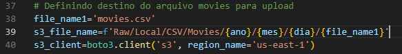
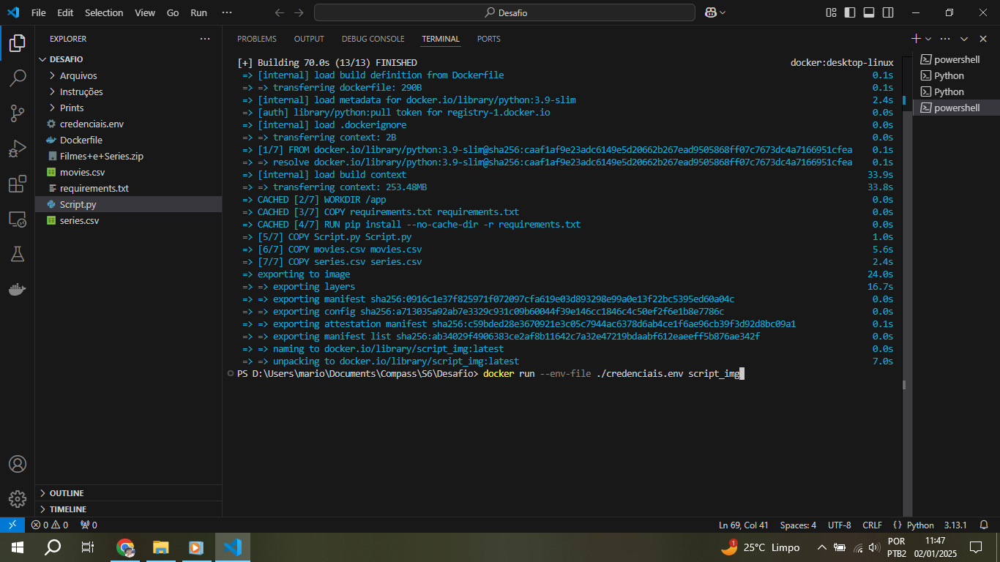
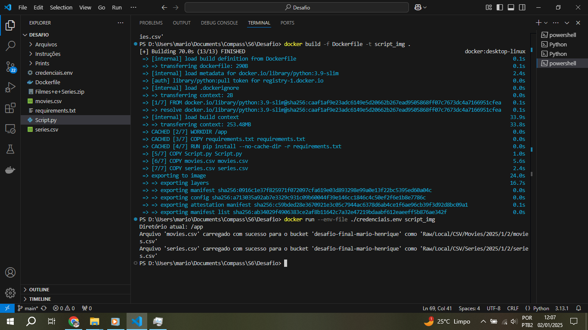
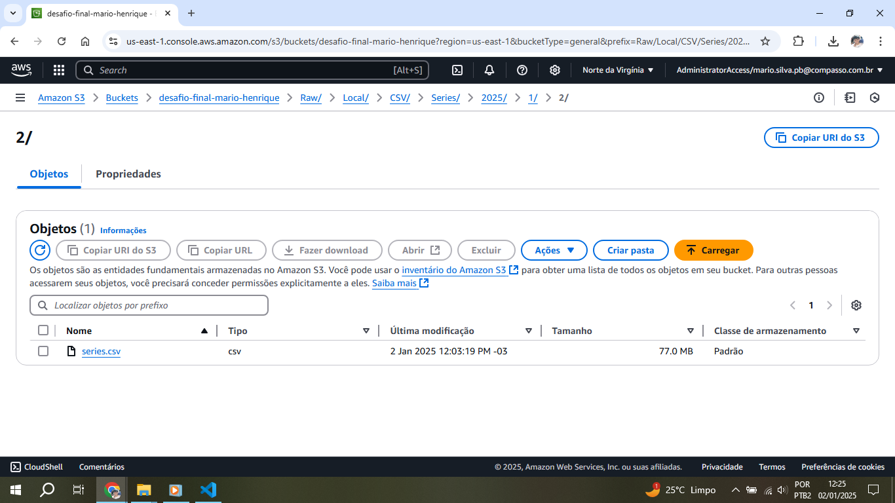

# Instruções

Nesta Sprint foi realizada a primeira etapa do desafio final: upload dos arquivos CSV sem tratamento para um Bucket na AWS. Também foram executados exercícios para a prática dos serviços AWS.<br>

## Resumo

**Amazon Athena:** Como criar bancos de dados e executar consultas

**AWS Lambda:** Como criar e executar funções

**Docker:** Como copiar arquivos e instalar bibliotecas

# Certificados

[Introdução ao Amazon Athena](certificados/Amazon-Athena.pdf)

[Amazon EMR Getting Started](certificados/Amazon-EMR.pdf)

[Amazon Redshift Getting Started](certificados/Amazon-Redshift.pdf)

[Noções básicas de Analytics na AWS - Parte 1](certificados/Analytics1.pdf)

[Fundamentos de Analytics na AWS - Parte 2](certificados/Analytics2.pdf)

[AWS Glue Getting Started](certificados/AWS-Glue.pdf)

[Melhores práticas para Data Warehousing com Amazon Redshift](certificados/DWAmazon-Redshift.pdf)

[Amazon Quicksight - Getting Started](certificados/QuickSight.pdf)

[Serverless Analytics](certificados/Serverless-Analytics.pdf)


# Exercícios

[Pasta Exercicios](exercicios/)

Exercício 1 - Lab AWS S3


Link para o endpoint do bucket: http://s6-exercicio01.s3-website-us-east-1.amazonaws.com

Exercicio 2 - Lab AWS Athena


Código da consulta utilizada:
```
WITH Decadas AS (
    SELECT 
        Nome,
        Sexo,
        (Ano / 10) * 10 AS Decada,  -- Cálculo da Década
        SUM(Total) AS Total_usos
    FROM nomes
    WHERE Ano >= 1950
    GROUP BY Nome, Sexo, (Ano / 10) * 10
),
TopNomes AS (
    SELECT 
        Nome,
        Sexo,
        Decada,
        Total_usos,
        ROW_NUMBER() OVER (PARTITION BY Decada ORDER BY Total_usos DESC) AS rank
    FROM Decadas
)
SELECT 
    Decada,
    Sexo,
    Nome,
    Total_usos
FROM TopNomes
WHERE rank <= 3
ORDER BY Decada, rank;
```
CSV com os resultados:
[Resultados](exercicios/Ex2-Resultados.csv)

Exercicio 3 - Lab AWS Lambda


## Apresentação do desafio

[Desafio](desafio/README.md)

## Evidências

[Arquivos do Desafio](desafio/)

Códigos do Script em Python:
<br>
<br>
<br>
<br>
<br>
<br>
<br>
<br>


Código do arquivo Dockerfile


Construindo a imagem


Executando e construindo um novo container com a imagem criada



Arquivos salvos no Bucket na AWS S3



Erro de credenciais não localizadas
