# Desafio
Para a execução deste desafio foi necessário primeiramente definir as questões sobre o que analisar a partir dos dados fornecidos, para que depois fossem executadas as tarefas de upload dos dados brutos para o Bucket no AWS S3

## Etapas

### Definição dos questionamentos

1- Qual foi o ano de lançamento em que os filmes/series tiveram a maior nota média?
2- Qual ator teve o filme/série com a maior nota média?
3- Qual foi o filme mais votado e sua nota?
4- O ator que teve o filme/série com a maior nota média atuou em quais filmes/séries?
5- O filmes que tem mais de 120 minutos de duração tem nota média maior que os filmes menores de 120 minutos?
6- As series com mais de 2 anos de duração possuem nota média maior que as séries que tem 2 anos ou menos de duração?

### Códigos do desafio

1. Primeiramente, foi feito o script em Python para enviar os arquivos brutos para o AWS S3. Primeiro importa-se as bibliotecas que serão utilizadas: Boto3, OS e Datetime
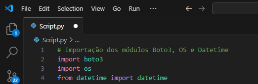

2. Definição das variáveis de ambiente, utilizado a biblioteca Boto3
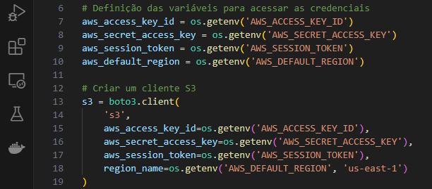 

3. Alteração do diretório de trabalho do OS, para que encontre os arquivos para upload
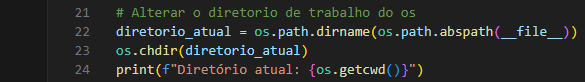

4. Utilizando a biblioteca Datetime, define-se a data atual em uma variável e depois separa-se esta data em dia, mês e ano. Isto foi utilizado para criar pastas no S3 com a data atual de upload dos arquivos brutos
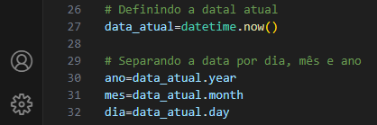

5. Definição do nome do Bucket para onde os arquivos serão enviados
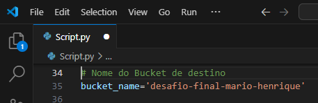

6. Definição das variáveis para o upload do primeiro arquivo: **movies**
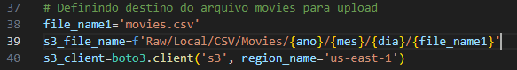

7. Upload do primeiro arquivo e tratamento de erros em caso de falha no upload
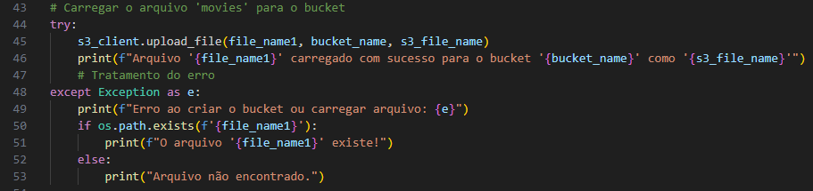

8. Definição das varia´veis para o upload do segundo arquivo: **series**
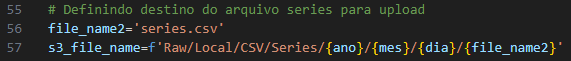

9. Upload do segundo arquivo e tratamento de erros em caso de falha no upload
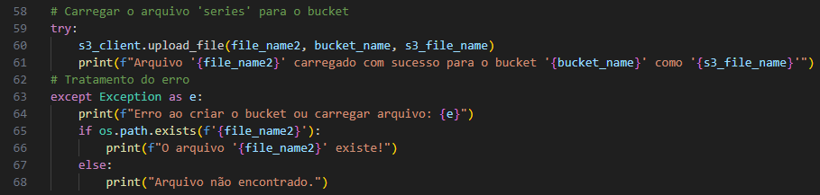

10. Arquivo dockerfile, para criação de uma imagem, que executa as seguintes tarefas: Instala bibliotecas necessárias, copia os arquivos CSV para o container e executa o script em python
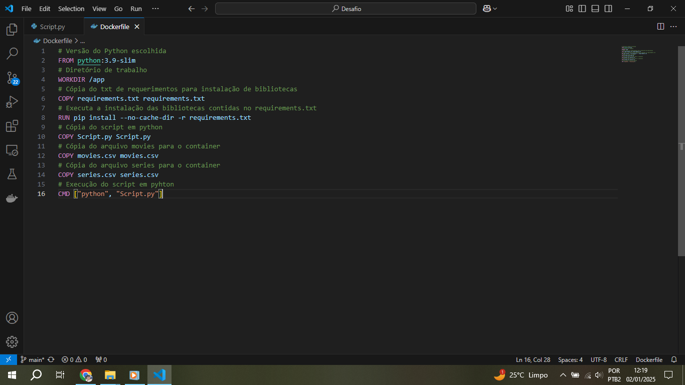

### Execução do desafio

11. Primeiro é construída a imagem através do arquivo Dockerfile
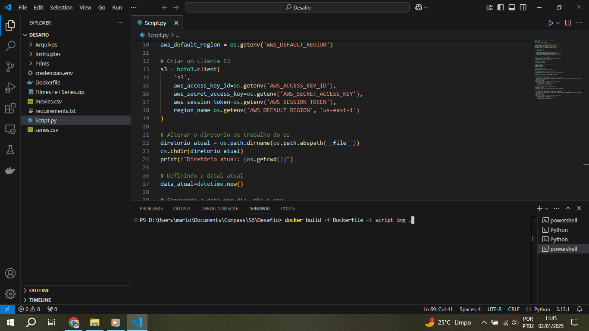
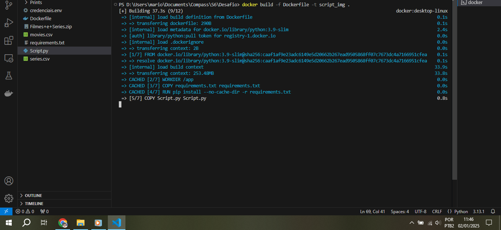

12. Depois é criado e executado um container para execução do script, ao mesmo tempo em que as credenciais são definidas como variáveis de ambiente através do arquivo .env. Os arquivos finalmente são carregados no S3
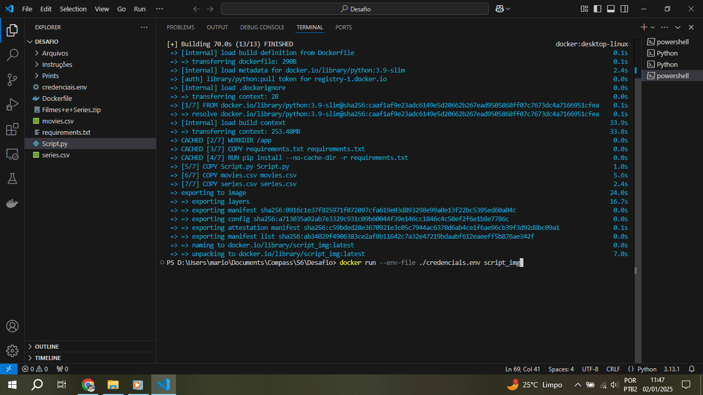
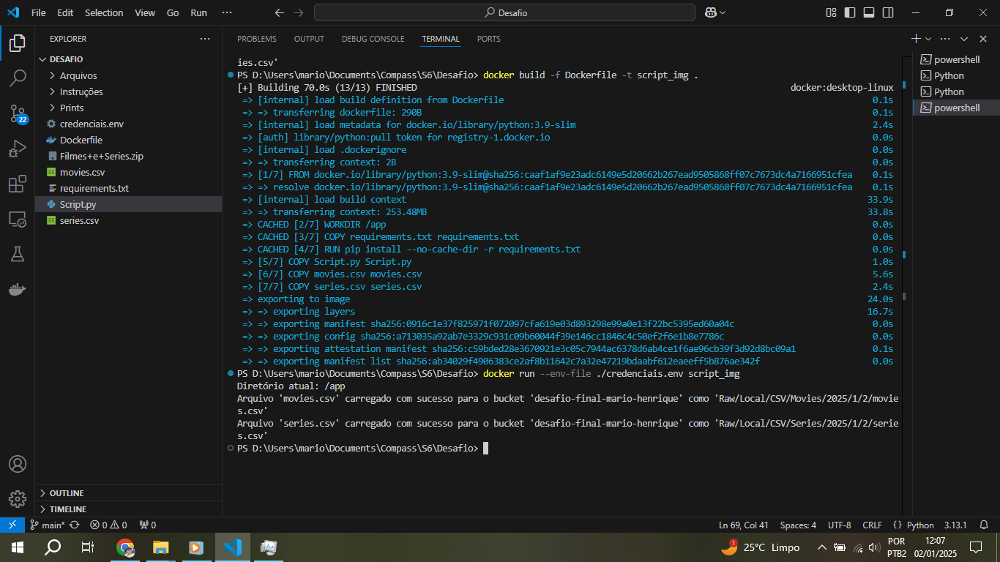

13. Arquivos carregados no console do AWS S3
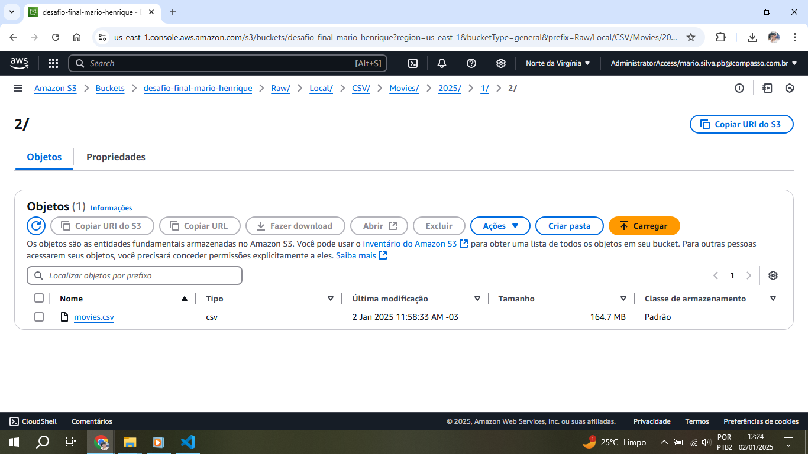
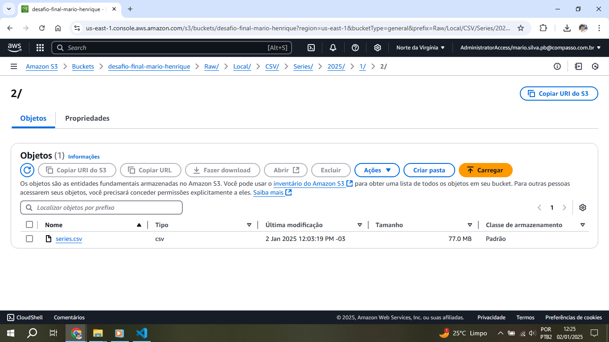

## Erros e problemas

1. Houveram problemas ao tentar executar o script com as variáveis de ambiente para definir as credenciais. Então foi criado o método de criar o arquivo .env para ser executado assim que fosse criado e executado o container com a imagem requerida
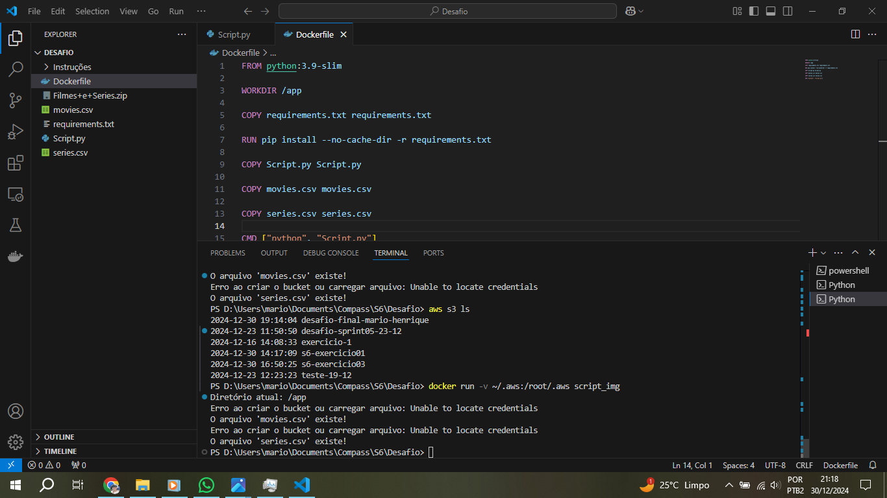