# Desafio
O desafio foi baseado em obter novos dados de filmes, a partir das IDS disponíveis no arquivo CSV fornecido. Não foi necessário obter novos dados para as séries, pois o conteúdo disponível no CSV fornecido supre as necessidades dos dados requeridos. 
Para a execução deste desafio foi utilizado o serviço **Lambda** da AWS

## Etapas
1- Testes locais para obter ids específicas de filmes e seus respectivos dados 
2- Testes locais com um script mais complexo, obtendo dados a partir das IDs constantes no CSV: Movies 
3- Execução do script na AWS Lambda

## Tema da análise

**Análise de métricas dos filmes e séries e o impacto destas nas notas de avaliação e arrecadação de bilheteria**

Questionamentos: 
1- Qual foi o ano de lançamento em que os filmes tiveram a maior nota média? 
2- Qual foi o ano de lançamento em que as séries tiveram a maior nota média? 
3- Qual ator teve o filme com a maior nota média? 
4- O ator que teve o filme com a maior nota média atuou em quais filmes? Quais foram as notas desses filmes? 
5- Os filmes que tem mais de 120 minutos de duração tem nota média maior que os filmes menores de 120 minutos? 
6- As series com mais de 2 anos de duração possuem nota média maior que as séries que tem 2 anos ou menos de duração? 
7- Quais foram os 10 filmes com maior arrecadação de bilheteria e a sua lucratividade em relação ao orçamento no últimos 10 anos? 
8- Os filmes com mais votos dos últimos 10 anos tem maior orçamento em comparação com outros?

### Primeiros testes
1. Primeiramente foram executados testes no Google Collab para ver como a API responde e a forma dos dados fornecidos

2. Posteriormente, foi criado um script para obter dados dos filmes

 

### Desenvolvimento do código local

3. Um novo código foi desenvolvido localmente para testar a obtenção dos dados. Este código é ligeiramente mais simples que o necessário para ser executado na AWS Lambda. Mais detalhes sobre o código serão detalhados na seção a seguir.  Pode-se visualizar o código no link:
[Código](../desafio/Script_Local.py) 
E sua execução:

### Desenvolvimento do código para a AWS

O código pode ser visto a seguir:
[Código para AWS](../desafio/Script_AWS.py) 

4. O código foi todo modularizado com funções, algumas assíncronas para processar as tarefas mais rapidamente. Nesta primeira seção temos as importações das bibliotecas, obtenção da chave pessoal de API, URL base para consulta, o nome do bucket que será usado e para onde os arquivos serão salvos, inicialização do cliente S3 e limitação do número de requisições da API para 4 operações simultâneas
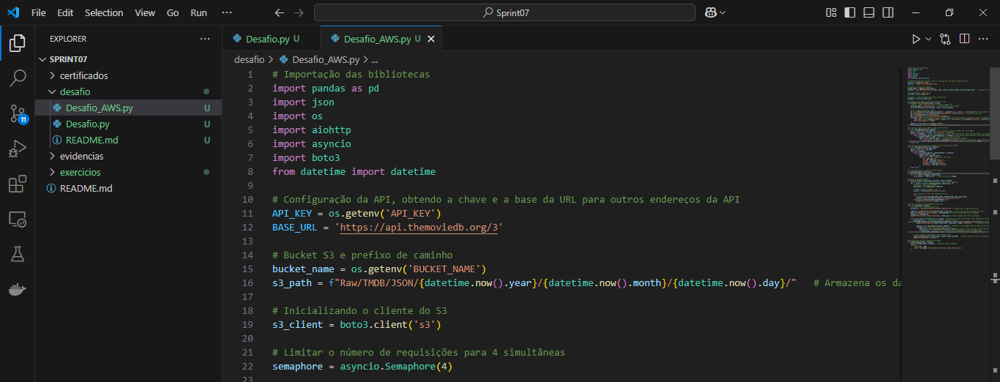

5. A seguir temos a primeira função que processa os dados do CSV armazenado no serviço S3, executando a leitura deste de acordo com os filtros da função
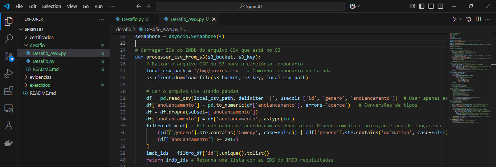

6. Temos a primeira função assíncrona, que busca a ID do filme no TMDB, a partir da ID constante no IMDB

7. Nesta função são buscadas as informações requeridas dos filmes no TMDB e retornadas pela função

8. Esta função divide os dados em lotes menores, neste caso, 100 filmes por arquivo

9. Função para salvar os arquivos no bucket especificado, com informações se foi salvo corretamente ou não
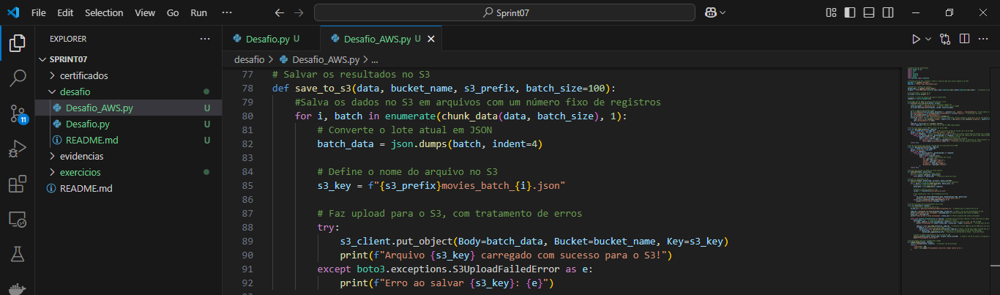

10. Função principal, que chama as outras funções auxiliares. Contendo: caminho para salvar os arquivos no S3, estrutura de dados para salvar informações dos filmes, informações sobre quantas IDS serão processadas e o andamento do processo

11. Função lambda_handler para iniciar a execução do script

### Preparação para executar o script na AWS Lambda

12. Criar uma camada na AWS para executar as bibliotecas requeridas, para isto primeiro foi necessário obter as bibliotecas a partir de um Docker Container, com o seguinte Dockerfile:
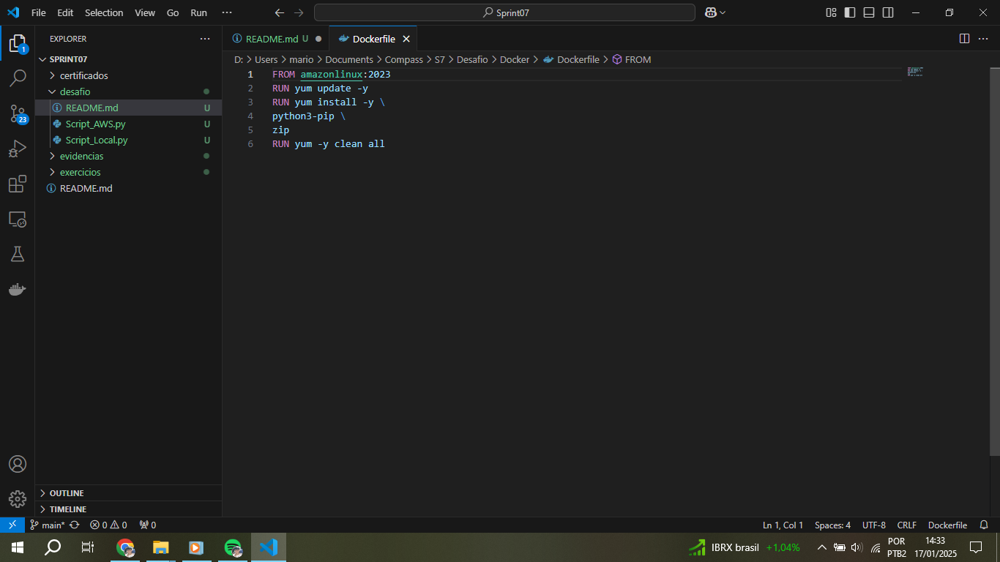

13. Depois foram executados comandos de instalação dentro do container, para obter as bibliotecas: Pandas, aiohttp e boto3. Os seguintes arquivos foram gerados, e depois compactados dentro de uma pasta zip:

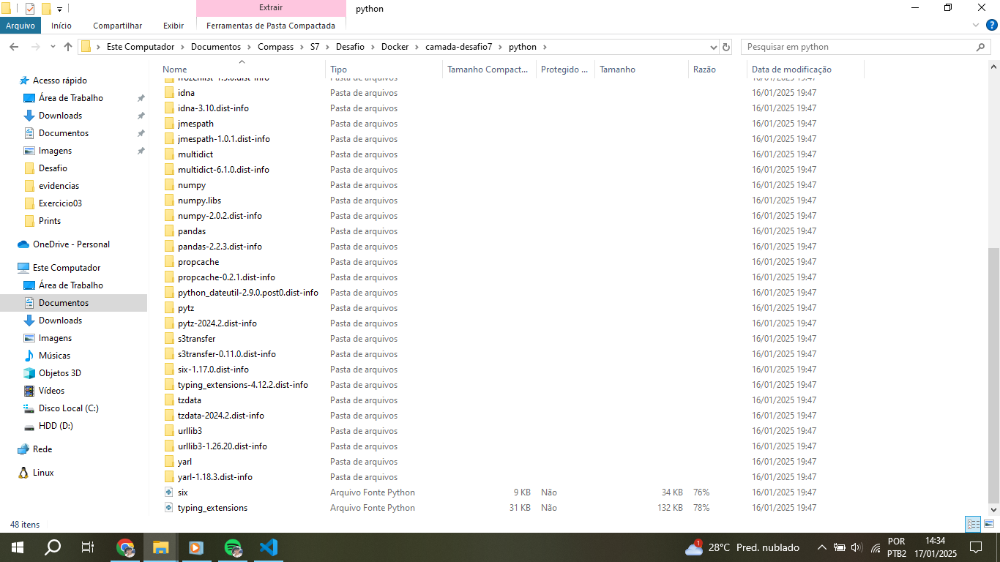

14. Então a camada pode ser criada, para que posteriormente a execução do script tenha sucesso
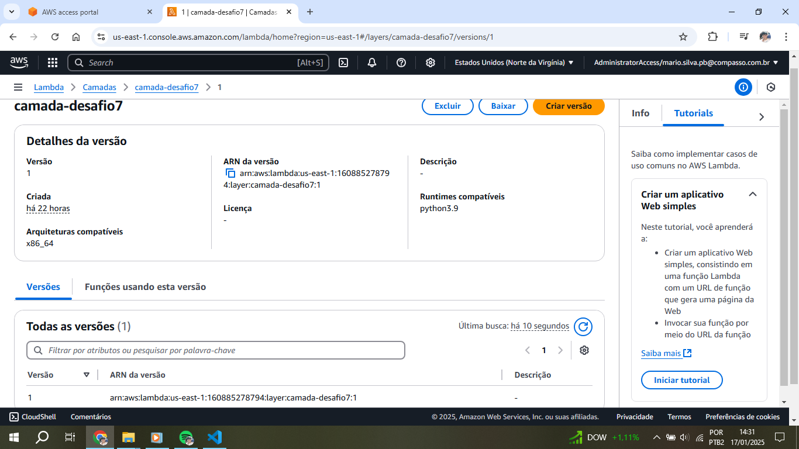

15. Antes da execução do script é necessário ajustar mais algumas configurações, entre elas a de permissão de acesso de leitura e escrita no Bucket definido:
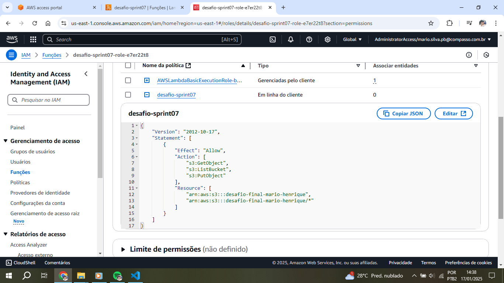

16. Agora pode-se ajustar algumas configurações da função lambda que foi criada, entre estas configurações estão: Seleção da camada a ser utilizada, configuração do tempo de limite de execução para 15 minutos e memória de 2048 MB, e as variáveis de ambiente para acessar a API e para o Bucket
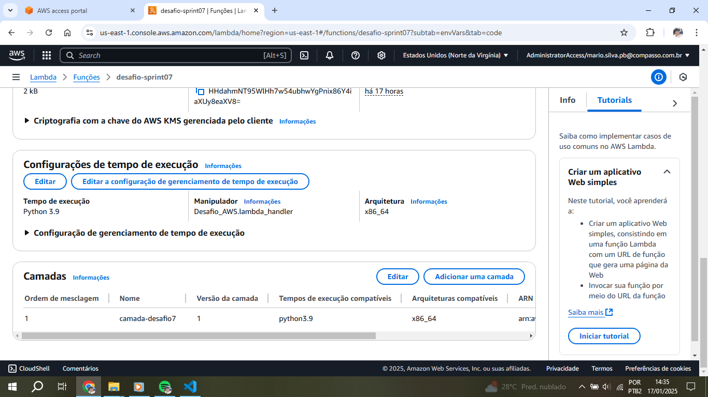

### Resultados

17. Após a execução bem sucedida, pode-se ver a mensagem de sucesso:
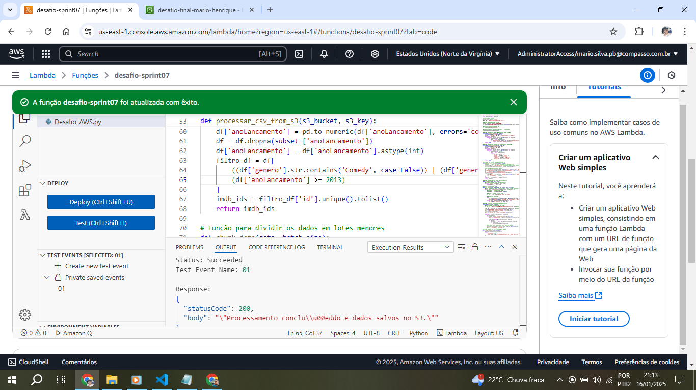

18. Os arquivos salvos no Bucket, ao total foram 183 arquivos, totalizando mais de 18 mil registros para os 10 anos de análise
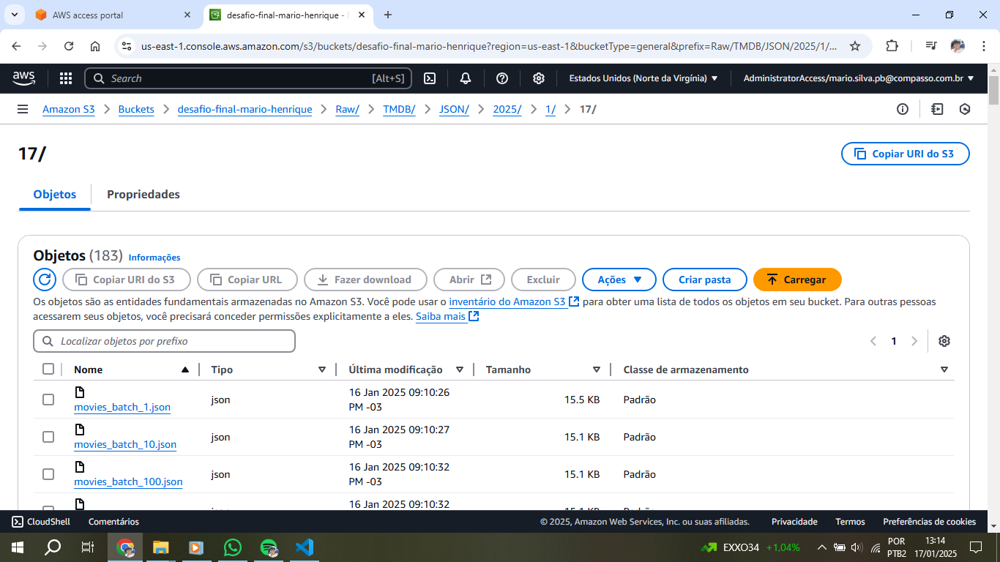

## Erros e problemas

1. Nenhuma ID do csv é correspondente às IDS dos filmes do TMDB, então nenhum filme é coletado

2. Nenhuma ID é encontrada. Foram necessários vários ajustes no código para que este funcionasse adequadamente
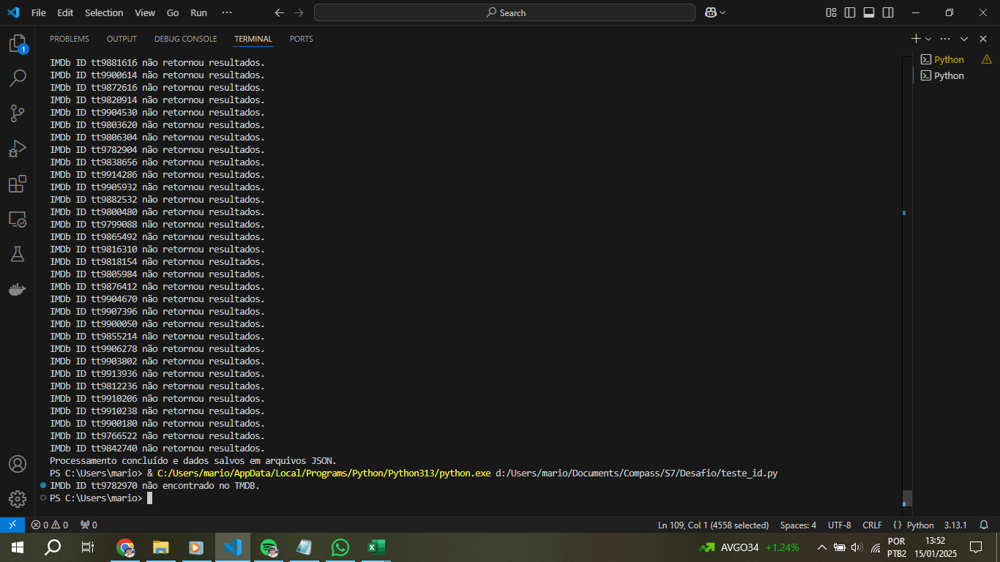

3. Ocorreram vários erros de execução no Lambda, por não adicionar os arquivos nas camadas corretamente. O erro foi usar pip -install no ambiente local do powershell, no lugar de fazer em um container

4. Outro erro ocorreu por não configurar adequadamente o IAM para as permissões de escrita e leitura no Bucket, sendo necessária a correção do JSON de configuração