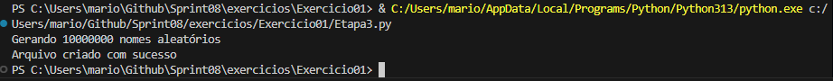
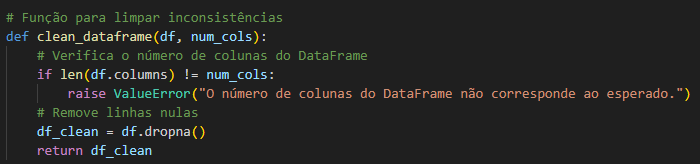
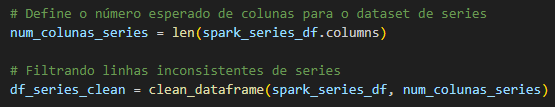
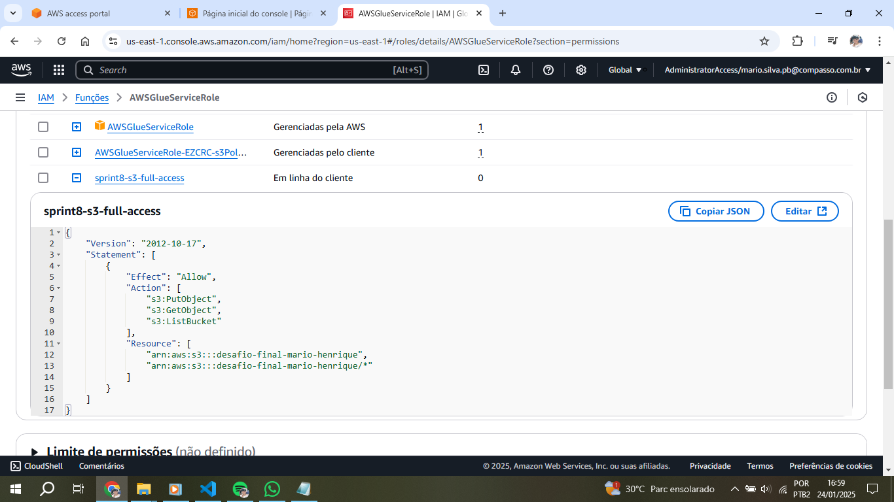
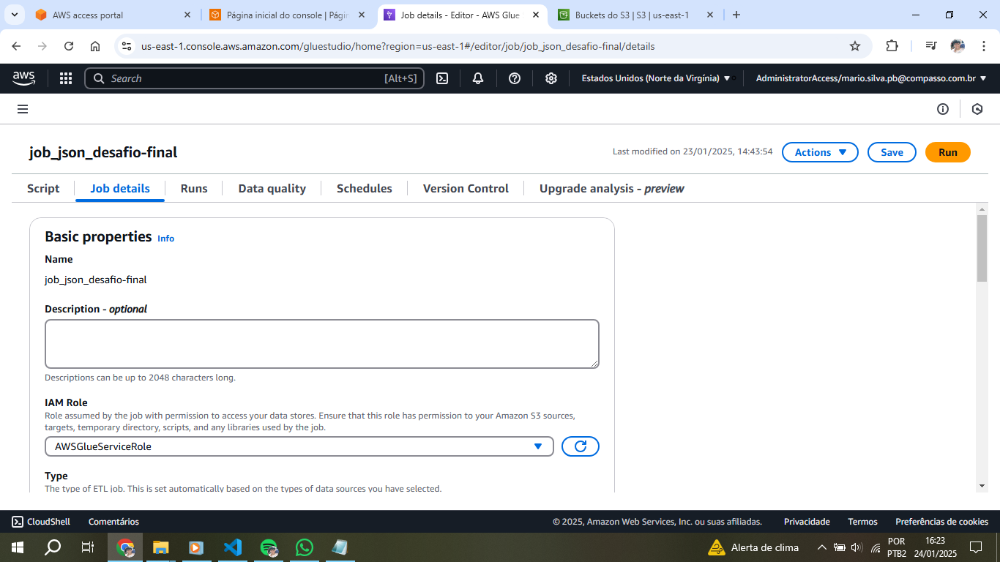

# Instruções

Nesta Sprint foram realizados alguns exercícios no Python e no Spark, com operações referentes a consulta e inserção de dados em dataframes utilizando o Spark SQL.  
Também foi executada a terceira parte do desafio, tratando os dados da camada RAW e enviando-os para a camada TRUSTED, convertendo e limpando os arquivos para o formato parquet.

## Resumo

**AWS Glue:** Utilizar o serviço para executar jobs e criar catálogos de dados

**Amazon Athena:** Consultar dados a partir do catálogo criado

**Apache Spark:** Executar funções de consulta e inserção de dados

**Python:** Executar scripts para criar arquivos de dados

# Exercícios

[Pasta Exercicios](exercicios/)

Exercício 1 - Geração e massa de dados. Dividido em 3 etapas, entre as quais:

Etapa 1 - Criação de uma lista de 250 números aleatórios 
[Código](exercicios/Exercicio01/Etapa1.py)

Etapa 2 - Criação de uma lista contendo 20 animais e geração de um arquivo CSV contendo estes 
[Código](exercicios/Exercicio01/Etapa2.py) 
[Arquivo](exercicios/Exercicio01/animais.csv) 

Etapa 3 - Criação de um arquivo txt contendo 10 milhões de nomes aleatórios 
[Código](exercicios/Exercicio01/Etapa3.py)

O arquivo era pesado para ser carregado no Github (140 MB), então um print do arquivo local foi gerado:

Exercicio 2 - Apache Spark. Utilização do Spark para inserir e consultar dados em dataframe 
[Código](exercicios/Exercicio02/Exercicio02.ipynb)

Exercicio 3 - Exercício TMDB. Obtenção de dados a partir da API do TMDB 

[Código](exercicios/Exercicio03/Exercicio03.py) 

## Apresentação do desafio

[Desafio](desafio/README.md)

## Evidências

[Arquivos do Desafio](desafio/)

Importação das bibliotecas necessárias para executar o código de processamento dos CSVs
 

Parâmetros para execução correta do script, incluindo os paths
 

Definição dos paths de entrada e saída 
 

Função para limpar inconsistências no dataframe
 

Parâmetros para ler o CSV do arquivo movies 
 

Conversão para um dataframe do Spark 
 

Contagem do número de colunas no dataframe e chamada da função
 

Conversão do dataframe movies para dynamic dataframe
 

Conversão de movies para o formato parquet 
 

Parâmetros para ler o CSV do arquivo series 
 

Conversão para um dataframe do Spark 
 

Contagem do número de colunas no dataframe e chamada da função
 

Conversão do dataframe series para dynamic dataframe
 

Conversão de series para o formato parquet e fim do job 
 

Importação das bibliotecas necessárias para executar o código de processamento dos JSONs
 

Parâmetros para execução correta do script, incluindo os paths
 

Definição dos paths de entrada e saída 
 

Parâmetros para ler os arquivos JSON 
 

Conversão para um dataframe do spark 
 

Remoção dos registros com valores duplicados e nulos 
 

Conversão para o formato parquet 
 

Configuração do IAM
 

Configuração do IAM no job Glue para processamento dos CSVs
 

Detalhes da configuração do job Glue 
 

Definição das variáveis para o job
 

Configuração do IAM no job Glue para processamento dos JSONs
 

Detalhes da configuração do job Glue 
 

Definição das variáveis para o job
 

Execução bem sucedida para o job de processamento dos CSVs
 

Execução bem sucedida para o job de processamento dos JSONs
 

Arquivos parquet no bucket para o CSV Movies
 

Arquivos parquet no bucket para o CSV Series
 

Arquivo parquet no bucket para os JSONs
 

Criação do catálogo de dados com o Crawler
 

Dados visualizados no Amazon Athena para movies, series e os JSONs do TMDB

Log de erro ao tentar gravar no bucket especificado

Log de erros na função de contagem de colunas pelo spark

