# Desafio
Este desafio consiste de realizar a 3ª etapa do desafio final, limpar os dados oriundos da camada RAW para a camada TRUSTED. 
Para isso foram criados 2 scripts: 1 para tratar os dados referentes aos CSVs locais: movies e series, e outro script para os dados adquiridos da API do TMDB. 
A execução dos scripts foram feitos através do AWS Glue e posteriormente foi criado um banco de dados no Crawler

## Etapas

### Tema do desafio a ser respondido

**Análise de métricas dos filmes e séries e o impacto destas nas notas de avaliação e arrecadação de bilheteria**

Questionamentos: 
1- Qual foi o ano de lançamento em que os filmes tiveram a maior nota média? 
2- Qual foi o ano de lançamento em que as séries tiveram a maior nota média? 
3- Qual ator teve o filme com a maior nota média? 
4- O ator que teve o filme com a maior nota média atuou em quais filmes? Quais foram as notas desses filmes? 
5- Os filmes que tem mais de 120 minutos de duração tem nota média maior que os filmes menores de 120 minutos? 
6- As series com mais de 2 anos de duração possuem nota média maior que as séries que tem 2 anos ou menos de duração? 
7- Quais foram os 10 filmes com maior arrecadação de bilheteria e a sua lucratividade em relação ao orçamento no últimos 10 anos? 
8- Os filmes com mais votos dos últimos 10 anos tem maior orçamento em comparação com outros?

### Criando o código para os dados dos CSVs movies e series

1. Primeiramente todos os códigos foram desenvolvidos na ambiente local (VSCode), para depois serem colocados no AWS Glue. Nesta etapa é feita a importação das bibliotecas necessárias para executar o código
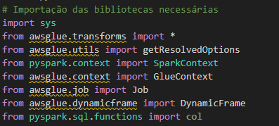 

2. São definidos os parâmetros para execução correta do script, entre eles: Caminhos de entrada dos arquivos e o caminho de saída para os arquivos no formato parquet
 

3. Os caminhos para os arquivos são armazenados em variáveis e após é impresso o caminho de entrada para movies e series
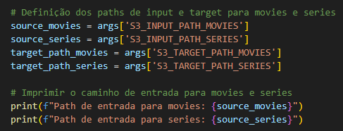 

4. Função para verificar o número de colunas no dataframe e remover as linhas nulas
 

5. Variável para armazenar a leitura do csv movies, contendo os parâmetros necessários
 

6. Conversão do dataframe movies para um dataframe do spark e realizar os procedimentos necessários
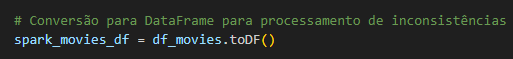 

7. Contagem do número de colunas no dataframe e chamada da função para fazer a limpeza no dataframe
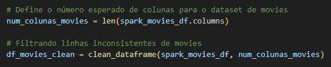 

8. Conversão de volta para o DynamicFrame, para ser convertido para o formato parquet
 

9. Conversão dos dados para o formato parquet, contendo todos os parâmetros necessários
 

10. Variável para armazenar a leitura do csv series, contendo os parâmetros necessários
 

11. Conversão do dataframe series para um dataframe do spark e realizar os procedimentos necessários
 

12. Contagem do número de colunas no dataframe e chamada da função para fazer a limpeza no dataframe
 

13. Conversão de volta para o DynamicFrame, para ser convertido para o formato parquet
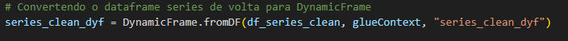 

14. Conversão dos dados para o formato parquet, contendo todos os parâmetros necessários
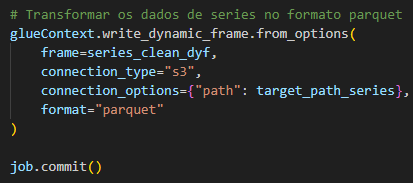 

### Criando o código para os dados JSON vindos do TMDB

15. Importação das bibliotecas para executar o script no AWS Glue 
 

16. Definição dos parâmetros para iniciar o job 
 

17. Definição dos caminhos de entrada e saída dos arquivos 
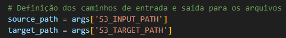 

18. Leitura dos arquivos JSON, de origem da API do TMDB. Armazenamento em um dynamic dataframe 
 

19. Transforma o dynamic dataframe para um dataframe comum, para que possam ser feitos outros procedimentos 
 

20. Remoção dos registros com valores nulos e duplicados 
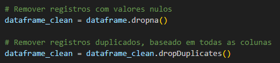 

21. Transforma o dataframe que teve os dados tratados no formato parquet 
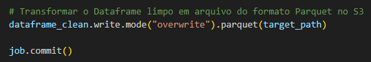 

### Configurações na AWS

22. Utilização do AWS IAM para configurar o acesso de leitura e escrita no bucket para o job dos CSVs locais

23. Configuração do Job para os arquivos CSV locais: movies e series, contendo a função correta para o IAM ter acesso ao bucket

24. Definição das configurações do Job a serem utilizados, tais como versão do Glue, linguagem a ser utilizada, CPU e RAM

25. Definição das variáveis a serem utilizadas, sendo as entradas e saídas para os arquivos movies e series

26. Utilização do AWS IAM para configurar o acesso de leitura e escrita no bucket para o job dos json originados da API do TMDB

27. Definição das configurações do Job a serem utilizados, tais como versão do Glue, linguagem a ser utilizada, CPU e RAM
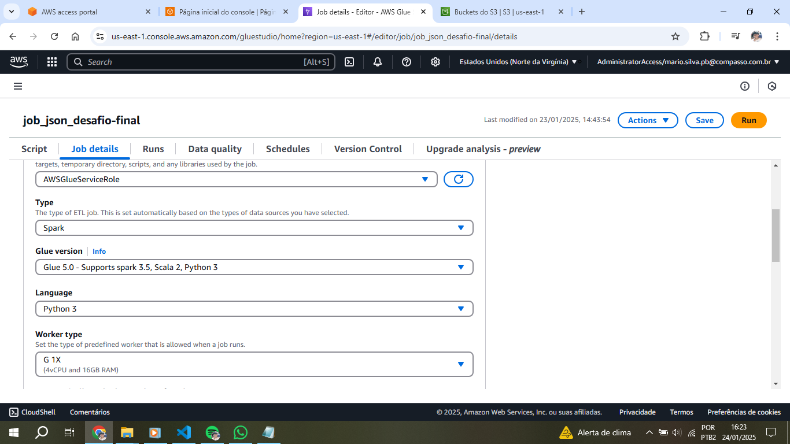

28. Definição das variáveis a serem utilizadas para a entrada e saída dos arquivos JSON
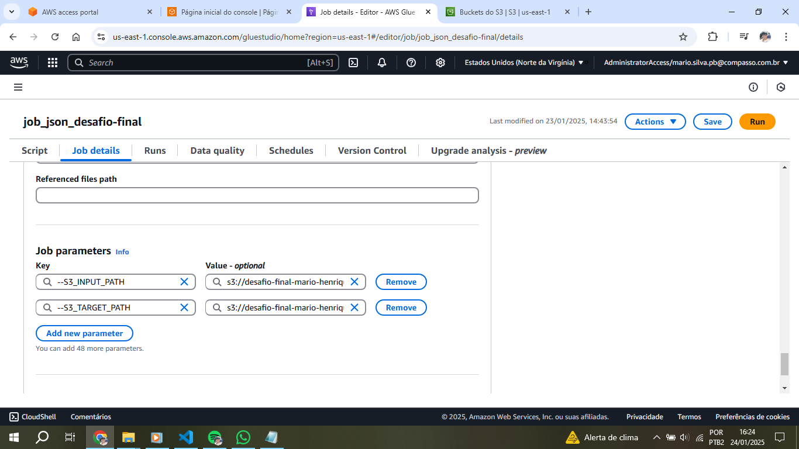

### Execução bem sucedida

29. Execução bem sucedida para o job de processamento dos CSVs

30. Execução bem sucedida para o job de processamento dos JSONs
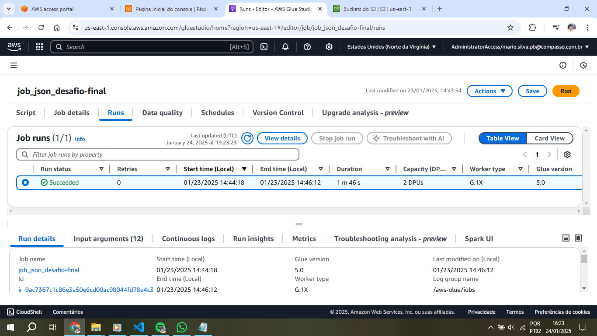

31. Arquivos parquet para movies armazenados corretamente dentro do bucket 

32. Arquivos parquet para series armazenados corretamente dentro do bucket 
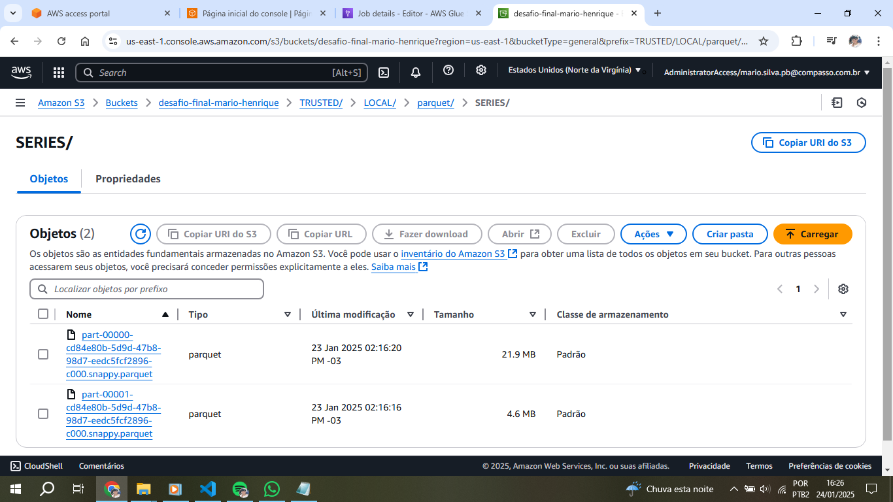

33. Arquivo parquet para os JSONs armazenado corretamente dentro do bucket 
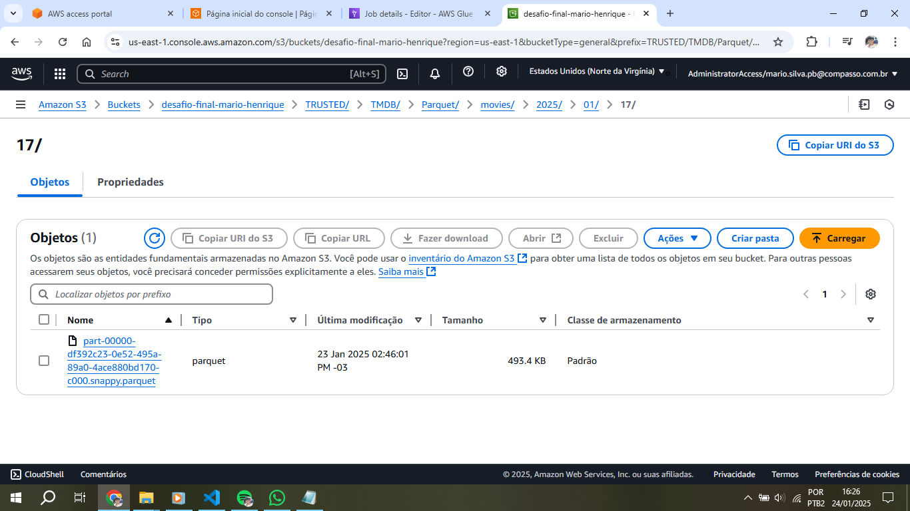

### Criando um Data Catalog

34. Para criar um data catalog, é necessário criar um crawler, que foi identificado como: **desafio-sprint08** 
e conter o caminho para a criação da base de dados, que são os caminhos para os arquivos parquet de movies, 
series e os obtidos a partir do TMDB.
No print a seguir é possível ver que o serviço foi executado com sucesso
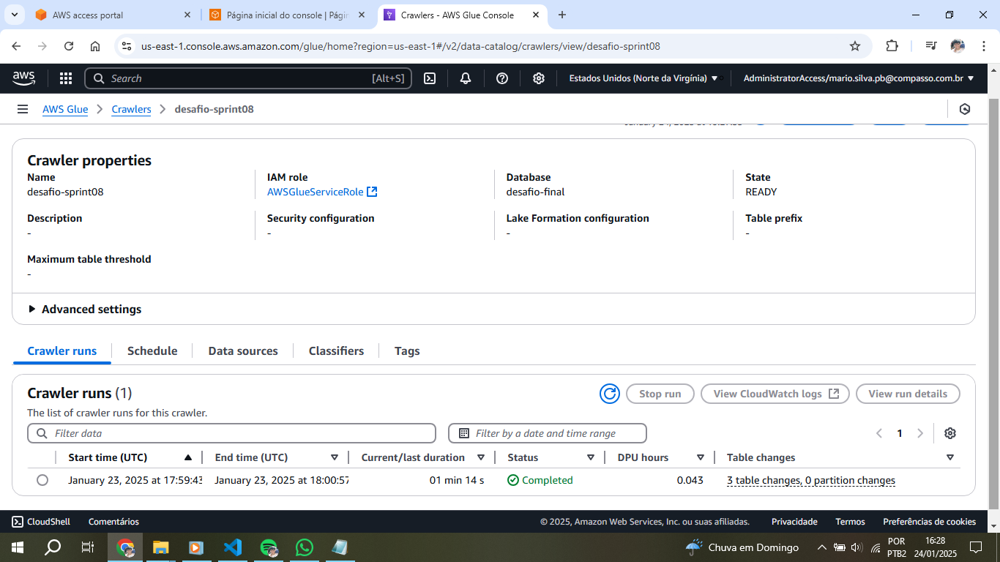

35. Através do Amazon Athena é possível realizar uma consulta simples para visualizar os dados dos 3 arquivos mencionados acima:
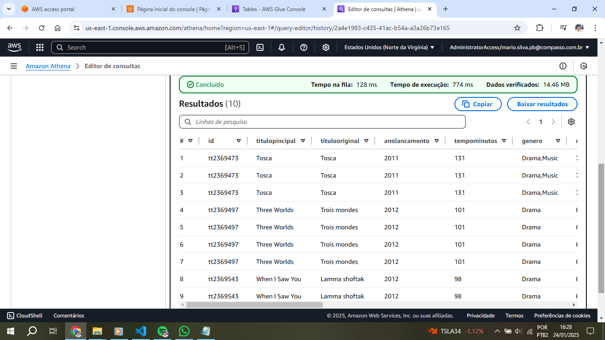
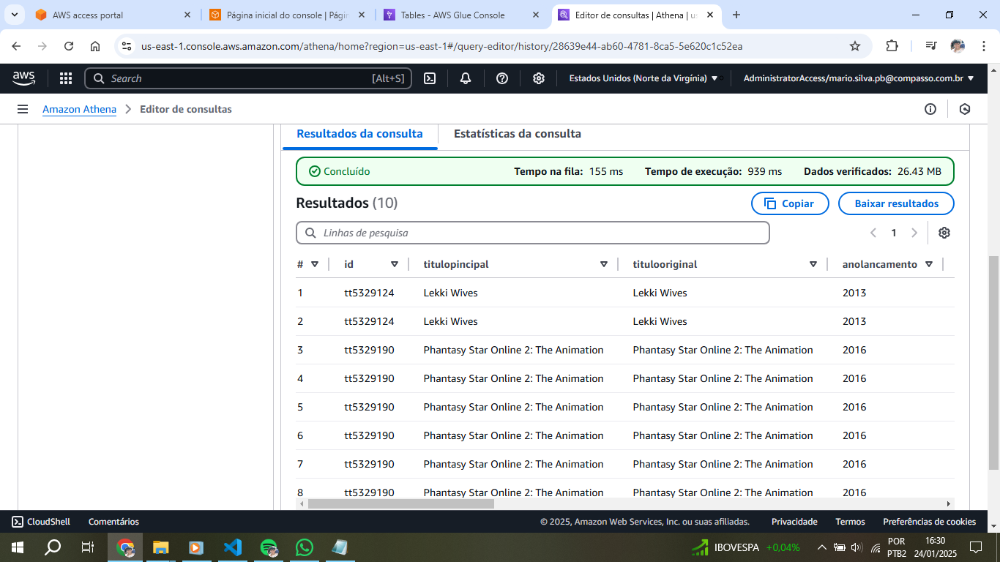
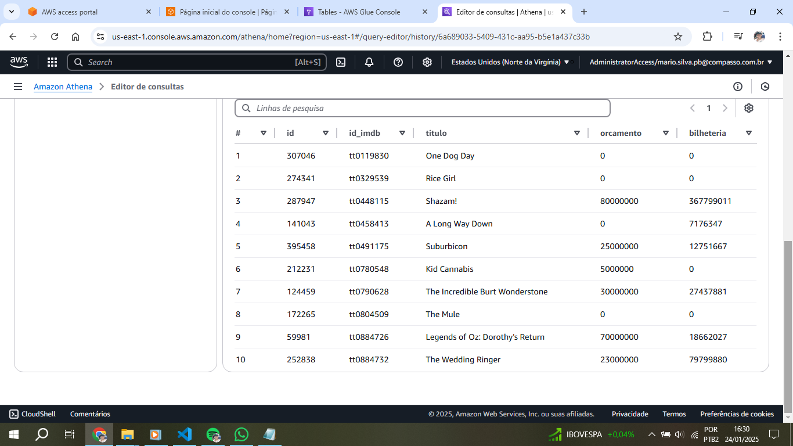

## Erros e problemas

Houveram alguns erros durante as execuções do script para processar os arquivos CSV, como pode-se ver a seguir

1. Através do log de erros no Cloudwatch, é possível ver que houve um erro ao tentar gravar
no bucket especificado. Posteriormente isso foi corrigido alterando as permissões do IAM
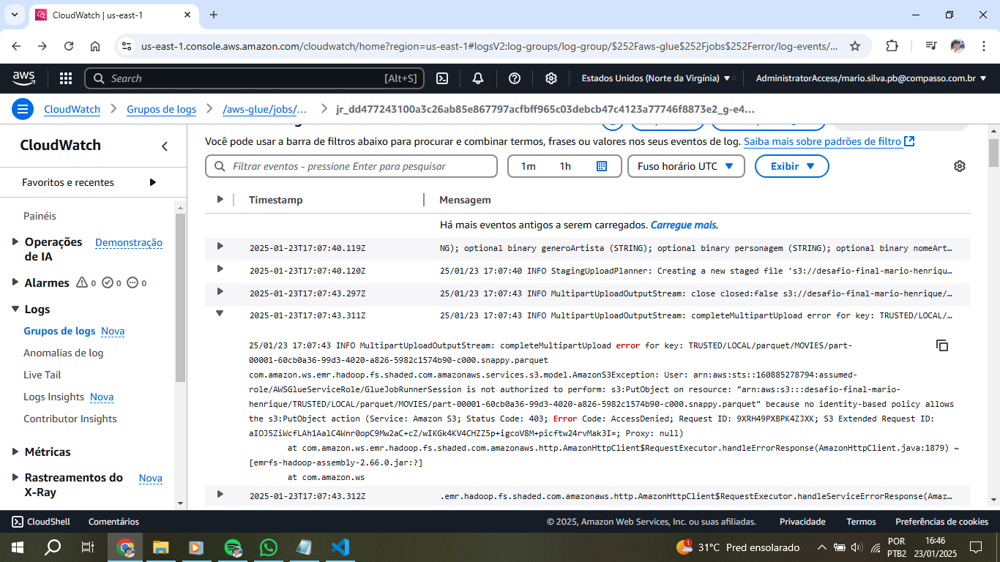

2. Houveram erros na função de contagem de colunas pelo spark. Posteriormente o código foi adaptado e a execução foi bem sucedida

