# Instruções

Nesta Sprint foi realizada...  

## Resumo

**AWS Glue:** Como utilizar o serviço para executar jobs

**AWS Lambda:** Como configurar, criar e executar funções

**Apache Spark:** Como utilizá-lo e executar suas funções

# Exercícios

[Pasta Exercicios](exercicios/)

Exercício 1 - 

Exercicio 2 -  

Exercicio 3 - 

[Código](exercicios/Exercicio02/Ex3.py) 

## Apresentação do desafio

[Desafio](desafio/README.md)

## Evidências

[Arquivos do Desafio](desafio/)

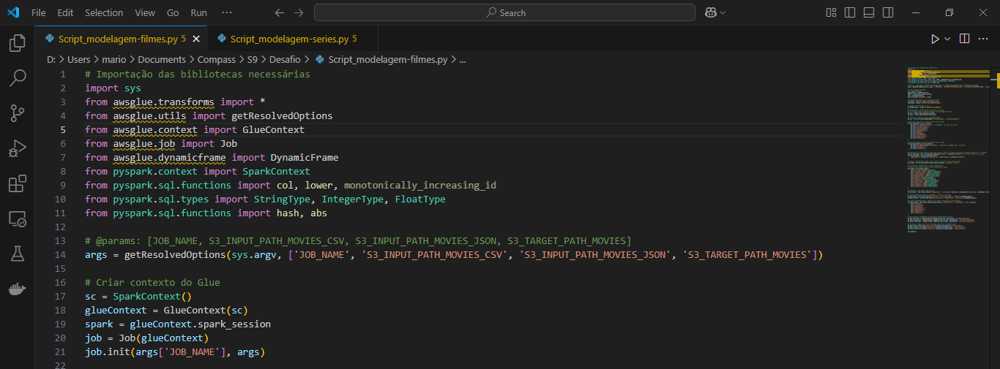

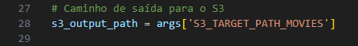

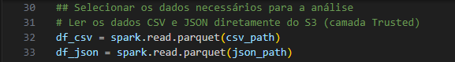

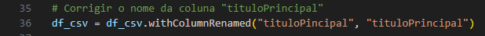

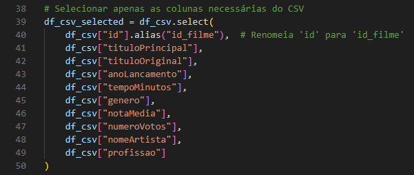

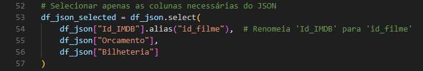

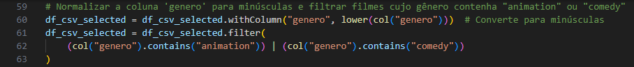

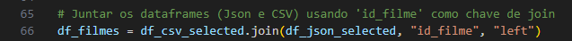

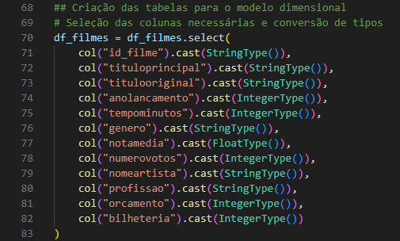

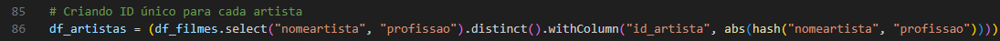

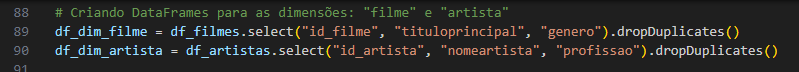

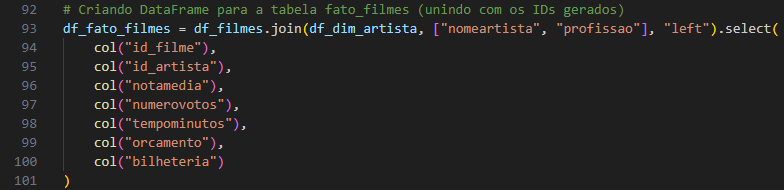

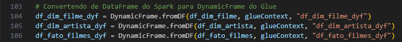
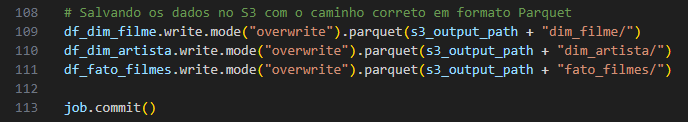

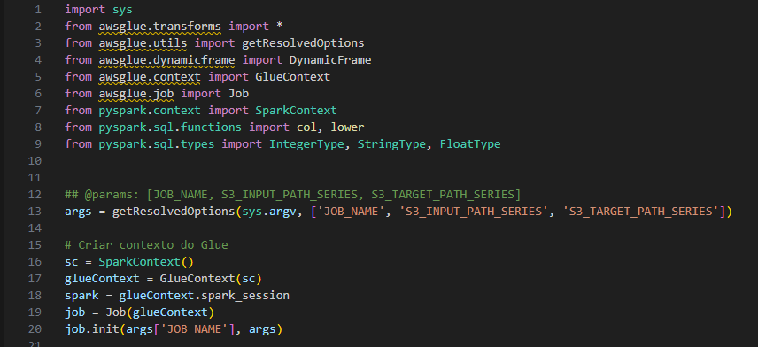

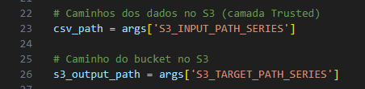

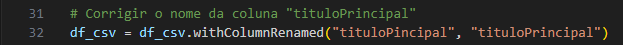
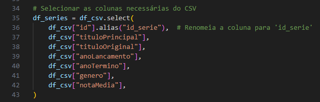

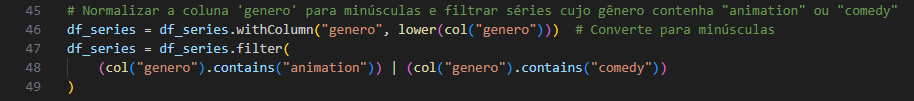

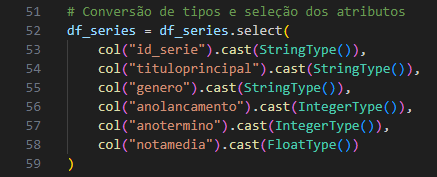

