# Instruções

Nesta Sprint foi realizada a 4ª etapa do desafio final, que consistiu em unir arquivos, limpar dados e criar o modelo dimensional necessário para a análise futura.  

## Resumo

**AWS Glue:** Executar jobs para unir e limpar dados, gerar arquivos

**AWS Glue Data Catalog:** Executar Crawler, criar tabelas

**AWS Athena:** Realizar consultas para visualizar dados

## Apresentação do desafio

[Desafio](desafio/README.md)

## Evidências

[Arquivos do Desafio](desafio/)

Modelagem para filmes 
 

Modelagem para séries 
 

Inicialização do script para modelagem de filmes 
 

Variáveis que contém o caminho dos arquivos na camada Trusted 
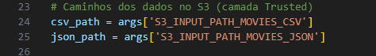 

Variável que contém o caminho para a saída dos arquivos no S3 
 

Leitura dos arquivos parquet do CSV e dos JSONs 
 

Renomeação da coluna TituloPrincipal  
 

Coluna 'id' é renomeada para 'id_filme' para melhor identificação 
 

Seleção das colunas necessárias com origem nos JSONs 
 

Seleção dos gêneros requeridos 
 

Junção dos dataframes 
 

Seleção das colunas necessárias e conversão de tipos de dados 
 

Criação de uma coluna de id para artistas 
 

Criação de dataframes para as dimensões 
 

Criação de dataframe para a fato 
 

Conversão de dataframe spark para dynamic frame do Glue 
 

Salvamento dos dados em parquet no S3 
 

Inicialização do script para modelagem de series 
 

Definição dos caminhos de entrada e saída 
 

Leitura do arquivo csv  
 

Renomeação da coluna TituloPrincipal  
 

Seleção das colunas necessárias do CSV 
 

Seleção dos gêneros requeridos 
 

Seleção e conversão de tipos de dados 
 

Criação do dataframe para a dimensão título 
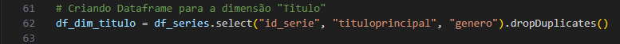 

Criação do dataframe para a tabela fato 
 

Conversão de dataframe spark para dynamic frame do Glue 
 

Salvamento dos dados em parquet no S3 
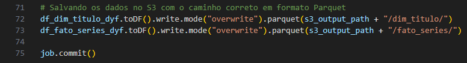 

Script para o job de modelagem dos filmes 
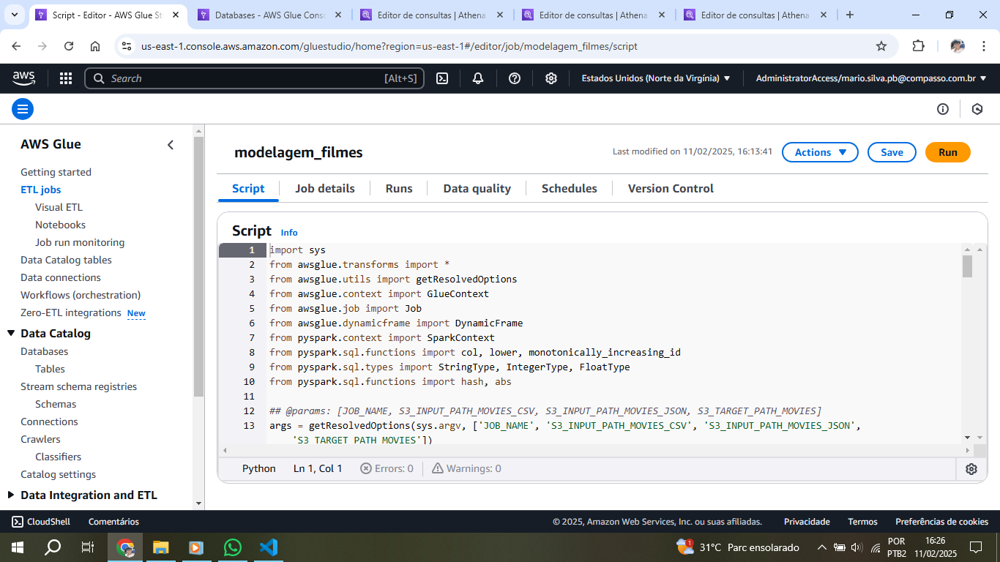 

Configurações para o job 
 
 
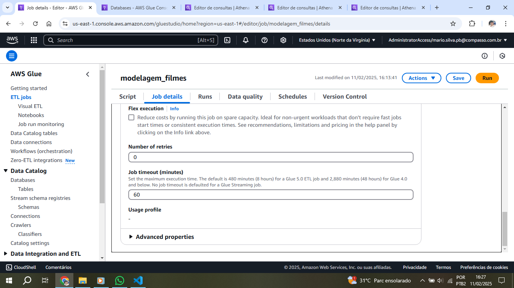 

Definição dos paths de entrada e saída 
 

Execução bem sucedida do job de modelagem dos filmes 
 

Arquivos salvos no S3 no local especificado 
 
 
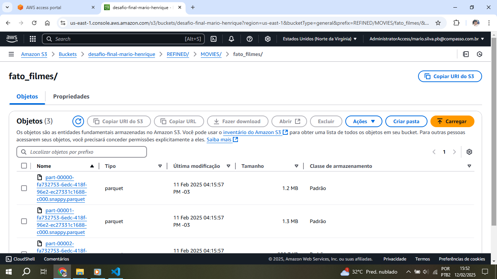 

Script para o job de modelagem das series 
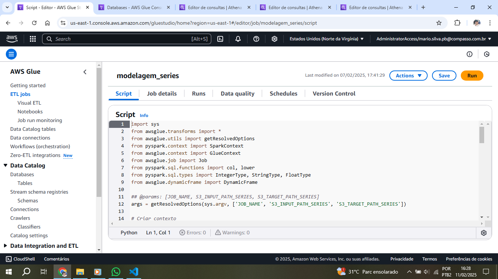 

Configurações para o job 
 
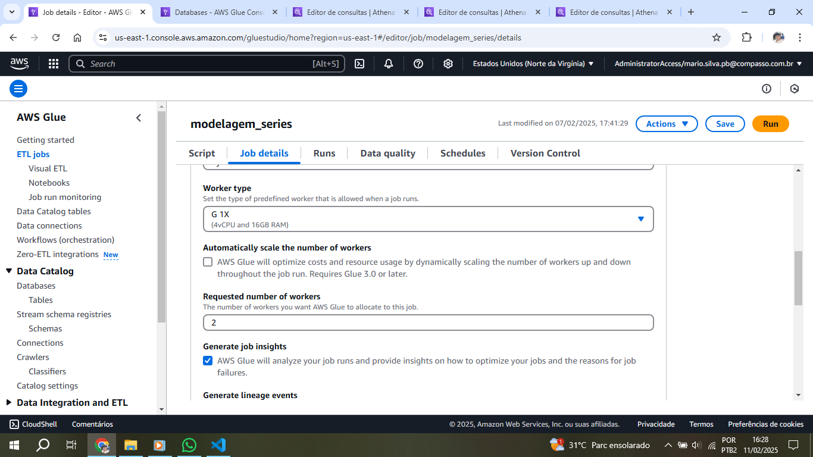 
 

Definição dos paths de entrada e saída 
 

Execução bem sucedida do job de modelagem das series 
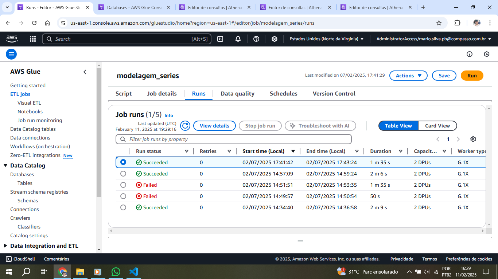 

Arquivos salvos no S3 no local especificado 
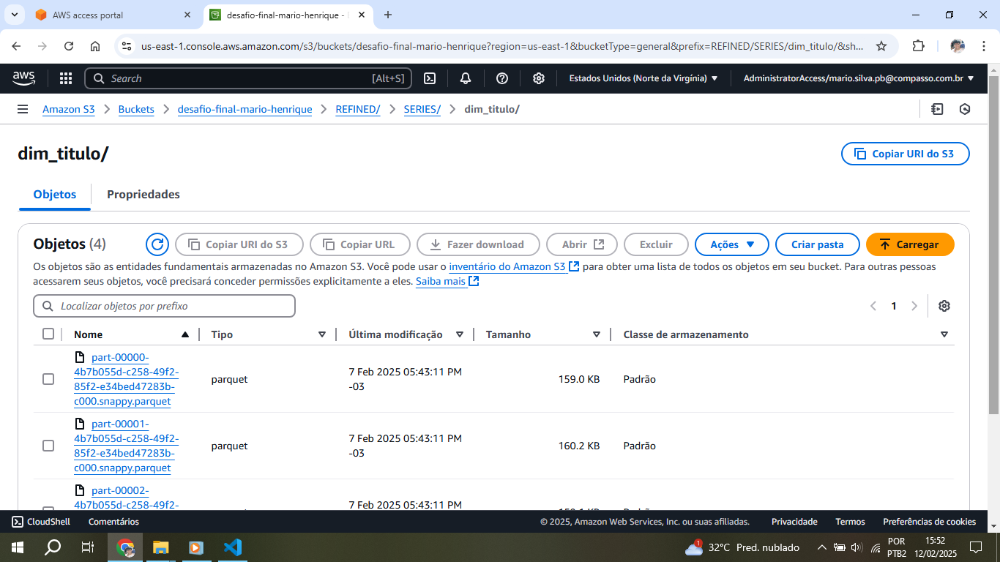 
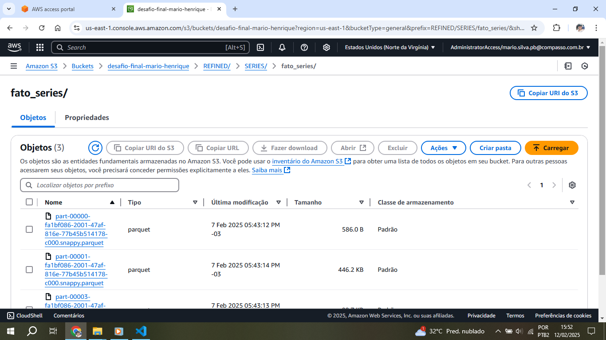 

Criação do banco de dados para a modelagem de filmes 
 

Crawler para criar as tabelas 
 

Visualização das tabelas no Athena 
 
 
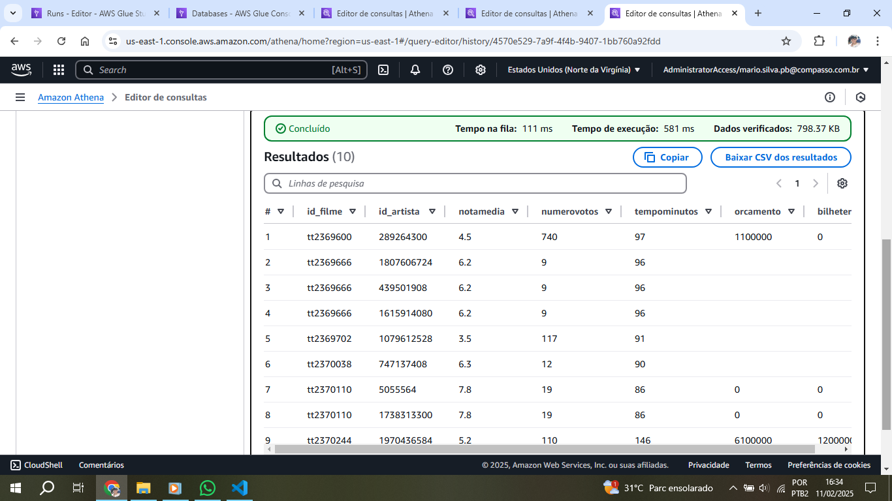 

Criação do banco de dados para a modelagem de series 
 

Crawler para criar as tabelas 
 

Visualização das tabelas no Athena 
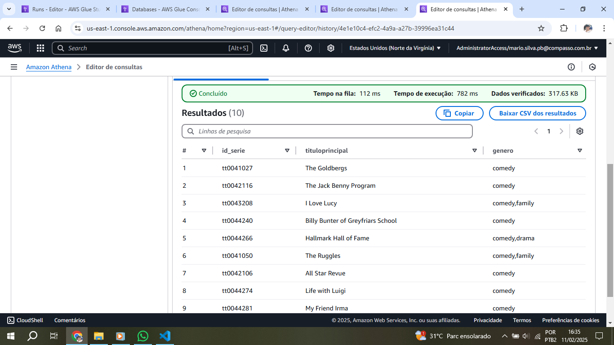 
 

Erro de digitação no script ao nomear incorretamente a variável do dataframe 
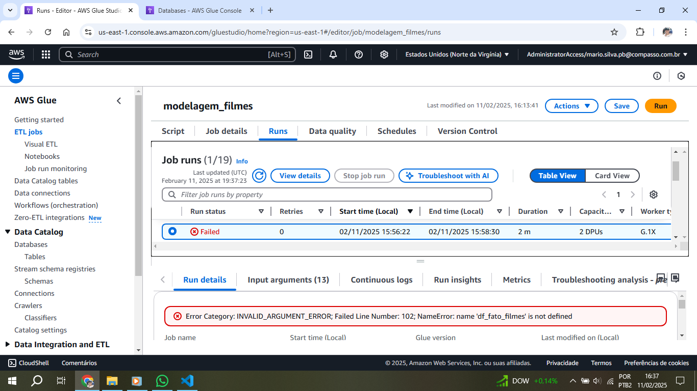 

Erro ao não definir corretamente os caminhos de entrada dos arquivos 
 

Erro ao sobrescrever dados no S3 
 

Erro de sintaxe no script 
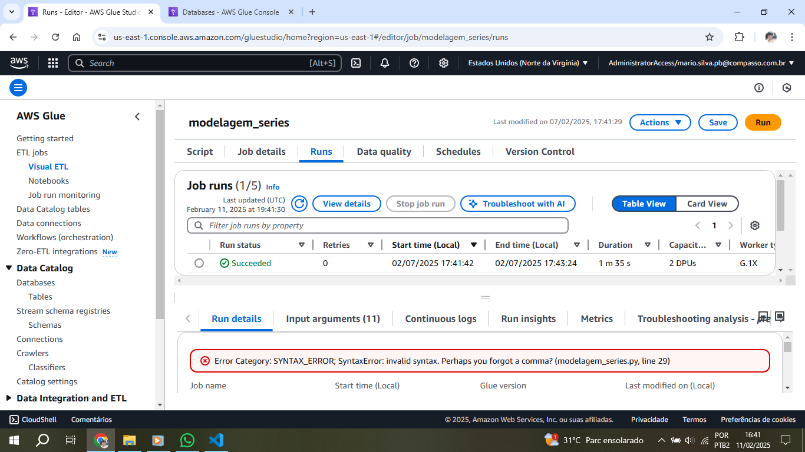 