# Desafio
Esta é a 4ª etapa do desafio final. Nesta sprint foi realizada a modelagem dimensional e a limpeza dos dados, unindo os arquivos JSON contendo os dados originados da API do TMDB em conjunto com o arquivo CSV, advindos da camada TRUSTED. 
Foram criados 2 scripts para refinar e modelar os dados necessários para a futura análise: um para filmes e outro para séries. Os novos dados refinados e modelados foram salvos na camada REFINED no AWS S3. 
Posteriormente, foi executado 2 crawlers (um para filmes e outro para séries) para criar as tabelas nos bancos de dados respectivos.

## Etapas

### Tema do desafio a ser respondido

**Análise de métricas dos filmes e séries e o impacto destas nas notas de avaliação e arrecadação de bilheteria**

Questionamentos: 
1- Qual foi o ano de lançamento em que os filmes tiveram a maior nota média? 
2- Qual foi o ano de lançamento em que as séries tiveram a maior nota média? 
3- Qual ator teve o filme com a maior nota média? 
4- O ator que teve o filme com a maior nota média atuou em quais filmes? Quais foram as notas desses filmes? 
5- Os filmes que tem mais de 120 minutos de duração tem nota média maior que os filmes menores de 120 minutos? 
6- As series com mais de 2 anos de duração possuem nota média maior que as séries que tem 2 anos ou menos de duração? 
7- Quais foram os 10 filmes com maior arrecadação de bilheteria e a sua lucratividade em relação ao orçamento no últimos 10 anos? 
8- Os filmes com mais votos dos últimos 10 anos tem maior orçamento em comparação com outros?

### Modelagem dos dados

A primeira etapa do desafio consiste em fazer a modelagem dimensional dos dados, sendo uma para filme e outra para séries: 

1. Criação da modelagem para filmes, contendo as 2 tabelas para dimensão: **dim_filme** e **dim_artista** e 1 tabela fato: **fato_filmes** 
 

2. Criação da modelagem para séries, contendo 1 tabela para dimensão: **dim_titulo** e 1 tabela fato: **fato_series** 
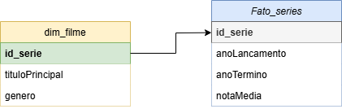 

### Script para filmes

Para obter apenas os dados necessários da camada TRUSTED, refiná-los e criar as tabelas para o modelo dimensional foi necessário a execução de um job no Glue. A seguir está o código necessário para a implementação: 

3. O script é iniciado com a importação das bibliotecas, variáveis de ambiente e definição de parâmetros para executar o Glue 
  

4. Definição das variáveis que contém o caminho dos arquivos na camada Trusted 
 

5. Definição da variável que contém o caminho para a saída dos arquivos no S3 
 

6. Nesta primeira parte do código são juntados os arquivos CSV e JSON e selecionadas as colunas necessárias para a futura análise.
Nesta parte do código são lidos os arquivos parquet do CSV e dos JSONs e armazenados em uma lista 
 

7. Há uma coluna com o nome errado, então esta é renomeada 
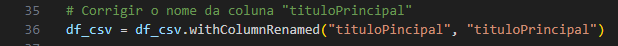 

8. São selecionadas apenas as colunas necessárias do CSV para a futura análise. A coluna 'id' é renomeada para 'id_filme' para melhor identificação 
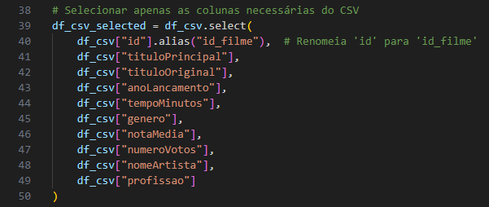 

9. Apenas as colunas necessárias para análise são selecionadas dos arquivos JSON. A coluna 'id_IMDB' é renomeada para 'id_filme' para corresponder às IDs do CSV no momento de unir os arquivos 
 

10. Padronização dos atributos da coluna 'genero' em minúsculas e filtragem pelos gêneros **animação** ou **comédia** 
Obs: Os gêneros estão em inglês na fonte de dados 
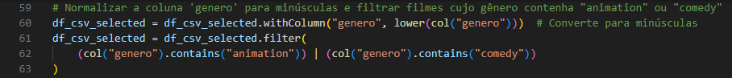 

11. Junção dos dataframes que contém os dados em CSV e os JSONs, relacionando com as ids dos filmes 
 

12. Nesta segunda parte do código são executados comandos para criar os dados conforme modelo dimensional. São selecionadas as colunas
necessárias e convertidas para os tipos de dados requeridos 
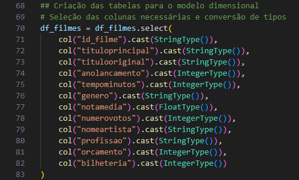 

13. Aqui é criada uma coluna 'id_artista' no dataframe para relacionar os nomes dos artistas e suas profissões à uma ID única gerada pelo Spark 
 

14. Criação dos dataframes para criar as dimensões: filmes e artistas, contendo os respectivos campos necessários e eliminação de linhas duplicadas 
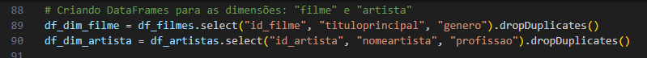 

15. Criação do dataframe para criar a tabela fato de filmes, contendo os campos necessários e a ligação com as ids de artistas, vindo da tabela dimensional de artistas 
 

16. Conversão dos dataframes do spark para o dynamic frame do Glue  
 

17. Armazenamento dos arquivos parquet, de cada dataframe, no caminho especificado no S3 e finalização do job 
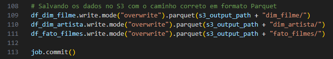 

### Script para séries

O script para refinar os dados de séries é mais simplificado, pois para esta análise não há dados do TMDB para serem unificados com os dados
já fornecidos. A modelagem também é simplificada, com apenas 2 tabelas. 

18. O script é iniciado com a importação das bibliotecas, variáveis de ambiente e definição de parâmetros para executar o Glue 
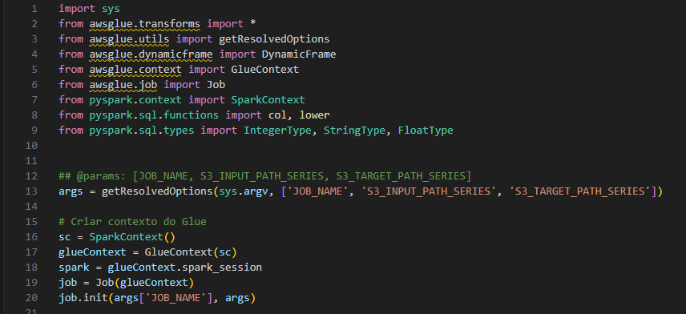 

19. Definição das variáveis que contém o caminho de entrada do arquivo CSV que está na TRUSTED, e o caminho de saída para REFINED 
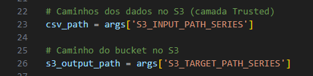 

20. Leitura dos dados CSV que estão em formato parquet 
 

21. Correção do nome da coluna 'TituloPrincipal', renomeando-a 
 

22. Seleção das colunas necessárias para a análise dos dados e renomeação da coluna 'id' para 'id_serie' 
 

23. Padronização dos atributos da coluna 'genero' em minúsculas e filtragem pelos gêneros **animação** ou **comédia** 
 

24. Seleção das colunas necessárias e conversão para os tipos de dados requeridos 
 

25. Criação da tabela dimensão título, contendo os campos requeridos e eliminação de linhas duplicadas 
 

26. Criação da tabela fato series, contendo os campos requeridos e eliminação de linhas duplicadas 
 

27. Conversão dos dataframes do spark para o dynamic frame do Glue  
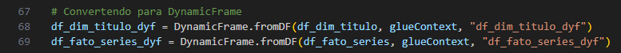  

28. Armazenamento dos arquivos parquet, de cada dataframe, no caminho especificado no S3 e finalização do job 
  

### Execução dos jobs no Glue

**Script para filmes**

29. O código digitado localmente no VSCode é colado no espaço de script do AWS Glue para poder executar o job que é nomeado como: modelagem_filmes 
 

30. Configurações são definidas para o job, como: IAM Role, worker type, número de workers, e o timeout do job 
 
 
 

31. Em job parameters, são definidas as variáveis locais para os caminhos de entrada dos arquivos necessários para o script e o caminho de
saída dos arquivos parquet. Após todas as configurações definidas, o job é salvo e executado 
 

32. Após a execução do job, o console exibe se a execução foi bem sucedida e os arquivos são armazenados no local especificado no S3 
 
 
 
 

**Script para series**

33. O código digitado localmente no VSCode é colado no espaço de script do AWS Glue para poder executar o job que é nomeado como: modelagem_series 
 

34. Configurações são definidas para o job, como: IAM Role, worker type, número de workers, e o timeout do job 
 
 
 

35. Em job parameters, são definidas as variáveis locais para o caminho de entrada dos arquivos necessários para o script e o caminho de
saída dos arquivos parquet. Após todas as configurações definidas, o job é salvo e executado 
 

36. Após a execução do job, o console exibe se a execução foi bem sucedida e os arquivos são armazenados no local especificado no S3 
 
 
 

### Criando catálogo de dados

**Para filmes**

37. Um banco de dados é criado com o nome: modelagem_filmes 
 

38. Após a criação do banco de dados, é criado um crawler com o caminho especificado dos dados. Então as 3 tabelas são criadas a partir dos dados fornecidos 
 

39. Ao clicar em 'Table data' de cada tabela, como pode-se ver no print do passo 37, o Athena é aberto com uma consulta simples para exibir os dados das 3 tabelas. Abaixo encontram-se respectivamente: dim_artista, dim_filme e fato_filmes 
 
 
 

**Para séries**

40. Um banco de dados é criado com o nome: modelagem-series 
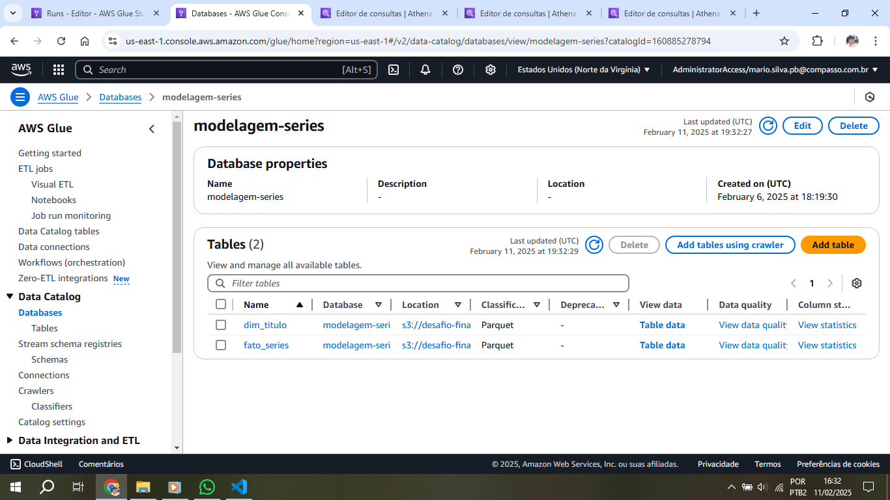 

41. Após a criação do banco de dados, é criado um crawler com o caminho especificado dos dados. Então as 2 tabelas são criadas a partir dos dados fornecidos 
 

42. Ao clicar em 'Table data' de cada tabela, como pode-se ver no print do passo 40, o Athena é aberto com uma consulta simples para exibir os dados das 2 tabelas. Abaixo encontram-se respectivamente: dim_titulo e fato_series 
 
 

## Erros e problemas

Ocorreram alguns problemas na execução dos jobs no Glue por erros simples de digitação, tais como atribuições de variáveis, caminhos dos arquivos, entre outros que foram prontamente corrigidos

1. Ao executar o primeiro job no Glue houve um erro de digitação no script ao nomear incorretamente a variável do dataframe que continha os filmes 
 

2. Um erro foi gerado ao não definir corretamente os caminhos de entrada dos arquivos CSV e JSONs 
 

3. Ao reexecutar um job para sobreescrever os dados que estavam incorretos no S3, um erro foi apresentado por não ter definido a política de exclusão de arquivos do S3 no IAM 
 

4. Houve um erro de sintaxe na digitação do script para a modelagem de series, ao não colocar ',' após as colunas desejadas para o dataframe 
 