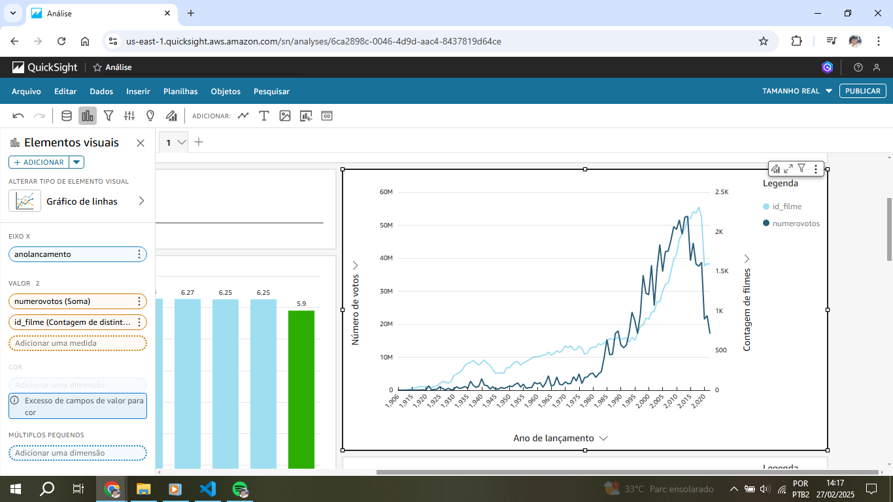
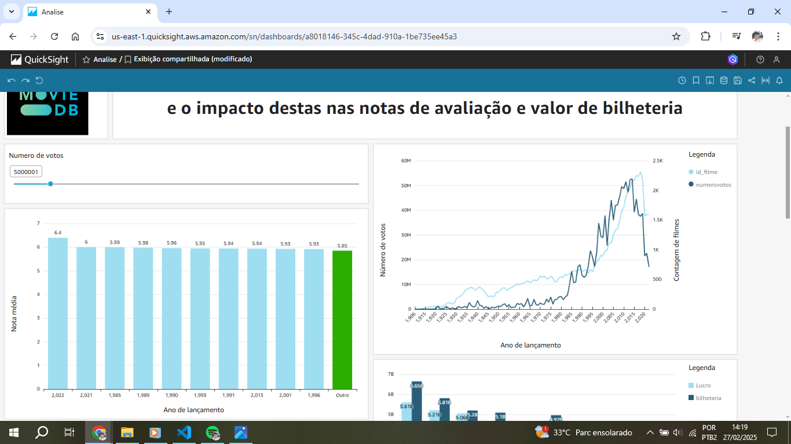

# Instruções

Nesta Sprint foi realizada a etapa final do desafio, que consiste em realizar a análise de dados com o Quicksight. 
Para realizar o desafio, foram visualizados tutoriais da AWS e cursos fornecidos pela trilha da Sprint 10.

## Resumo

**AWS Glue:** Utilizar o serviço para executar jobs de ETL

**AWS Quicksight:** Realizar análises, criando dashboard interativo com gráficos de diversos tipos

## Apresentação do desafio

[Desafio](desafio/README.md)

## Evidências

[Arquivos do Desafio](desafio/)
[Análise em PDF](desafio/Analise.pdf)

### Configuração do conjunto de dados no Quicksight

Conjunto de dados para análise de filmes configurado 
 

Joins configurados: dim_filme com fato_filme e dim_filme com dim_artista 
 
 

Conjunto de dados para séries configurado: fato_series com dim_titulo 
 
 

### Criando o dashboard
Cabeçalho com 2 campos para imagens e 1 para o tema da análise 
 

Gráfico dos 10 filmes com maiores médias de avaliação, com filtros e ação de filtro para detalhamento de votos 
 
 
 
 
 
 
 

Gráfico de linha para votação por ano de lançamento e número de filmes lançados por ano 
 

Gráfico de barras horizontais para nota média por ano de lançamento de séries (top 10) 
 
 

Gráfico de barras duplas para os 10 filmes com maiores lucros, considerando o período de 2013 a 2022 
 
 
 
 

Gráfico de barras horizontais comparando notas médias de filmes com duração maior ou menor que 120 minutos 
 
 

Gráfico de dispersão para analisar a relação entre orçamento e número de votos 
 
 

Gráfico de barras horizontais para desempenho dos filmes conforme a quantidade de profissões dos atores 
 
 

Gráfico de barras horizontais para desempenho de séries com até 2 anos de duração ou mais 
 
 
 

### Painel da análise

Painel publicado para interação e exportação em PDF 
 

Notas Médias por Ano de Filmes 
   

Votação e Lançamentos por Ano de Filmes  
 

Notas Médias por Ano de Séries   
 

Lucro e Bilheteria de Filmes   
 

Votos x Orçamento de Filmes 
  

Avaliação por Duração de Filmes   
 

Avaliação por profissão dos Artistas de Filmes   
  

Avaliação por Duração de Séries   
 

### Interação com os gráficos

Ao passar o mouse, é exibido o maior crescimento dos votos a partir de 1983 
 

Controle deslizante com a exibição de 5 milhões de votos, alterando a exibição de avaliações anuais 
 

Seleção de 2022 mostra votos e lançamentos desse ano 
 

Seleção do filme com maior lucro revela orçamento e número de votos no outro gráfico 
 
 

### Erros e problemas

Modelagem dimensional da sprint 9 refeita 
 