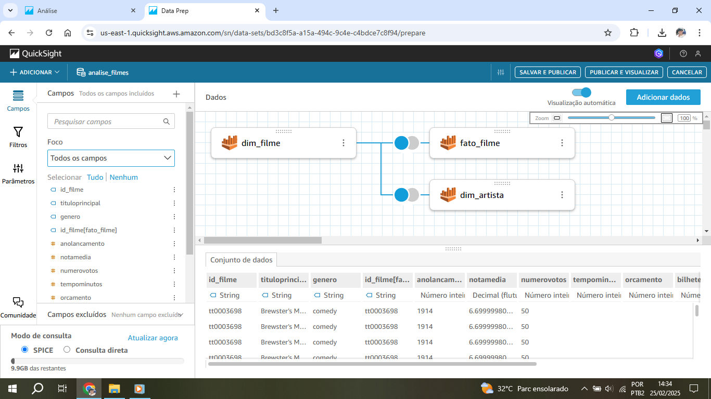
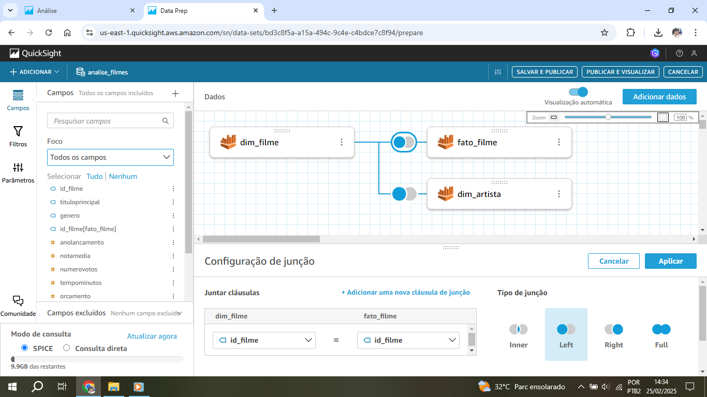
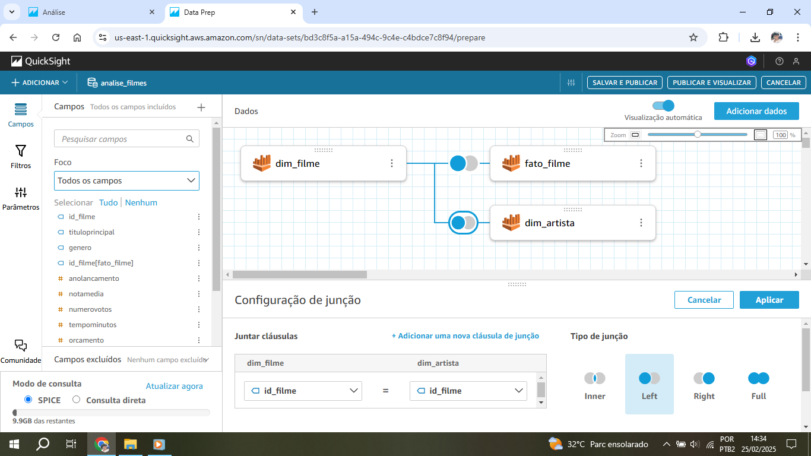
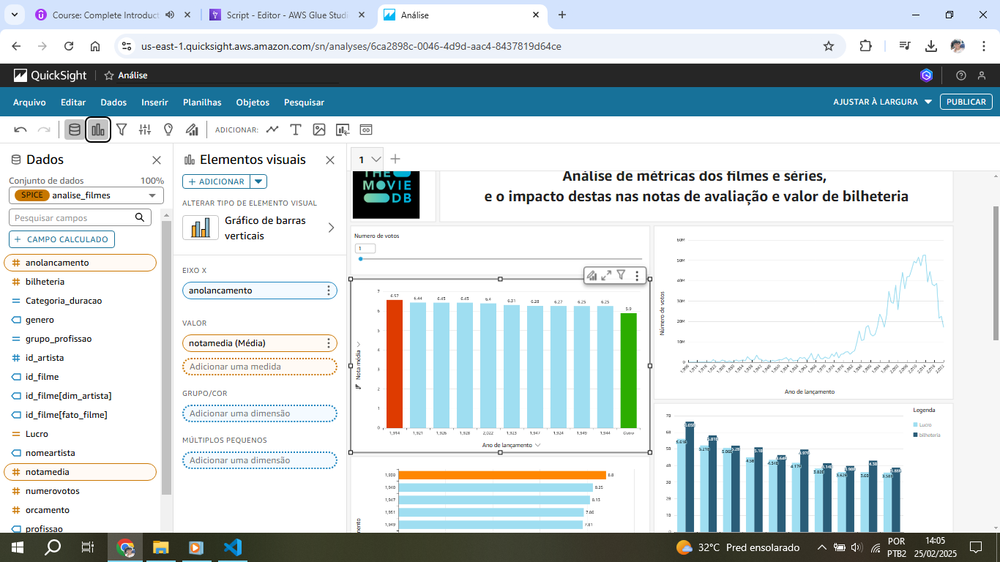
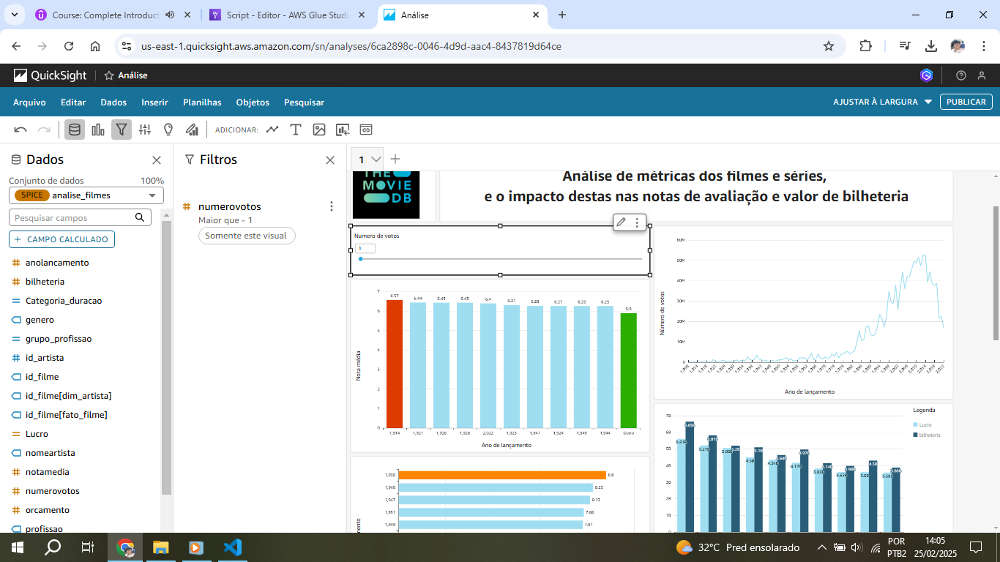
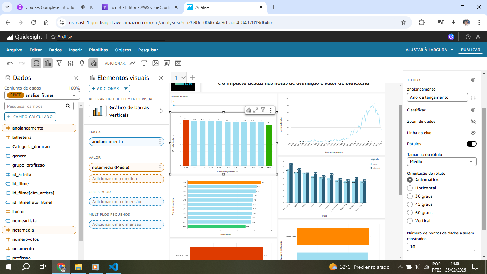
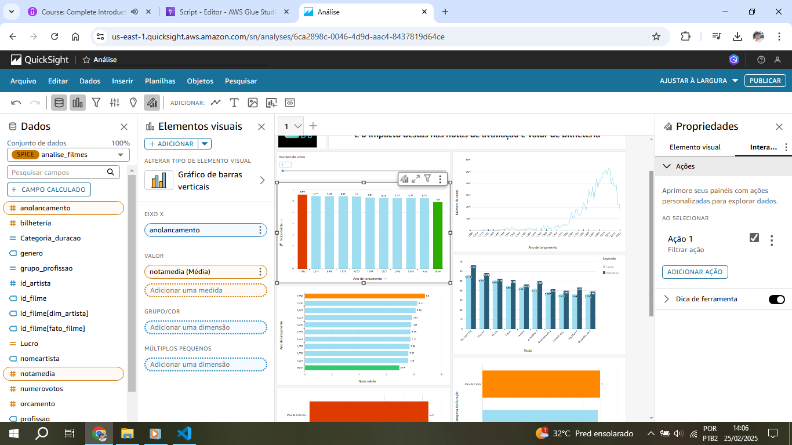
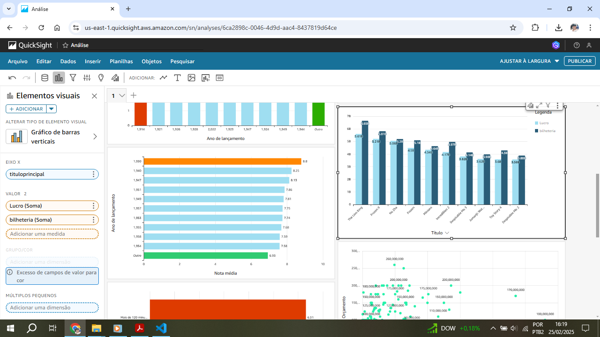
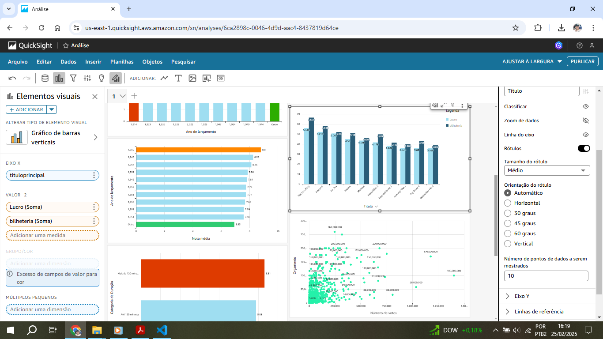
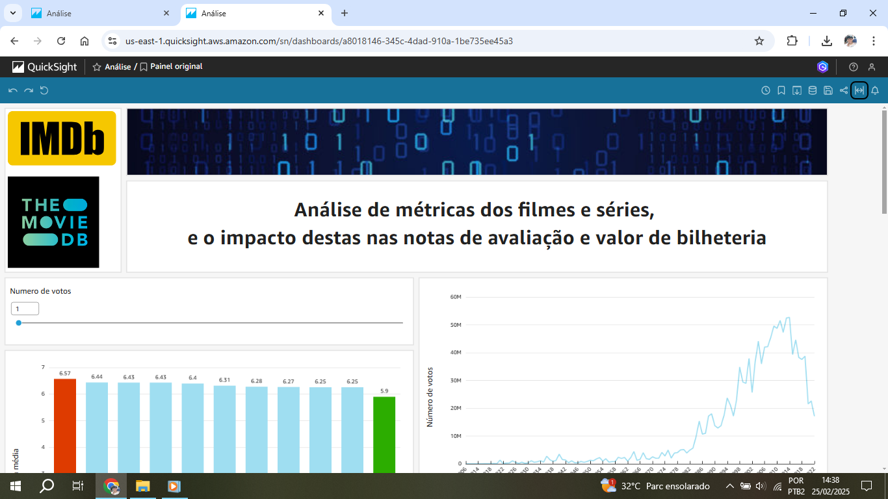

# Desafio
Para a execução da última etapa do desafio que consiste em realizar a análise de dados foi utilizado o Quicksight da AWS, com dados originados do catálogo de dados do Glue.

## Etapas

### Tema e questões respondidas
**Análise de métricas dos filmes e séries e o impacto destas nas notas de avaliação e arrecadação de bilheteria**

1-Qual foi o ano de lançamento em que os filmes tiveram a maior nota média?
2-Como foi a votação nos filmes ao longo do tempo?
3-Qual foi o ano de lançamento em que as séries tiveram a maior nota média?
4-Quais foram os 10 filmes com maior lucro e a sua arrecadação de bilheteria de 2013 a 2022?
5-Os filmes que tem mais de 120 minutos de duração tem nota média maior que os filmes menores ou iguais a 120 minutos?
6-Os filmes de 2013 a 2022 com mais votos tem maior orçamento?
7-Os atores que tem mais de uma profissão possuem os filmes com nota maior do que aqueles que apenas atuam como atores? 
8-As series com mais de 2 anos de duração possuem nota média maior que as séries que tem 2 anos ou menos de duração?

### Configuração do conjunto de dados no Quicksight

1. Para que os dados possam ser analisados, primeiramente é necessário configurar o conjunto de dados. O primeiro conjunto para a análise de filmes é feito. As tabelas dim_filme, fato_filme e dim_artista são adicionadas 
 

2. Posteriormente, os joins são configurados, relacionando a tabela dim_filme com fato_filme e dim_filme com dim_artista 
 
 

3. O segundo conjunto de dados para analisar as séries é configurado, unindo fato_series com dim_titulo 
 
 

### Criando o dashboard

4. No cabeçalho do dashboard foram inseridos 2 campos para ilustração de imagens e 1 campo para o texto, contendo o tema da análise 
 

5. O primeiro gráfico é criado, para a análise de anos de lançamento para os filmes com as 10 maiores médias de avaliação. São configurados: os valores dos eixos, filtros - dos quais um contém controle deslizante para filtrar anos de lançamento com a somatória de votos, e a ação de filtro para o ano selecionado ser exibido a quantidade de votos recebidos no gráfico ao lado 
 
 
 
 
 
 
 

6. Para analisar a votação por ano de lançamento dos filmes é criado um gráfico de linha 
 

7. A análise de nota média por ano de lançamento de séries é feita através de um gráfico de barras horizontais, com a exibição dos 10 maiores valores e o maior valor em destaque 
 
 

8. A análise dos 10 filmes com maiores lucros é feita através de um gráfico de barras duplas, em que uma representa o lucro e a outra o valor arrecadado na bilheteria, além dos filtros para que considere apenas o período de 2013 a 2022 (período em que foi possível obter os dados), orçamento e bilheteria maiores que 0. 
 
 
 

Para este gráfico foi necessário criar um campo calculado para desconsiderar valores nulos e para efetuar o lucro com base no cálculo de subtração de: bilheteria-orçamento
 

9. Para analisar se os filmes que tem mais de 120 minutos de duração tem nota média maior que os filmes de até 120 minutos foi cirado um gráfico de barras horizontais, com a maior nota média em destaque
 

Foi necessário criar um campo calculado, para criar as duas categorias de filmes: Maior que 120 minutos ou até 120 minutos 
 

10. Para obter a análise da relação entre orçamento dos filmes e número de votos foi criado um gráfico de dispersão, com filtragem de ano de lançamento maior ou igual a 2013, número de votos e orçamento maiores que 0 
 
 

11. Foi criado um gráfico de barras horizontal para analisar o desempenho dos filmes entre os atores que possuiam mais de uma profissão ou somente a profissão de ator/atriz 
 

Para isso foi criado um campo calculado para criar as duas categorias: mais de uma profissão ou apenas uma profissão 
 

12. Foi criado um gráfico de barras horizontal para verificar o desempenho entre as séries que possuem até 2 anos de duração ou mais de 2 anos
 

Foi criado um campo calculado para calcular a duração das séries, pois este campo não estava presente na base de dados. Os valores nulos foram desconsiderados 
 

Foi criado um campo calculado, a partir de outro já criado anteriormente: 'DuracaoSerie', para criar as duas categorias 
 

### Painel da análise

13. A partir do dashboard criado na análise, foi publicado o painel para interagir com o dashboard e visualizá-lo. Aqui também é possível exportar o PDF do dashboard 
 
No link a seguir é possível ver o PDF do dashboard: 
[PDF da análise](Analise.pdf) 

 

 

 

 

 

 

 

 

 

 

 

 

 

## Erros e problemas

1. 

2. 

