# Desafio
Para a execução da última etapa do desafio que consiste em realizar a análise de dados foi utilizado o Quicksight da AWS, com dados originados do catálogo de dados do Glue. 
Primeiramente foi construída uma análise no Quicksight, contendo gráficos e textos para ilustração e depois inseridos gráficos com os dados para análise. Concluída esta etapa, o painel foi publicado para visualização da análise e interação com os dados fornecidos. 
Com o painel concluído é possível exportar um PDF para ver o dashboard ou compartilhar este com usuários definidos. 

## Etapas

### Tema e questões respondidas

**Análise de métricas dos filmes e séries e o impacto destas nas notas de avaliação e arrecadação de bilheteria**

1-Qual foi o ano de lançamento em que os filmes tiveram a maior nota média? 
2-Como foi a votação nos filmes ao longo do tempo? 
3-Qual foi o ano de lançamento em que as séries tiveram a maior nota média? 
4-Quais foram os 10 filmes com maior lucro e a sua arrecadação de bilheteria de 2013 a 2022? 
5-Os filmes de 2013 a 2022 com mais votos tem maior orçamento? 
6-Os filmes que tem mais de 120 minutos de duração tem nota média maior que os filmes menores ou iguais a 120 minutos? 
7-Os atores que tem mais de uma profissão possuem os filmes com nota maior do que aqueles que apenas atuam como atores? 
8-As series com mais de 2 anos de duração possuem nota média maior que as séries que tem 2 anos ou menos de duração? 

### Configuração do conjunto de dados no Quicksight

1. Para que os dados possam ser analisados, primeiramente é necessário configurar o conjunto de dados. O primeiro conjunto para a análise de filmes é feito. As tabelas dim_filme, fato_filme e dim_artista são adicionadas 
 

2. Posteriormente, os joins são configurados, relacionando a tabela dim_filme com fato_filme e dim_filme com dim_artista 
 
 

3. O segundo conjunto de dados para analisar as séries é configurado, unindo fato_series com dim_titulo 
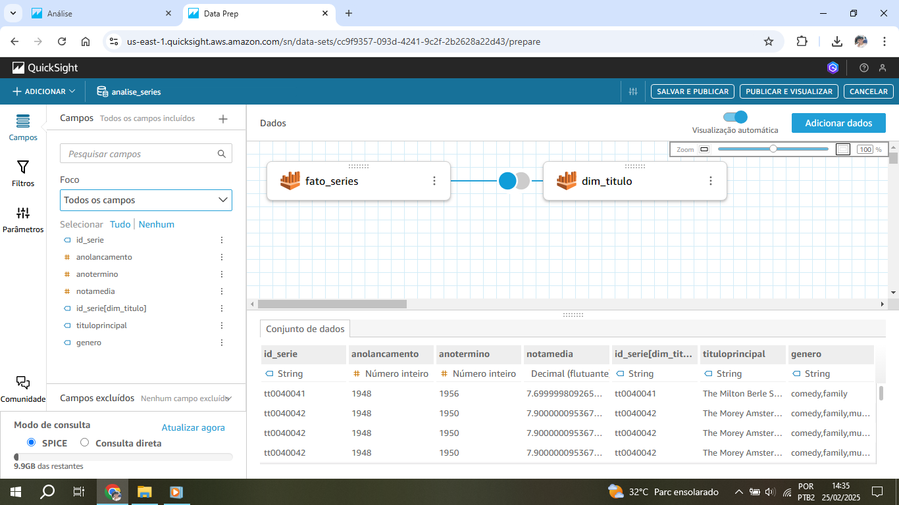 
 

### Criando o dashboard

4. No cabeçalho do dashboard foram inseridos 2 campos para ilustração de imagens e 1 campo para o texto, contendo o tema da análise 
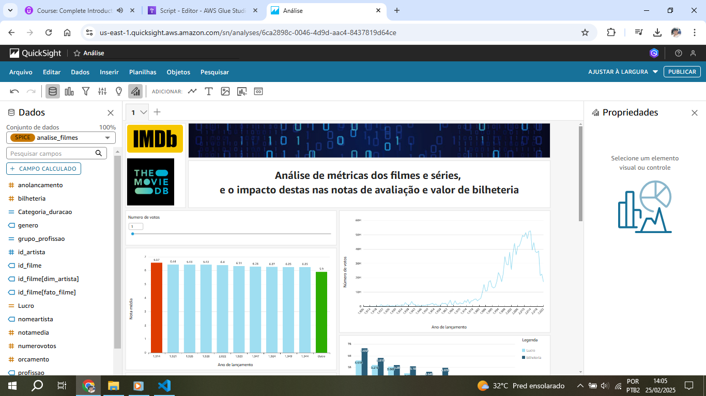 

5. O primeiro gráfico é criado, para a análise de anos de lançamento para os filmes com as 10 maiores médias de avaliação. São configurados: os valores dos eixos, filtros - dos quais um contém controle deslizante para filtrar anos de lançamento com a somatória de votos, e a ação de filtro para o ano selecionado ser exibido a quantidade de votos recebidos no gráfico ao lado 
 
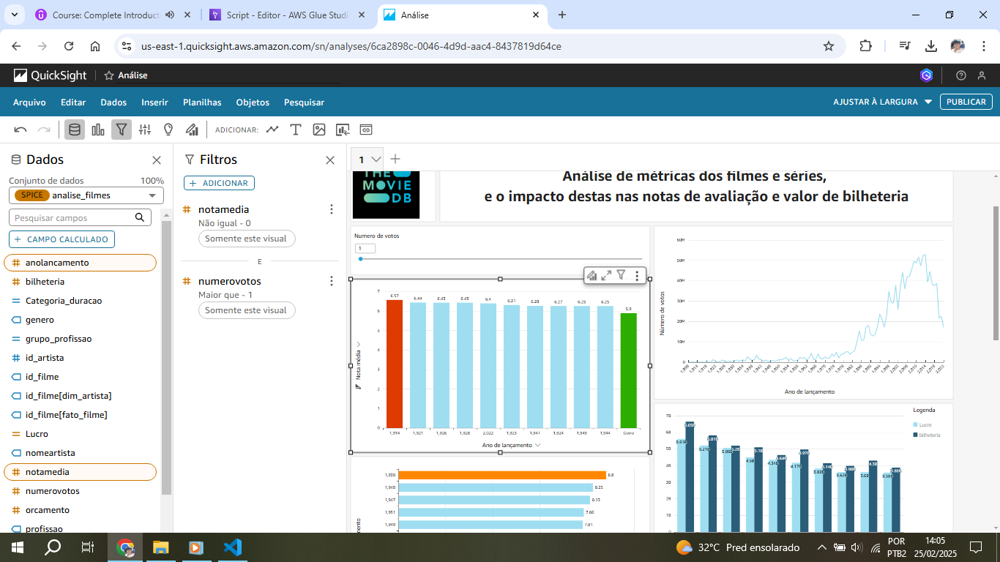 
 
 
 
 
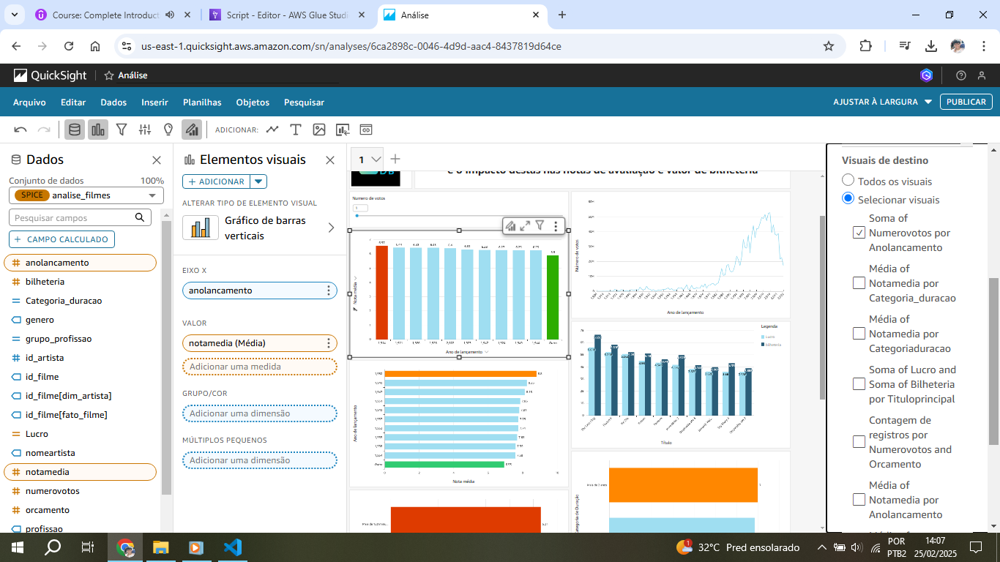 

6. Para analisar a votação por ano de lançamento dos filmes é criado um gráfico de linha, juntamente com a análise de quantos filmes
foram lançados por ano  
 

7. A análise de nota média por ano de lançamento de séries é feita através de um gráfico de barras horizontais, com a exibição dos 10 maiores valores e o maior valor em destaque 
 
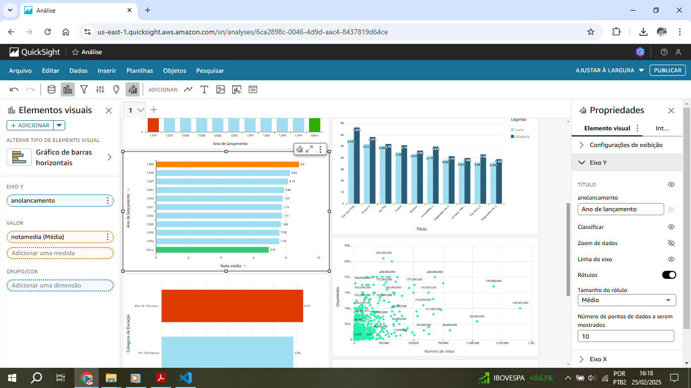 

8. A análise dos 10 filmes com maiores lucros é feita através de um gráfico de barras duplas, em que uma representa o lucro e a outra o valor arrecadado na bilheteria, além dos filtros para que considere apenas o período de 2013 a 2022 (período em que foi possível obter os dados), orçamento e bilheteria maiores que 0. 
 
 
 

Para este gráfico foi necessário criar um campo calculado para desconsiderar valores nulos e para efetuar o lucro com base no cálculo de subtração de: bilheteria-orçamento
 

9. Para analisar se os filmes que tem mais de 120 minutos de duração tem nota média maior que os filmes de até 120 minutos foi cirado um gráfico de barras horizontais, com a maior nota média em destaque
 

Foi necessário criar um campo calculado, para criar as duas categorias de filmes: Maior que 120 minutos ou até 120 minutos 
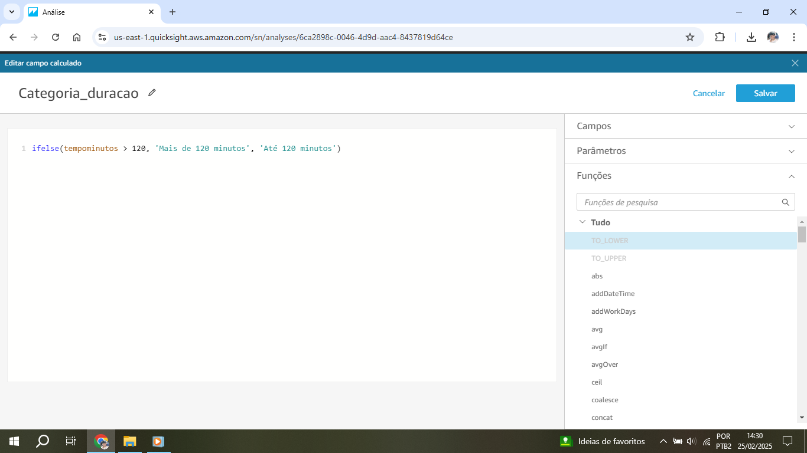 

10. Para obter a análise da relação entre orçamento dos filmes e número de votos foi criado um gráfico de dispersão, com filtragem de ano de lançamento maior ou igual a 2013, número de votos e orçamento maiores que 0 
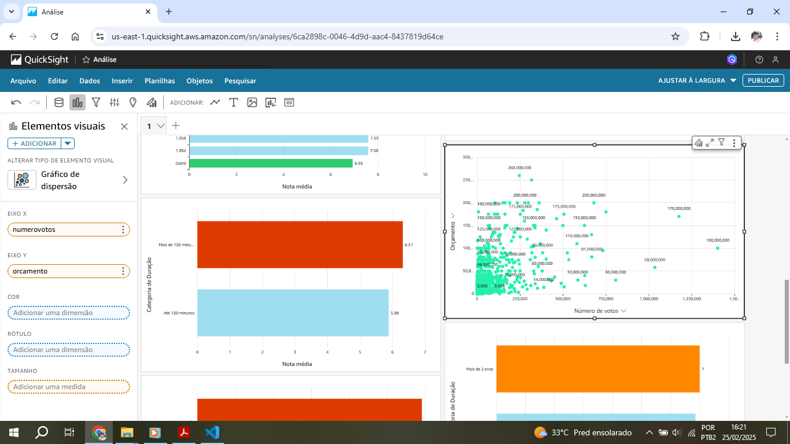 
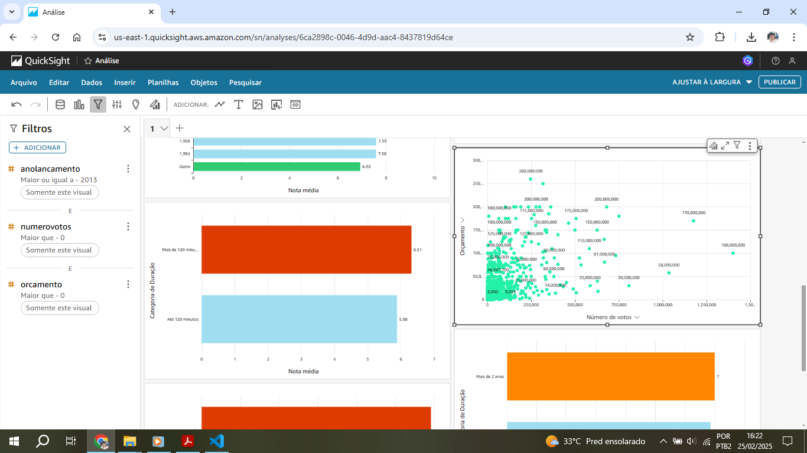 

11. Foi criado um gráfico de barras horizontal para analisar o desempenho dos filmes entre os atores que possuiam mais de uma profissão ou somente a profissão de ator/atriz 
 

Para isso foi criado um campo calculado para criar as duas categorias: mais de uma profissão ou apenas uma profissão 
 

12. Foi criado um gráfico de barras horizontal para verificar o desempenho entre as séries que possuem até 2 anos de duração ou mais de 2 anos
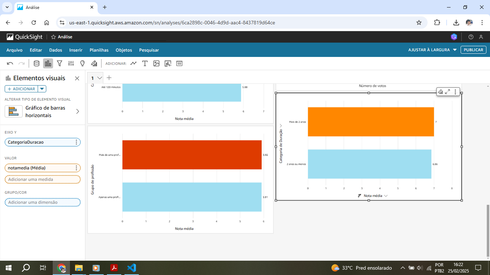 

Foi criado um campo calculado para calcular a duração das séries, pois este campo não estava presente na base de dados. Os valores nulos foram desconsiderados 
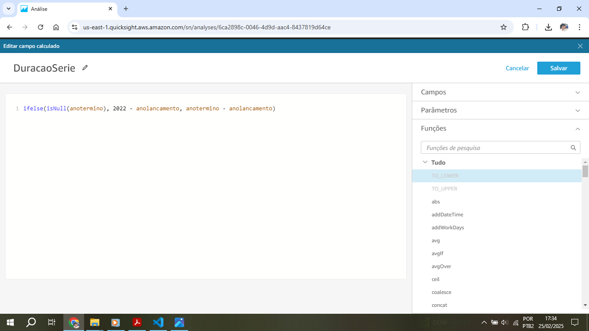 

Foi criado um campo calculado, a partir de outro já criado anteriormente: 'DuracaoSerie', para criar as duas categorias 
 

### Painel da análise

Toda a análise foi feita com filmes e séries das categorias animação e comédia. 
Para análise de dados como orçamento e bilheteria dos filmes foram considerados dados entre os anos de 2013 a 2022 

13. A partir do dashboard criado na análise, foi publicado o painel para interagir com o dashboard e visualizá-lo. Aqui também é possível exportar o PDF do dashboard 
 
No link a seguir é possível ver o PDF do dashboard: 
[PDF da análise](Analise.pdf) 

14. O primeiro gráfico é referente às notas médias agrupadas por ano do conjunto de filmes.
Pode-se verificar os 10 anos com as maiores notas médias, sendo 1914 o ano em que os filmes tiveram a maior nota média
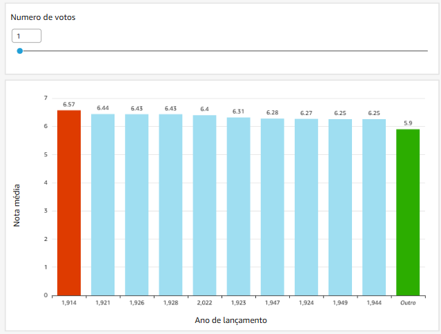 

15. O segundo gráfico diz como foi a votação dos filmes ao longo dos anos, agrupando a soma dos votos por ano, além de exibir na segunda linha quantos filmes foram lançados por ano. 
Observa-se um grande crescimento no número de votações a partir de 1983, com o pico em 2014 - isto provavelmente deve-se à grande quantidade de filmes lançados no período. 
Em 2020 houve uma grande queda no número de filmes lançados, e consequentemente no número de votos, provavelmente devido à pandemia. 
 

16. Neste gráfico, é feita a análise das notas de avaliação por ano de lançamento das séries. Observa-se que o ano de 1930 foi o que obteve
a maior nota média. 
 

17. Este gráfico contém os 10 filmes de maior lucro, juntamente com a arrecadação de bilheteria. "O Rei Leão" foi o filme que teve o maior lucro, porém entre estes 10 filmes não foi o mais lucrativo, dada a diferença entre lucro e bilheteria. Se considerarmos este fator, "Ne Zha" foi o mais lucrativo entre os 10 filmes com maior lucro. 
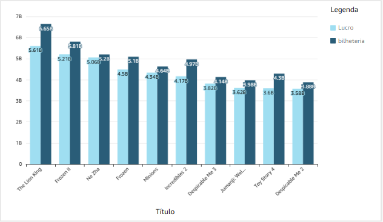 

18. O gráfico de dispersão contém a relação entre número de votos e orçamento. Foi investigado se quanto maior o orçamento, maior é o número de votos de um filme, dada a maior visibilidade que os filmes com maior orçamento possuem. 
Constatou-se que nem sempre o filme com o maior orçamento é mais popular pelo número de votos, apesar de possuir uma quantidade expressiva de votação 
 

19. Neste gráfico mais simples é feita a comparação de avaliação entre os filmes que possuem até 120 minutos de duração e os que tem mais de 120 minutos. Verifica-se que por uma ligeira margem, os que possuem mais de 120 minutos de duração são mais bem avaliados 
 

20. Neste outro gráfico é feita a comparação de avaliação dos filmes com artistas que apenas atuam como atores ou os que possuem mais de uma função, como: diretor, escritor, etc. Por uma diferença ínfima, os que possuem mais de um profissão tem filmes melhor avaliados, mas podemos considerar até mesmo nula essa diferença, empatando com os que possuem apenas uma profissão. 
 

21. No último gráfico é feita outra comparação entre as séries que possuem mais de 2 anos de duração e as que possuem 2 anos ou menos. 
As que possuem mais de 2 anos de duração possuem notas de avaliação melhores, ou seja, séries mais longas são melhores avaliadas por pouca diferença 
 

### Interação com os gráficos

22. Passando o mouse sobre a linha do gráfico é possivel verificar que a partir de 1983 o número de votos anuais para os filmes passa a crescer 
 

23. Selecionando no controle deslizante 5 milhões de votos, acima do primeiro gráfico de barras, é possível ver a mudança nas avaliações por ano. 
5 milhões de votos anuais já é um valor considerável e muda completamente o panorama dos anos mais bem avaliados para filmes 
 

24. Selecionando o ano de 2022 é possível verificar que o gráfico ao lado muda para exibir quantos votos este ano teve e quantos filmes foram lançados 
 

25. Ao selecionar o filme com o maior lucro é possível ver no gráfico de dispersão abaixo deste o seu orçamento e quantos votos possui 
Qualquer filme do gráfico de barras pode ser selecionado para ver mais informações sobre orçamento e quantidade de votos recebidos 
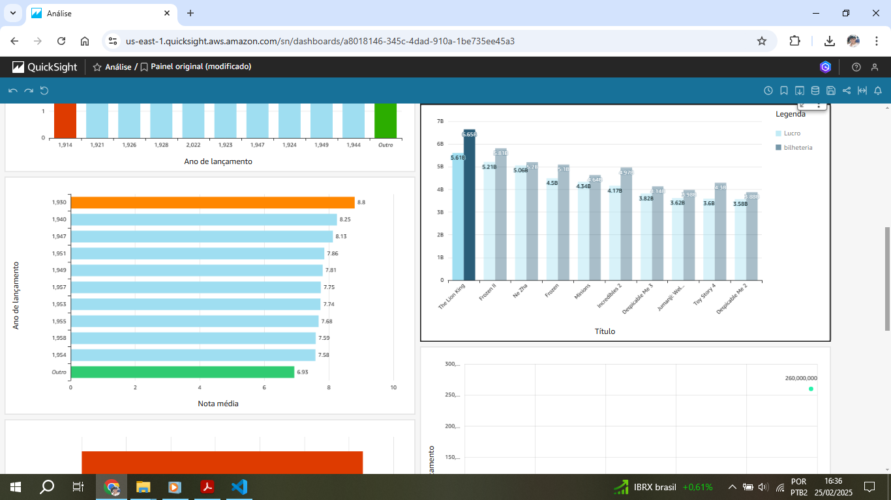 
 

## Erros e problemas

1. Para evitar a duplicação de dados na tabela fato, foi necessário refazer a modelagem dimensional da sprint 9. Por consequência o código para fazer o ETL no Glue também foi alterado: 
[Código reformulado](../../Sprint09/desafio/Script_modelagem-filmes-atual.py) 
 